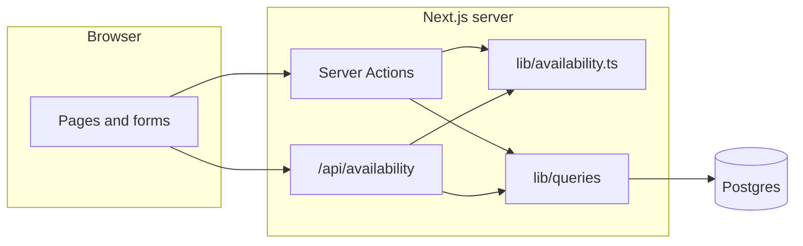
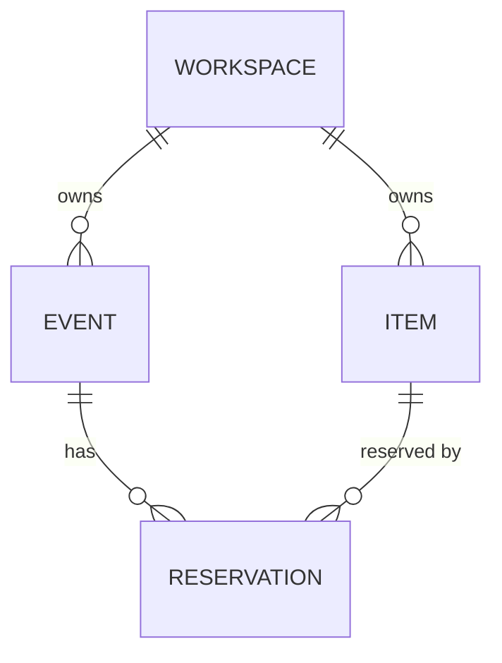
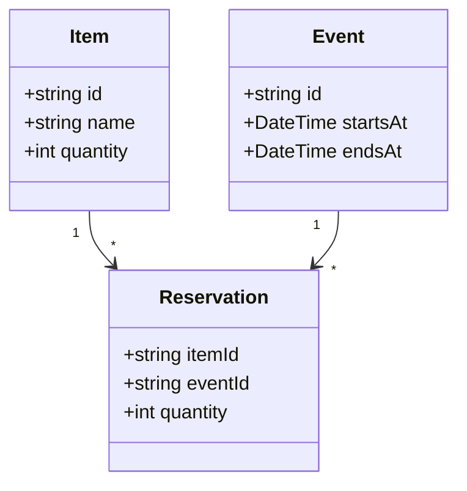
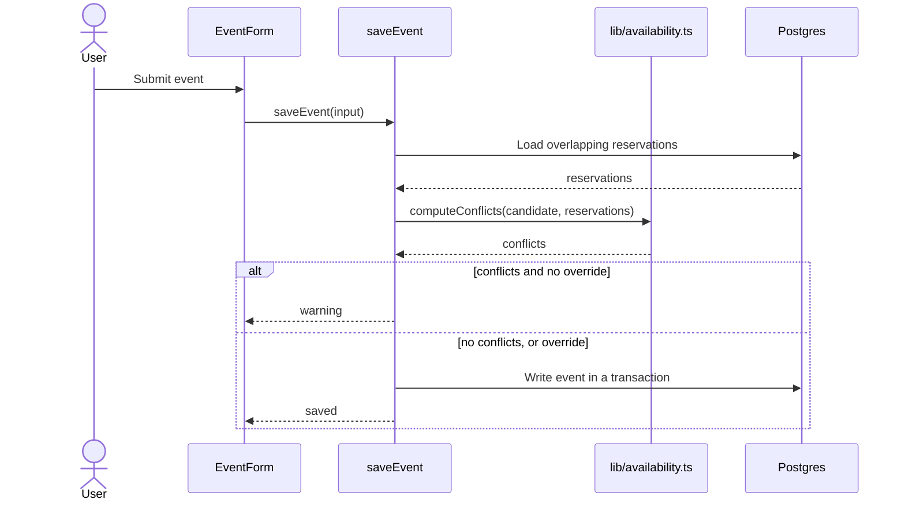

# Diagrams

Mermaid, inline in `docs/DeveloperGuide.md`, only where a diagram explains something prose does
not. Diagrams describe **built** code — never a planned design.

## Which Diagram, When

| Diagram | Mermaid type | Include when | Goes in |
|---|---|---|---|
| Architecture | `flowchart` with `subgraph`s | Always, from the first feature checkpoint | § 3 |
| Component | `flowchart` | A component has three or more internal parts | § 4, that component |
| Class / data model | `classDiagram`; `erDiagram` for a database schema | A data model or type hierarchy other code depends on | § 4, the owning component |
| Sequence | `sequenceDiagram` | A flow crossing three or more components, or where order matters | § 4, or § 3 for the representative request |

## Rules for Every Diagram

1. **Names match the code exactly** — files, functions, types, tables. A diagram with invented
   names is worse than none.
2. **About 15 nodes at most.** Split or abstract beyond that, and say what was left out.
3. **Followed by a numbered walkthrough** — one step per arrow that matters.
4. **Re-checked against the code** at every checkpoint that touches the component it shows.

## Examples

Names below are illustrative. Real diagrams use the project's own names.

### Architecture — `flowchart`

### Data model — `erDiagram`

### Types — `classDiagram`

### Flow — `sequenceDiagram`

1. The user submits the form; `saveEvent` receives the input.
2. It loads reservations overlapping the candidate window.
3. The pure engine computes conflicts — no database access.
4. Conflicts without an override return a warning; otherwise the event is written in one
   transaction.

## Syntax Pitfalls

- **Quote labels containing `/`, `(`, `)` or `:`** — `API["/api/availability"]`, not
  `API[/api/availability]`, which Mermaid reads as a shape.
- **Never use `end` as a flowchart node ID** — it closes a `subgraph`. Use `End` or `finish`.
- **`erDiagram` entity names have no spaces**; put readable names in relationship labels.
- **Keep one statement per line**; avoid trailing semicolons.
