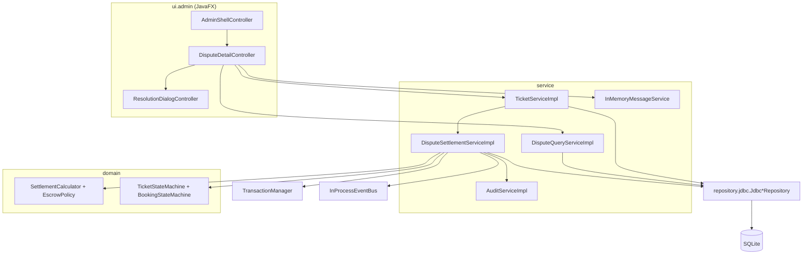
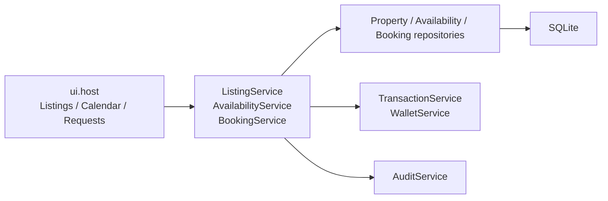
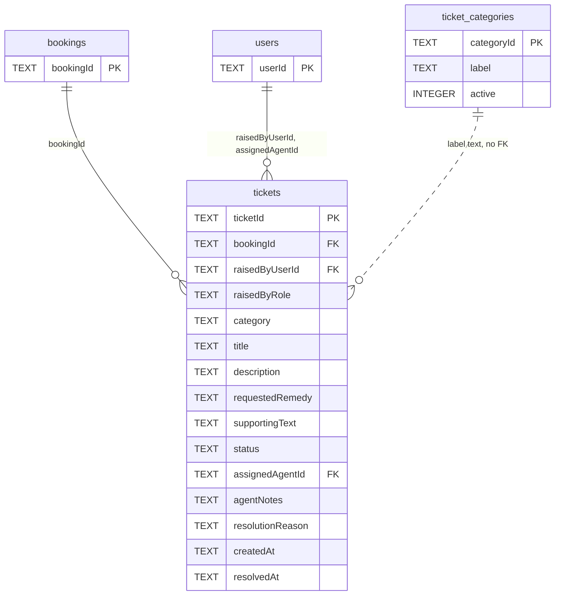
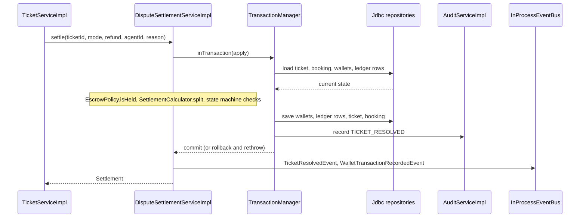

# Developer Guide — SnoozeShare

Handover brief for developers taking over this project. It describes **confirmed** work only and
is updated at checkpoints, so it can lag behind the code. For current status, work in flight, and
what to build next, read [`PROJECT_STATE.md`](../PROJECT_STATE.md) — that is the source of truth.

**Last updated:** 2026-09-27 — covers W6–W8 (Host Listings, Calendar, and Booking Requests), W10 (Agent Dispute Resolution), plus the scope, setup,
requirements and glossary it relies on

## Contents

1. [Overview & Scope](#1-overview--scope)
2. [Setting Up](#2-setting-up)
3. [Architecture](#3-architecture)
4. [Components](#4-components)
5. [Requirements](#5-requirements)
6. [Glossary](#6-glossary)
7. [Testing](#7-testing)

---

## 1. Overview & Scope

SnoozeShare is a Java 25 / JavaFX desktop application for short-term property rentals. Guests book
stays, hosts list properties, and support agents settle disputes between them. All money moves
through one wallet and transaction ledger, and the booking price is held in escrow until the stay
and its dispute window are over. It runs as a single process against an embedded SQLite database;
there is no server.

**Target user:** the three roles the app serves — Guest (renter), Host (homeowner) and Support
Agent (platform admin). This guide documents the Host management/request workflows and the Support
Agent's dispute-resolution tooling.

**Value proposition:** a support agent can take a dispute ticket, read both parties' evidence and
chat, and settle the booking's held escrow between guest and host in one atomic, audited action.
Every payout follows one uniform fee rule, so the ledger always adds up.

**Goals**

- Every dispute ticket ends in a fully settled booking: the whole held escrow reaches the guest, the
  host, or both, and nothing is paid twice.
- The platform fee is taken only from host earnings, never from guest money.
- Any failure during settlement leaves wallets, ledger, ticket and booking exactly as they were.
- Every agent mutation leaves an audit record.
- The ticket categories guests choose from are maintained by agents, not by code changes.

**Out of scope**

- **Force Cancel / Force Complete (backlog F9.2.1)** — redundant: accepting a ticket with a full
  refund already cancels in effect, and rejecting it already completes, and both close the ticket (C22).
- **Persistent chat threads** — chat is a general messaging feature owned by a separate Messaging
  workstream (W13). Dispute chat runs on a session-only stand-in until then (C21).
- **The design canvas palette outside the agent screens** — the canvas "Fall Light" tab layout and
  palette apply to the agent shell only; guest and host shells keep `theme.css` (C24).
- **Guest ticket filing and host response screens** — these belong to the guest and host dispute
  features, not to agent dispute resolution.
- **Account suspension and the audit-log viewer** — the Accounts and Audit Log tabs of the agent shell
  are placeholders owned by later features.
- **The auto-complete scheduler** — a booking with an open ticket must be skipped by whatever
  completes bookings after the dispute window (C17), but that scheduler is a separate feature.
- **Clawing money back from a host wallet** — agents only ever settle *held* escrow (C17).
- **Microservices, message brokers, horizontal scaling, JPMS modules, JPA/Hibernate, a separate DTO
  layer** — ruled out for a course-scoped single-process app (`PROJECT_STATE.md` § Known Gaps).

---

## 2. Setting Up

**Prerequisites**

| Tool | Version | Notes |
|---|---|---|
| JDK | 25 | `build.gradle` sets a Java 25 toolchain |
| Gradle | 9.7.1 | Provided by the wrapper (`gradlew`, `gradlew.bat`); nothing to install |
| JavaFX | 25.0.4 | Fetched by the `org.openjfx.javafxplugin` Gradle plugin; no separate SDK |
| SQLite | embedded | `org.xerial:sqlite-jdbc` is a Gradle dependency; the `sqlite3` CLI is only needed to rebuild `db/snoozeshare-mock.db` |

**Build, test, run** (Windows PowerShell; on macOS/Linux use `./gradlew`)

```powershell
.\gradlew build   # compile, checkstyle, tests
.\gradlew test    # tests only
.\gradlew run     # start the app (main class com.snoozeshare.app.Launcher)
```

**Environment variable**

| Name | Purpose | Where to obtain the value |
|---|---|---|
| `SNOOZESHARE_DB_URL` | Optional JDBC URL that points the app at a SQLite file, for example `jdbc:sqlite:build/acceptance.db`. When unset or blank the app uses an empty in-memory database, so nothing survives a restart. | Build it from a copy of the mock DB (below). No secret is involved. |

`Main` reads the variable and passes it to `AppContext.create(String)`.

**Run against a copy of the mock database**

`db/snoozeshare-mock.db` is a committed, pre-populated reference database. Never point the app at
it directly, because the app writes to whatever it opens. Copy it first:

```powershell
Copy-Item db\snoozeshare-mock.db build\acceptance.db -Force
$env:SNOOZESHARE_DB_URL = "jdbc:sqlite:build/acceptance.db"
.\gradlew run
Remove-Item Env:SNOOZESHARE_DB_URL   # when finished
```

The first start records the schema baseline in `schema_history` (D10); the copy needs no other
preparation.

**Mock logins.** Authentication is mocked (`UserService.authenticate(email)`): the login screen takes
an email and checks no credential. The mock agents seeded in [`db/seed-mock-data.sql`](../db/seed-mock-data.sql) are
`amy.tanaka@snoozeshare.test`, `ben.alvarez@snoozeshare.test` and `chen.wu@snoozeshare.test`. Registering
a Host or Agent through the app needs a registration code; those are mock constants in
[`RegistrationCodes`](../src/main/java/com/snoozeshare/config/RegistrationCodes.java).

**Rebuilding the mock database** (only after editing the seed):
`sqlite3 x.db < db/schema.sql` then `sqlite3 x.db < db/seed-mock-data.sql`, and replace
`db/snoozeshare-mock.db`. See the conventions in [Testing](#7-testing) before editing the seed.

---

## 3. Architecture

SnoozeShare is a layered modular monolith in one Gradle module. Dependencies run strictly downward:
`ui` → `service` → `domain` and `repository` → `infra.db`. The diagram shows the dispute-resolution
slice only; `AppContext` wires every box and hands the services to the UI.



Left out for clarity: `AppContext` wiring, `SessionContext`, the other repositories (booking,
property, user, wallet, wallet transaction), and the queue and category screens, which call the
same services.

The host-facing slices use the same service and repository boundaries:



W6 owns listing CRUD, publishing status and host listing metrics. W7 adds listing-specific calendar
views and persisted manual date blocks. W8 adds host-scoped booking projections, request decisions,
earnings previews and guarded escrow completion. Controllers receive these capabilities through
`AppContext`; they do not access repositories directly.

**One request: an agent resolves a ticket**

1. In `DisputeDetailController` the agent presses Accept, Reject dispute or Manual adjustment.
   `ResolutionDialogController` collects the reason and, where needed, a guest refund amount (with a live
   `ResolutionPreview`), and returns a `ResolutionRequest(mode, guestRefund, reason)`.
2. The controller calls `TicketService.resolve(ticketId, request, agentId)`.
3. `TicketServiceImpl.resolve` checks the caller is an agent, loads the ticket and booking, and
   turns the request into a single guest refund figure: Reject is 0, Manual uses the entered amount,
   and Accept uses the ticket's requested remedy (the whole escrow for `FULL_REFUND`, 0 for
   `HOST_PAYOUT`, the entered amount otherwise). It then calls `DisputeSettlementService.settle`.
4. `DisputeSettlementServiceImpl.settle` requires a non-blank reason and the `AGENT` role, then runs
   the rest inside one `TransactionManager.inTransaction` call.
5. Inside the transaction it checks the preconditions (ticket `IN_REVIEW` and assigned to the caller;
   booking `CONFIRMED`; escrow still held per `EscrowPolicy.isHeld`), splits the escrow with
   `SettlementCalculator.split`, and confirms both state machines allow the transitions.
6. Still inside the transaction it updates the guest wallet and writes a ledger row (if the refund is
   above zero), does the same for the host (if the host share is above zero), saves the ticket as
   resolved, saves the booking as `COMPLETED`, and records one audit row.
7. The transaction commits; any exception rolls everything back and nothing is published.
8. After commit, `TicketResolvedEvent` and one `WalletTransactionRecordedEvent` per ledger row are
   published on the `InProcessEventBus`. `DisputeQueueController` subscribes to the ticket event and
   refreshes its rows.

**Main parts**

- **`ui.admin`** owns the agent screens. It may call `service` interfaces, the domain enums and
  records, and `AppContext` (to reach services). It must not import `repository` or `java.sql`.
- **`service`** owns business rules. `TicketServiceImpl` owns the ticket lifecycle and categories,
  `DisputeSettlementServiceImpl` is the only class that moves money for a dispute, and
  `DisputeQueryServiceImpl` builds read models for the screens.
- **`domain`** is pure Java (no JavaFX, no JDBC): the settlement maths, the escrow-held test and the
  state machines.
- **`repository.jdbc`** is the only place that touches `java.sql`. **`infra.db`** owns the connection,
  the transaction boundary and migrations.

**Key Decisions**

| Decision | Why | Rejected | Ref |
|---|---|---|---|
| Escrow is held through the 7-day dispute window; a ticket opened in it leaves escrow held and the agent controls settlement. Agent money actions therefore always act on held escrow, with no clawback. | Consistent with the backlog's auto-complete and guest dispute rules; removes the "already paid out" case. | | C17 |
| Every resolution settles the **full** held escrow: guest refund `R` with no fee, host receives `(escrow − R) × 0.97`. Accept is the requested remedy, Reject is `R = 0`, Manual is an agent-set `R`. | The platform cut is only ever taken from host earnings, never from guest money. | The mockup's single-wallet "Adjust wallet" dropdown | C20 |
| A separate `DisputeSettlementService` moves the money, instead of `TransactionService.applyTicketRemedy` / `manualOverride`. | Those single-sided methods cannot express a two-sided full-escrow settlement. Also keeps W10 from editing shared W3 code. | | C16, D5 |
| Ticket chat runs through a general `MessageService` interface; W10 ships a temporary in-memory implementation. | Agent chat is one more participant in a general messaging feature, so it is not owned by dispute resolution. | W10 owning a `ticket_messages` table | C21 |
| No Force Cancel / Force Complete. The agent only settles by resolving a ticket. | Accepting or rejecting already closes the ticket and settles the booking. | Force actions on the detail screen | C22 |
| Resolving a ticket moves the booking `CONFIRMED → COMPLETED`, so `BookingStateMachine` allows `Role.AGENT` on that transition. "Stay ended — escrow held" is a derived display label, not a status. | Bookings in the dispute window are `CONFIRMED`; the label avoids a new status. | | C23 |
| The agent shell uses the design canvas layout (top bar plus tab strip Disputes / Accounts / Audit Log / Categories) and "Fall Light" palette, applied through `agent-theme.css` on the agent scene only. | Operator ruled canvas differences to be defects after a visual check. | Keeping the sidebar and navy theme as a documented deviation (D11) | C24 |
| Internal notes are one persisted free-text field per ticket (`Ticket.agentNotes`), replaced on Save. An assigned agent can Unassign (`IN_REVIEW → OPEN`), which is audited. | Operator preference after a visual check. | A note history list; disabling Assign after assigning | C25 |
| Agents can delete a category, but not while any ticket uses its label; deactivate it instead. Modals get a 50% light-grey scrim, and chat and notes boxes are user-resizable. | Delete is a new capability beyond backlog F9.3.1; protecting used labels keeps ticket history intelligible. | | C26 |
| `UNDER_REVIEW` was renamed `IN_REVIEW` in code, schema, seed data and UI text. | One term across code and UI. | A UI-only rename | C27 |

---

## 4. Components

Dependencies come first. Money is `BigDecimal` at scale 2 with `HALF_UP` throughout.

### 4.1 Settlement domain

**Purpose:** pure rules for dividing a booking's held escrow and deciding whether it is still held.

**API**

- [`SettlementCalculator.split(escrow, guestRefund)`](../src/main/java/com/snoozeshare/domain/settlement/SettlementCalculator.java) returns a `SettlementBreakdown`.
- [`SettlementBreakdown`](../src/main/java/com/snoozeshare/domain/settlement/SettlementBreakdown.java) is a record of `escrow`, `guestRefund`, `hostGross`, `fee`, `hostNet`.
- [`EscrowPolicy.isHeld(bookingTransactions)`](../src/main/java/com/snoozeshare/domain/settlement/EscrowPolicy.java) is true when the list has an `ESCROW_HOLD` row and no `ESCROW_REFUND`, `BOOKING_PAYOUT`, `TICKET_REMEDY` or `AGENT_OVERRIDE` row.

**Depends on:** `domain.enums`, `domain.model.WalletTransaction`, `DomainValidation`. No JavaFX or JDBC.

**Invariants**

- The full escrow is settled: `guestRefund + hostGross = escrow`.
- The 3% fee is `round(hostGross × 0.03, 2, HALF_UP)` and applies to the host share only; the guest refund is fee-free.
- `0 ≤ guestRefund ≤ escrow`, with at most two decimal places; otherwise `IllegalArgumentException`.
- A zero amount produces no ledger row (the caller omits it).

**Deviations:** none.

### 4.2 State machines

**Purpose:** the single legality check for booking and ticket transitions.

**API:** [`BookingStateMachine.canTransition(from, to, role)`](../src/main/java/com/snoozeshare/domain/statemachine/BookingStateMachine.java) and [`TicketStateMachine.canTransition(from, to, role)`](../src/main/java/com/snoozeshare/domain/statemachine/TicketStateMachine.java).

**Depends on:** `domain.enums` only.

**Invariants**

| Machine | Transition | Allowed for |
|---|---|---|
| Booking | `CONFIRMED → COMPLETED` | `HOST` and, for dispute resolution, `AGENT` (C23) |
| Ticket | `OPEN → IN_REVIEW` | `AGENT` |
| Ticket | `IN_REVIEW → OPEN` (Unassign, C25) | `AGENT` |
| Ticket | `IN_REVIEW → RESOLVED_APPROVED` or `RESOLVED_REJECTED` | `AGENT` |
| Ticket | any other, including out of a resolved status | nobody |

Terminal booking statuses never transition. The `FORCE_*` booking statuses remain in the enum and the
booking machine but nothing in the agent UI uses them (C22).

**Deviations:** D9 (the `AGENT` permission on `CONFIRMED → COMPLETED` is an additive change to a shared file).

### 4.3 Persistence: tickets and ticket categories

**Purpose:** store dispute tickets and the category lookup that guests choose from.

**API**

- [`TicketRepository`](../src/main/java/com/snoozeshare/repository/TicketRepository.java) and its adapter [`JdbcTicketRepository`](../src/main/java/com/snoozeshare/repository/jdbc/JdbcTicketRepository.java): `findById`, `findByStatus`, `findQueue(status, assignee, agentId)`, `existsByCategory(label)`, `save` (upsert).
- [`TicketCategoryRepository`](../src/main/java/com/snoozeshare/repository/TicketCategoryRepository.java) and [`JdbcTicketCategoryRepository`](../src/main/java/com/snoozeshare/repository/jdbc/JdbcTicketCategoryRepository.java): `findActive`, `findAll`, `findById`, `labelInUse(label, excludeCategoryId)`, `save`, `deleteById`.
- [`MigrationRunner.migrate`](../src/main/java/com/snoozeshare/infra/db/migration/MigrationRunner.java) applies `V001__foundation.sql`, or adopts a database that already has a `users` table (such as the mock DB) by recording the baseline.



1. `tickets` references the booking it disputes and the users involved (the raiser, and the assigned agent when there is one).
2. `tickets.category` holds the category **label text**, not a foreign key to `ticket_categories`.
3. `ticket_categories.active` is `1` or `0`; deactivating hides a category from new filings only.
4. `bookings` and `users` show only their keys; their other columns are not part of this component.

`raisedByRole` is limited to `GUEST` or `HOST`; `requestedRemedy` to `FULL_REFUND`, `PARTIAL_REFUND`,
`HOST_PAYOUT`, `OTHER`; `status` to `OPEN`, `IN_REVIEW`, `RESOLVED_APPROVED`, `RESOLVED_REJECTED`
(all `CHECK` constraints in [`db/schema.sql`](../db/schema.sql)).

**Depends on:** `infra.db.ConnectionFactory`, `JdbcCodecs` and `RowMappers` (`repository.jdbc.support`), `java.sql` (only here).

**Invariants**

- Only `repository.jdbc.*` imports `java.sql`.
- `findQueue` orders by `createdAt, ticketId`; a null status means every status; `MINE` requires an agent id.
- The ticket upsert only updates `status`, `assignedAgentId`, `agentNotes`, `resolutionReason`, `resolvedAt`; the filing fields are immutable after insert.
- `labelInUse` and `existsByCategory` compare case-insensitively.
- Timestamps are read with `JdbcCodecs.instant`, which needs UTC ISO-8601 text ending in `Z`.

**Deviations:** D8 (label text, so a rename does not rewrite existing tickets); D10 (`MigrationRunner` adoption); D12 (a) (ordering by `createdAt` text means sub-second ties can mis-order) and (b) (adoption only checks for a `users` table). The repository method names above are what the code has; the design spec used slightly different names, and the code wins.

### 4.4 Messaging seam

**Purpose:** let the dispute screens show and post ticket chat before a persistent messaging feature exists.

**API**

- [`MessageService`](../src/main/java/com/snoozeshare/service/MessageService.java): `thread(ticketId, ThreadChannel)` and `post(ticketId, channel, authorId, authorRole, body)`. The contract belongs to the Messaging workstream (W13).
- [`InMemoryMessageService`](../src/main/java/com/snoozeshare/service/impl/InMemoryMessageService.java): a temporary, session-only implementation wired in `AppContext`.
- [`Message`](../src/main/java/com/snoozeshare/domain/model/Message.java) and [`ThreadChannel`](../src/main/java/com/snoozeshare/domain/enums/ThreadChannel.java) (`GUEST`, `HOST`).

**Depends on:** a `Clock`, `DomainValidation`.

**Invariants**

- A non-blank body is required; it is trimmed.
- A guest can post only in the `GUEST` thread and a host only in the `HOST` thread; the agent can post in both.
- Messages live in memory and are lost when the app closes. The interface is the only thing the UI depends on, so a persistent replacement needs no UI change.

**Deviations:** C21 (chat ownership). `TicketService.addHostResponse` is deprecated and throws `UnsupportedOperationException`.

### 4.5 `DisputeSettlementService`

**Purpose:** the only class that moves money when an agent resolves a dispute.

**API:** [`DisputeSettlementService.settle(ticketId, mode, guestRefund, agentId, reason)`](../src/main/java/com/snoozeshare/service/DisputeSettlementService.java), implemented by [`DisputeSettlementServiceImpl`](../src/main/java/com/snoozeshare/service/impl/DisputeSettlementServiceImpl.java). It returns a [`Settlement`](../src/main/java/com/snoozeshare/service/Settlement.java) (ticket, booking, `SettlementBreakdown`, and the guest and host `WalletTransaction`, either of which is `null` when its amount was zero). [`ResolutionMode`](../src/main/java/com/snoozeshare/domain/enums/ResolutionMode.java) is `ACCEPT`, `REJECT` or `MANUAL`.

**Outcome by mode**

| Mode | Guest row | Host row | Ticket ends as |
|---|---|---|---|
| `ACCEPT` | `TICKET_REMEDY` when the refund is above zero | `BOOKING_PAYOUT` when the host share is above zero | `RESOLVED_APPROVED` |
| `REJECT` (refund must be 0) | none | `BOOKING_PAYOUT` for the whole escrow, net of fee | `RESOLVED_REJECTED` |
| `MANUAL` | `AGENT_OVERRIDE` when the refund is above zero | `BOOKING_PAYOUT` when the host share is above zero | `RESOLVED_APPROVED` if the refund is above zero, else `RESOLVED_REJECTED` |

The host row has `amount = hostGross − fee` and `feeAmount = fee`. Every row carries
`relatedBookingId`, `relatedTicketId` and `initiatedBy = agentId`. `ACCEPT` with a zero refund is
allowed only when the ticket's requested remedy is `HOST_PAYOUT`.



1. `TicketServiceImpl.resolve` derives the refund and calls `settle`.
2. `settle` validates the reason and the `AGENT` role, then hands the work to `TransactionManager`.
3. Inside the transaction the service loads the current ticket, booking, both wallets and the booking's ledger rows.
4. It applies the preconditions and the split (shown as a note; the domain classes are pure).
5. It writes wallets, ledger rows, ticket and booking, then one audit row, all on the same connection.
6. Commit makes everything visible at once; any exception rolls back all of it.
7. Only after commit are events published, then the `Settlement` is returned.

**Depends on:** `TicketRepository`, `BookingRepository`, `PropertyRepository`, `UserRepository`, `WalletRepository`, `WalletTransactionRepository`, `AuditService`, `EventBus`, `TransactionManager`, the settlement domain (4.1) and state machines (4.2).

**Invariants**

- Preconditions are checked inside the transaction: caller is an agent; ticket is `IN_REVIEW` and assigned to the caller; booking is `CONFIRMED`; escrow is held; `0 ≤ refund ≤ escrow`; reason non-blank. Any failure writes nothing.
- One transaction covers both wallet balances, both ledger inserts, the ticket, the booking (`COMPLETED`, `completedAt`) and the audit row. Events are published only after commit.
- Wallets are updated directly, not through `WalletLedgerWriter`, because `feeAmount` on `BOOKING_PAYOUT` rows is informational and `amount` is already net.
- A wallet's `balance` changes only in the same transaction as the ledger row that explains it.

**Deviations:** D5 (a dedicated service instead of `TransactionService.applyTicketRemedy` / `manualOverride`); D12 (c) (guest and host wallets are read once, so a self-booking where guest and host are the same user would lose an update), (d) (`AuditServiceImpl` stamps `Instant.now()`, not the injected clock), (e) (the escrow amount comes from `booking.totalAmount()`, not the `ESCROW_HOLD` row).

### 4.6 `TicketService`

**Purpose:** the ticket lifecycle for agents (queue, assign, unassign, notes, resolve) and category administration.

**API:** [`TicketService`](../src/main/java/com/snoozeshare/service/TicketService.java), implemented by [`TicketServiceImpl`](../src/main/java/com/snoozeshare/service/impl/TicketServiceImpl.java).

| Method | Behaviour |
|---|---|
| `queueForAgent(status, AssigneeFilter, agentId)` | Tickets oldest first; `AssigneeFilter` is `ALL`, `UNASSIGNED` or `MINE`; a null status means all. |
| `assignToMe(ticketId, agentId)` | `OPEN → IN_REVIEW`, sets the assignee. Fails if not `OPEN` or already assigned to another agent. |
| `unassign(ticketId, agentId)` | `IN_REVIEW → OPEN`, clears the assignee; only the assigned agent. |
| `saveNotes(ticketId, notes, agentId)` | Replaces the single internal-notes text; only while `IN_REVIEW` and assigned to the caller. |
| `resolve(ticketId, ResolutionRequest, agentId)` | Derives the refund and delegates to `DisputeSettlementService.settle`. |
| `listCategories()` / `listAllCategories()` | Active categories only (what guests see) / all categories. |
| `createCategory`, `renameCategory`, `setCategoryActive` | Label must be non-blank and unique, case-insensitively. |
| `deleteCategory(categoryId, agentId)` | Permanent delete; refused while any ticket uses the label (deactivate instead). |

`ResolutionRequest` is a record of `mode`, `guestRefund` and `reason`; the refund is required for
`MANUAL` and for `ACCEPT` of a `PARTIAL_REFUND` or `OTHER` request, and is ignored or derived otherwise.
`fileTicket` throws `UnsupportedOperationException` (guest filing is a separate feature) and
`addHostResponse` is deprecated (see 4.4).

**Depends on:** `TicketRepository`, `TicketCategoryRepository`, `BookingRepository`, `UserRepository`, `DisputeSettlementService`, `AuditService`, `AuthorizationService`, `TicketStateMachine`.

**Invariants**

- Every method requires the `AGENT` role; role is enforced here, not only in the UI.
- Every mutation makes exactly one `AuditService.record` call: `TICKET_ASSIGNED`, `TICKET_UNASSIGNED`, `TICKET_NOTE_SAVED`, `TICKET_CATEGORY_CREATED`, `TICKET_CATEGORY_RENAMED`, `TICKET_CATEGORY_TOGGLED`, `CATEGORY_DELETED`; resolution is audited by the settlement service as `TICKET_RESOLVED`.
- Ticket status changes go through `TicketStateMachine`.

**Deviations:** the design spec described notes as an appended, attributed list (`addAgentNote`); the built behaviour is one replaceable text (`saveNotes`, C25). `unassign` (C25) and `deleteCategory` (C26) were added after the spec. `tickets.category` is label text (D8).

### 4.7 `DisputeQueryService`

**Purpose:** read models for the agent screens, so controllers never touch repositories.

**API:** [`DisputeQueryService`](../src/main/java/com/snoozeshare/service/DisputeQueryService.java) with `queue(status, assignee, agentId)` returning [`DisputeSummary`](../src/main/java/com/snoozeshare/service/DisputeSummary.java) rows and `detail(ticketId)` returning a [`DisputeDetail`](../src/main/java/com/snoozeshare/service/DisputeDetail.java), implemented by [`DisputeQueryServiceImpl`](../src/main/java/com/snoozeshare/service/impl/DisputeQueryServiceImpl.java).

- `DisputeSummary`: ticket id and label, title, category, listing title, guest, host and assignee names, status, `createdAt`.
- `DisputeDetail`: the ticket, listing and dates, party names, booking status, `escrowAmount`, `escrowHeld` and `phaseLabel`.

**Depends on:** `TicketRepository`, `BookingRepository`, `PropertyRepository`, `UserRepository`, `WalletTransactionRepository`, `EscrowPolicy`, a `Clock`.

**Invariants**

- The ticket label is `#` plus the last four characters of the ticket id (for example `#0002`).
- `phaseLabel` is derived, never stored: "Stay ended — escrow held" (booking `CONFIRMED`, end date before today, escrow held), "Upcoming", "Active", or the prettified booking status otherwise (C23).
- Read-only: it never writes.

**Deviations:** none.

### 4.8 Agent UI (`ui.admin`)

**Purpose:** the Support Agent's shell with the Disputes and Categories screens.

**API**

| File | Role |
|---|---|
| [`AdminShellController`](../src/main/java/com/snoozeshare/ui/admin/AdminShellController.java) + [`admin-shell.fxml`](../src/main/resources/com/snoozeshare/ui/admin/admin-shell.fxml) | Top bar and tab strip (Disputes, Accounts, Audit Log, Categories); swaps the centre view. Accounts and Audit Log are placeholders. |
| [`DisputeQueueController`](../src/main/java/com/snoozeshare/ui/admin/tickets/DisputeQueueController.java) + `dispute-queue.fxml` | Oldest-first table, All / Unassigned / Mine chips, status filter (All statuses, Open, In review, Approved, Rejected), "N unassigned" badge; refreshes on `TicketResolvedEvent`. |
| [`DisputeDetailController`](../src/main/java/com/snoozeshare/ui/admin/tickets/DisputeDetailController.java) + `dispute-detail.fxml` | Booking summary, guest and host chat panes, one notes field, Assign to me / Unassign, Accept, Reject dispute, Manual adjustment. The Accept label follows the ticket raiser ("remedy guest" or "remedy host"). |
| [`ResolutionDialogController`](../src/main/java/com/snoozeshare/ui/admin/tickets/ResolutionDialogController.java) + `resolution-dialog.fxml` | One dialog for the three modes; reason required; live preview. |
| [`ResolutionPreview`](../src/main/java/com/snoozeshare/ui/admin/tickets/ResolutionPreview.java) | Pure logic that turns a refund text into a preview or an error message, using `SettlementCalculator`. |
| [`CategoryAdminController`](../src/main/java/com/snoozeshare/ui/admin/categories/CategoryAdminController.java), [`CategoryDialogController`](../src/main/java/com/snoozeshare/ui/admin/categories/CategoryDialogController.java) | Category table with active toggle, Add and Edit modals; Edit has Delete. |
| [`AgentModal`](../src/main/java/com/snoozeshare/ui/admin/AgentModal.java) | Shared modal shell: transparent undecorated stage plus a light-grey scrim over the owner window. |
| [`HeightGrip`](../src/main/java/com/snoozeshare/ui/admin/HeightGrip.java) | Drag handle that resizes chat panes together and the notes box, within min and max heights. |
| [`agent-theme.css`](../src/main/resources/com/snoozeshare/ui/admin/agent-theme.css) | The "Fall Light" palette, loaded on the agent scene root only. |

**Depends on:** `AppContext` (to reach `TicketService`, `DisputeQueryService`, `MessageService`, `SessionContext`, `EventBus`), the domain enums and records, and `NavShellController` from the shared shell.

**Invariants**

- `ui.*` must not import `com.snoozeshare.repository` or `java.sql`; `LayerDependencyTest` and `UiDependencyTest` check this. Controllers reach data only through service interfaces. (The rule against importing `infra.db` is a convention; the tests do not check it.)
- The dialog requires a reason and a refund within the escrow, and the services enforce the same rules again.
- There is no Force Cancel / Force Complete control anywhere (C22).
- Subscriptions are released in `DisputeQueueController.dispose()` when the shell navigates away.

**Deviations:** D7 (the design canvas shows Force actions, a newest-first queue, an "Adjust wallet" dropdown and no Accept amount field; the built screens follow C22, oldest-first per F9.1.1, and the refund-amount field of C20); D11 (a sidebar shell) was superseded by C24, so the built shell is the tab strip; D12 (f) (`DisputeDetailController.load()` still calls `render()` outside the error handler). The dispute screens use the `SGD` currency label (C10).

### 4.9 Host listing management (`ui.host.listings`)

**Purpose:** hosts create, edit, publish, deactivate and inspect their own properties.

| File | Role |
|---|---|
| [`HostListingsController`](../src/main/java/com/snoozeshare/ui/host/listings/HostListingsController.java) + `host-listings.fxml` | Host-scoped `My listings` dashboard with listing cards, booking/rating metrics, Active/Inactive control, Edit, and calendar entry. |
| [`HostListingFormController`](../src/main/java/com/snoozeshare/ui/host/listings/HostListingFormController.java) + `host-listing-form.fxml` | Shared create/edit form with Basic Details, Location, Capacity & Pricing, and Amenities cards; validates checkout after check-in. |
| [`HostListingDetailController`](../src/main/java/com/snoozeshare/ui/host/listings/HostListingDetailController.java) + `host-listing-detail.fxml` | Host-facing listing detail view with Back and Edit actions. |
| [`ListingServiceImpl`](../src/main/java/com/snoozeshare/service/impl/ListingServiceImpl.java) | Enforces host ownership, validates listing data, persists changes and emits audit records. |
| [`ListingMetricsService`](../src/main/java/com/snoozeshare/service/ListingMetricsService.java) | Supplies total-booking and average-rating metrics with zero-value fallbacks. |

New listings are `ACTIVE` by default. Property and status values are displayed with human-readable
labels, while the service and database retain enum values. Host listing mutations are owner-only and
audited.

### 4.10 Host calendar and date overrides (`ui.host.calendar`)

**Purpose:** hosts inspect one listing's monthly availability and create or remove manual blocks.

[`HostCalendarController`](../src/main/java/com/snoozeshare/ui/host/calendar/HostCalendarController.java)
loads the selected listing, renders booked/blocked/available/adjacent-month days, supports month
navigation, and shows all-month manual overrides. Manual blocks use inclusive end dates and permit
single-day ranges; creation rejects invalid dates, overlaps with bookings or existing blocks, and
non-owned listings. Every persisted block carries an optional reason and can be removed by its owner.

The calendar is reached from a listing card and returns to Host Listings through the shell callback.
Availability rules remain in `AvailabilityService`; the controller does not query the database.

### 4.11 Host booking requests (`ui.host.bookings`)

**Purpose:** hosts review pending requests, see past decisions, approve or reject requests, and view
projected earnings.

| File | Role |
|---|---|
| [`HostBookingsController`](../src/main/java/com/snoozeshare/ui/host/bookings/HostBookingsController.java) + `host-bookings.fxml` | Host-scoped pending/history tables, guest rating, gross/net figures, decision actions, and status badges. The page loads its own `host-bookings.css`; it does not own agent table classes. |
| [`HostBookingDecisionDialogController`](../src/main/java/com/snoozeshare/ui/host/bookings/HostBookingDecisionDialogController.java) + `host-booking-decision-dialog.fxml` | Approve/reject confirmation modal; rejection accepts an optional message to the guest. |
| [`BookingServiceImpl`](../src/main/java/com/snoozeshare/service/impl/BookingServiceImpl.java) | Enforces host ownership and state transitions, previews host earnings, persists the optional rejection message, and settles normal bookings. |
| [`HostBookingRow`](../src/main/java/com/snoozeshare/service/HostBookingRow.java) | Read model combining booking, listing, guest, gross/net projection and average guest rating. |

Approval moves a pending booking to `CONFIRMED` while retaining escrow until check-in. Rejection
fully refunds the held amount and may expose the host's optional message in the guest trip view.
Normal completion runs only after checkout plus the seven-day dispute window and skips bookings with
an open or in-review ticket. Eligible completion atomically pays the host the net amount after the 3%
host-side fee and publishes wallet events after commit. The broader structured host dispute response
path remains deferred to W13 (C29); W8's persisted message is the confirmed narrow exception (C31).

---

## 5. Requirements

### Functional Requirements

Numbering follows [`docs/ProductBacklog.md`](ProductBacklog.md).

- **F5 / W6** Hosts can create, edit, publish and deactivate their own listings, view listing details and metrics, and open a listing-specific calendar.
- **F6 / W7** Hosts can inspect monthly availability and create/remove validated inclusive manual date blocks with optional reasons.
- **F7 / W8** Hosts can review pending booking requests, approve or reject them, see gross/net earnings and guest ratings, and review past request statuses. Normal completion respects the seven-day dispute window and open-ticket guard.

- **F9.1.1** The system shows an active dispute ticket queue sorted oldest first, with guest and host evidence and their chat threads. Filters: All / Unassigned / Mine, and by status. Chat threads are session-only for now (see Known Limitations).
- **F9.1.2** Agents can accept (assign to themselves) ticket requests, unassign, and record internal notes on a ticket.
- **F9.2.1** *Dropped.* Force Cancel / Force Complete was removed as redundant with ticket accept and reject (C22).
- **F9.2.2** Agents resolve a dispute by settling the booking's full held escrow: accept the requested remedy, reject the ticket (host paid in full net of the 3% fee), or apply a manual adjustment (Full refund, Full payout, or a custom split). Guest refunds carry no fee. Resolution completes the booking (`CONFIRMED → COMPLETED`).
- **F9.3.1** Agents can create, rename, activate/deactivate and delete the ticket categories guests choose from. Delete is beyond the backlog wording (C26): it is refused when any ticket was filed under the label, in which case the category must be deactivated instead.
- **F12.1.1** A `MessageService` gives each dispute ticket a guest-to-agent and a host-to-agent thread. *(planned)*
- **F12.1.2** Messages persist, each party reads only its own thread, and the agent reads both. *(planned)*

### Non-Functional Requirements

- **NFR1** Settlement is atomic: wallet balances, ledger rows, ticket, booking and audit row commit together or not at all, and no event is published on failure.
- **NFR2** Money is `BigDecimal` at scale 2 with `HALF_UP` rounding. The platform fee is 3% of the host share, rounded once, and no fee is taken from guest money.
- **NFR3** Every mutating agent action makes exactly one audit record.
- **NFR4** Layering: `ui.*` imports no `repository.*` and no `java.sql`; only `repository.jdbc.*` imports `java.sql`; `domain` imports no JavaFX or `java.sql`.
- **NFR5** Ticket and booking status changes go through `TicketStateMachine` and `BookingStateMachine`; a resolved ticket cannot be settled again.
- **NFR6** Ledger integrity: for each wallet, `balance` equals the sum of its transactions, and each row's `balanceAfter` equals the running sum in time order.
- **NFR7** Role checks run in the service layer, not only in the UI.
- **NFR8** Domain events are published only after the database transaction commits.

### Known Limitations

- **Chat is not persisted** — dispute chat uses `InMemoryMessageService` until the Messaging workstream supplies a persistent `MessageService` (C21).
- **No guest or host screens to file a ticket** — `fileTicket` is unsupported, so tickets exist only through seeded data until those features arrive.
- **Category renames do not update existing tickets** — `tickets.category` stores label text (D8).
- **Accounts and Audit Log tabs are placeholders** — owned by later features.
- **Platform fees are informational** — `feeAmount` on `BOOKING_PAYOUT` rows records the fee, but there is no platform wallet and no double-entry transfer. Revisit only if the platform needs its own reportable balance (`PROJECT_STATE.md` § Known Gaps).
- **Ticket categories are a lookup table, not a rules engine** — revisit only if workflow branching is needed (`PROJECT_STATE.md` § Known Gaps).
- **Authentication is mocked** — login takes an email and checks no credential; role separation is enforced in service code (`PROJECT_STATE.md` § Known Gaps).
- **Single-process only** — no multi-instance or distributed deployment support (`PROJECT_STATE.md` § Known Gaps).
- **Sub-second ticket ordering** — the queue orders by `createdAt` text, so tickets created in the same second can mis-order (D12 (a)).
- **Migration adoption is shallow** — `MigrationRunner` adopts any database that has a `users` table (D12 (b)).
- **Self-booking loses an update** — if guest and host are the same user, settlement reads that wallet once (D12 (c)).
- **Audit timestamps ignore the injected clock** — `AuditServiceImpl` uses `Instant.now()` (D12 (d)).
- **Escrow amount is `booking.totalAmount()`** — settlement does not read it from the `ESCROW_HOLD` row (D12 (e)).
- **A load error can escape the detail screen's handler** — `DisputeDetailController.load()` calls `render()` outside the error handler (D12 (f)).
- **Auto-complete must skip open tickets** — W10 does not implement the scheduler; whatever completes bookings after the dispute window must leave a booking alone while its ticket is `OPEN` or `IN_REVIEW` (C17).
- **W6 host listing forms** use text inputs for descriptions and max guests, human-readable dropdown values, and a four-card two-column layout.
- **W7 manual blocks** use inclusive end dates, including single-day blocks; overlapping bookings and blocks are rejected.
- **W8 host responses** persist only the optional rejection message; structured dispute notes/evidence remain W13 scope (C29).

---

## 6. Glossary

- **Agent (Support Agent):** the platform-admin role. Agents triage tickets, settle disputes and maintain ticket categories.
- **AGENT_OVERRIDE:** wallet transaction type written on the guest's wallet for a manual adjustment that refunds the guest.
- **BOOKING_PAYOUT:** wallet transaction type for money released to the host. On dispute settlement its `amount` is already net of the 3% fee and `feeAmount` records the fee.
- **Dispute window:** the 7 days after checkout during which escrow stays held and a ticket can be opened (C17).
- **Escrow:** the booking's `totalAmount`, held out of the guest's wallet from booking until it is refunded or paid out. It is "held" while a booking has an `ESCROW_HOLD` row and no releasing row.
- **ESCROW_HOLD:** wallet transaction type that records the escrow being taken from the guest.
- **Guest refund (`R`):** the part of the escrow returned to the guest; never charged a fee.
- **Host share:** `escrow − R`, the gross amount owed to the host before the 3% fee.
- **IN_REVIEW:** ticket status after an agent has taken it (renamed from `UNDER_REVIEW`, C27). An agent can return it to `OPEN` by unassigning.
- **Ledger:** the append-only `wallet_transactions` table; each wallet's `balance` is a cached sum of its rows.
- **Manual adjustment:** an agent-chosen split of the held escrow (Full refund, Full payout or Custom), independent of the remedy the ticket asked for.
- **Mock DB:** the committed reference database `db/snoozeshare-mock.db`, built from `db/schema.sql` and `db/seed-mock-data.sql`.
- **Remedy:** what the ticket raiser asks for: `FULL_REFUND`, `PARTIAL_REFUND`, `HOST_PAYOUT` or `OTHER`.
- **Scrim:** the light-grey 50% overlay laid over the agent window while a modal dialog is open (C26).
- **Settlement:** dividing a booking's whole held escrow between guest and host in one atomic transaction when an agent resolves a ticket.
- **Ticket:** a dispute filed against a booking by its guest or host. It moves `OPEN → IN_REVIEW → RESOLVED_APPROVED` or `RESOLVED_REJECTED`.
- **Ticket category:** an admin-managed label (`ticket_categories`) offered to guests when they file a ticket. A ticket stores the label text.
- **TICKET_REMEDY:** wallet transaction type written on the guest's wallet when an agent accepts a ticket and refunds the guest.
- **Wallet:** a user's balance holder; `WalletTransaction` rows record every change.
- **Manual block:** a host-created availability override that makes a listing unavailable for an inclusive date range.
- **Pending request:** a guest booking with status `PENDING`, escrow held, and a host decision still required.
- **Projected net:** the host's gross booking amount less the 3% platform fee, before normal completion settlement.

---

## 7. Testing

### Automated

| Command | What it does |
|---|---|
| `.\gradlew test` | Runs every suite below (JUnit 5, TestFX on the classpath). |
| `.\gradlew build` | Compiles, runs checkstyle (`config/checkstyle/checkstyle.xml`), then all tests. |
| `.\gradlew test --tests "com.snoozeshare.service.DisputeFlowEndToEndTest"` | Runs one class. A pattern such as `--tests "*DisputeSettlement*"` also works. |
| `.\gradlew test --tests "com.snoozeshare.ui.HostBookingsControllerTest"` | Verifies the Host booking requests FXML/classes, context handoff, modal resource, host-owned stylesheet, table widths and status-badge selectors. |

No credentials or external services are needed. Database-backed suites copy `db/snoozeshare-mock.db`
to a temporary directory, so the committed file is never modified. Test run times were not
measured for this guide.

| Suite | Covers |
|---|---|
| Unit: `SettlementCalculatorTest`, `EscrowPolicyTest`, `StateMachineTest`, `AgentCompletionTest`, `ResolutionPreviewTest`, `HeightGripTest` | Split maths and fee rounding, the escrow-held rule, every legal and illegal transition per role, live preview text, drag-height bounds. |
| Service, fakes: `TicketServiceTest`, `TicketServiceCategoryTest`, `InMemoryMessageServiceTest` | Queue order and filters, assign / unassign / notes rules, category rules including delete-when-used, chat posting rules. |
| Mock-DB integration: `DisputeSettlementServiceTest`, `TicketServiceIntegrationTest`, `DisputeQueryServiceTest`, `JdbcTicketRepositoryTest`, `JdbcTicketCategoryRepositoryTest` | Exact ledger rows, wallet balances, ticket and booking end states, audit content, precondition rejections that leave the database unchanged, repository round trips, read models. Built on [`MockDbFixture`](../src/test/java/com/snoozeshare/testsupport/MockDbFixture.java) with `MockIds` and `SettlementFixtures`. |
| Atomicity: `DisputeSettlementAtomicityTest` | A forced failure after the guest row rolls back everything and publishes nothing; the connection stays usable. |
| Schema and migration: `SchemaParityTest`, `MockDbFixtureTest`, `MigrationRunnerReferenceDbTest` | `V001__foundation.sql` matches `db/schema.sql`; the mock DB opens and passes the ledger invariant; baseline adoption. |
| End to end: `DisputeFlowEndToEndTest` | `AppContext` on a mock DB copy: agent works an open ticket from queue to resolution through the real services. |
| Architecture: `LayerDependencyTest`, `UiDependencyTest` | `domain` has no JavaFX or `java.sql` imports; `ui` has no `com.snoozeshare.repository` or `java.sql` imports. |
| Layout: `AdminFxmlLayoutTest`, `AdminShellInitialsTest`, `ShellLayoutTest`, `AuthLayoutTest` | FXML and CSS content checks; these need no display. |
| Host UI: `HostListingsControllerTest`, `HostListingFormControllerTest`, `HostCalendarControllerTest`, `HostBookingsControllerTest` | Host listing CRUD/navigation/form contracts, calendar layout and validation, booking-request tables, decision modal, stylesheet ownership and status badges. |
| FX smoke and flow: `AdminUiSmokeTest`, `AgentModalTest`, `ResolutionDialogFlowTest`, `CategoryDialogFlowTest` | Real JavaFX toolkit: screens render, dialogs validate and return results, the scrim is added and removed. They skip (`assumeTrue`) when the toolkit cannot start, for example on a headless machine. |
| Snapshots: `AdminUiSnapshotTest`, `AdminDetailSnapshotTest`, `AdminModalSnapshotTest` | Render the agent screens at 1280x800 and write PNGs to `build/ui-snapshots/`. They never assert on pixels and skip when the toolkit cannot start. Open the images to review layout by eye. |

**Mock DB conventions to follow when writing tests or editing the seed**

- Ids are hex UUIDs (prefixes: users `a`/`b`/`c`, tickets `d`, listings `1`, bookings `2`, wallets `3`, transactions `4`, availability `5`, audit `6`, categories `7`, reviews `8`). A non-hex prefix makes `UUID.fromString` throw.
- Timestamps are UTC ISO-8601 ending in `Z`. `JdbcCodecs.instant` rejects zone-less values.
- SQLite returns money columns as `REAL`, so a `BigDecimal` can come back at scale 1 (`150.0`). Assert money with `compareTo`, never `equals`.
- Rebuild `db/snoozeshare-mock.db` from `db/schema.sql` and `db/seed-mock-data.sql` after any seed edit, and keep the ledger invariant (NFR6) true.

### Manual

**Agent screens visual check.** Layout and palette are cheaper to judge by eye than to assert.

- **Prerequisites:** a copy of the mock DB and `SNOOZESHARE_DB_URL` set as in [Setting Up](#2-setting-up); a display.
- **Steps:**
  1. Run `.\gradlew run` and log in as `amy.tanaka@snoozeshare.test`.
  2. On Disputes, check the queue is oldest first with an "N unassigned" badge, and that the All / Unassigned / Mine chips and status dropdown change the rows.
  3. Open ticket `#0002`. Check the booking summary shows the held escrow and "Stay ended — escrow held", that Accept, Reject dispute and Manual adjustment are disabled, and that no Force control exists.
  4. Press Assign to me (the button becomes Unassign and the actions enable). Type in the notes box, press Save, and drag the grips to resize the chat panes and notes box.
  5. Press Accept and enter a refund of `175`: the preview should read `Guest refund SGD 175.00 | Host payout SGD 679.00 (fee SGD 21.00)`. Leave the reason empty and confirm the dialog will not submit, then enter a reason and confirm.
  6. Open the Categories tab: add, rename and deactivate a category, try a duplicate label, and delete one that no ticket uses.
- **Expected:** the agent screens use the canvas tab strip and "Fall Light" palette; every modal dims the window behind it with a light-grey scrim; the resolved ticket shows escrow as "Settled" and its actions are disabled; a duplicate category label shows an error; a category used by a ticket cannot be deleted.

**Host screens visual and workflow check.** Use a copy of the mock DB and log in with a seeded host
account. Confirm that Listings starts on `My listings`, listing cards show metrics and fixed-width
status controls, Create/Edit uses the four-card form, and Open booking calendar shows the selected
listing's month with booked, blocked and available dates. Add and remove a manual block, including a
single-day block, and verify overlap/invalid-date feedback. On Requests, confirm pending and past
tables are populated, pending actions open the approve/reject modal, rejection accepts an optional
guest message, past statuses are uppercase green/red badges, and the first five pending columns align
with the past-request table.
