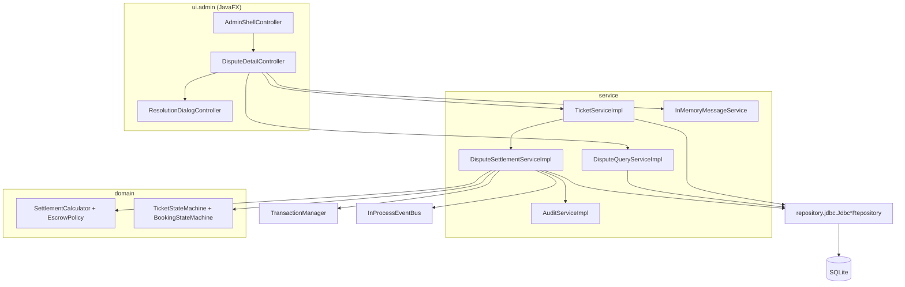
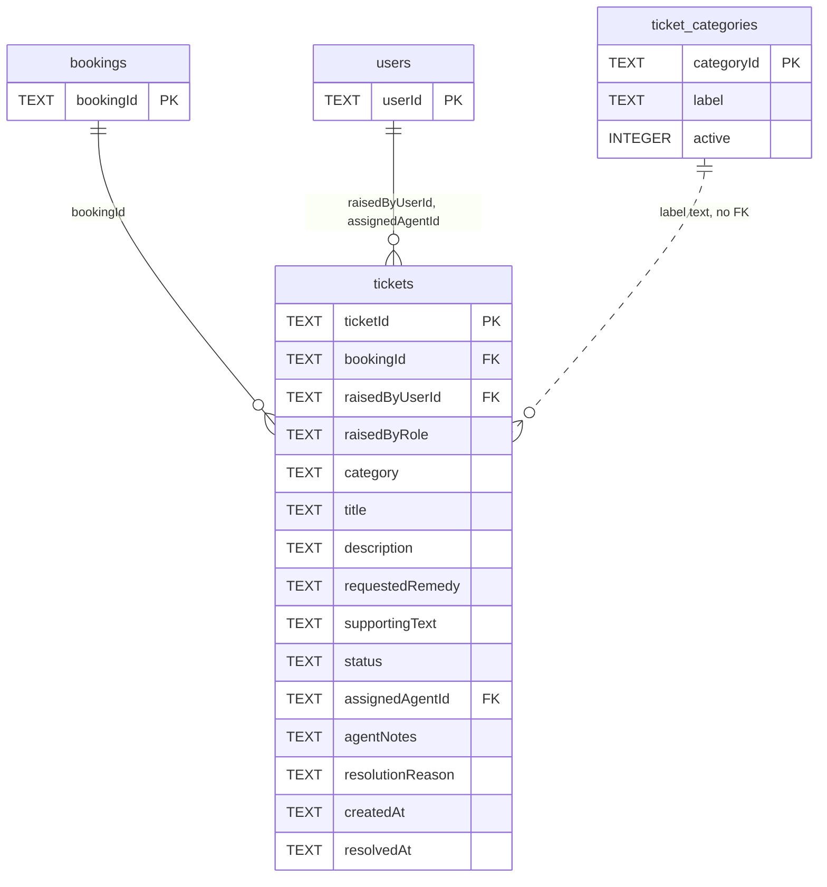
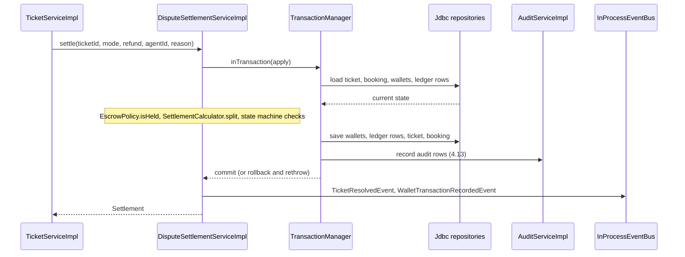
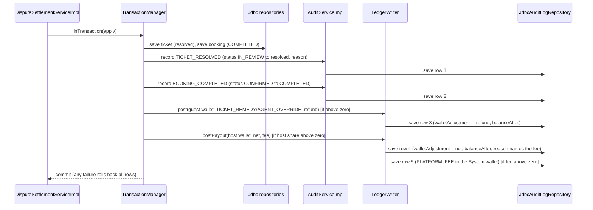
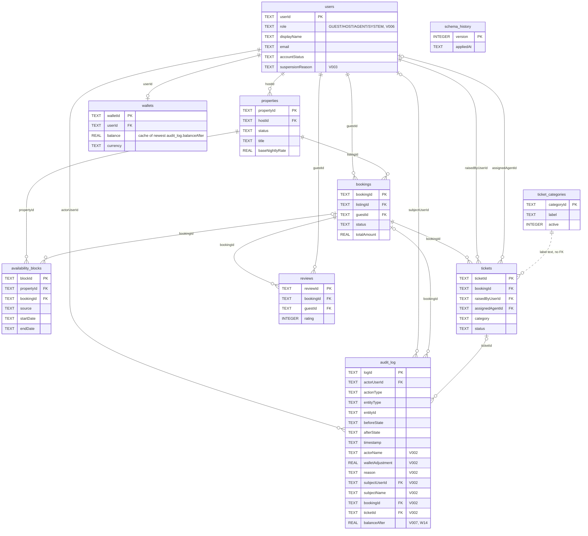
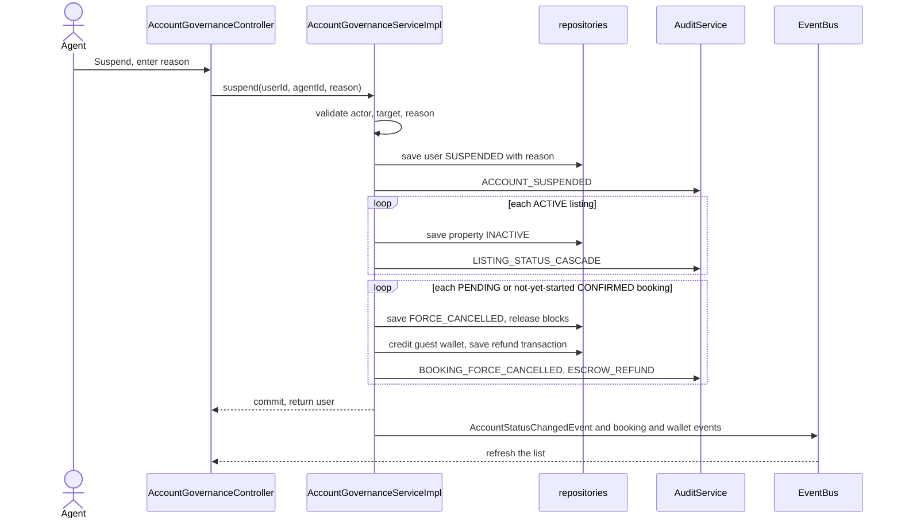
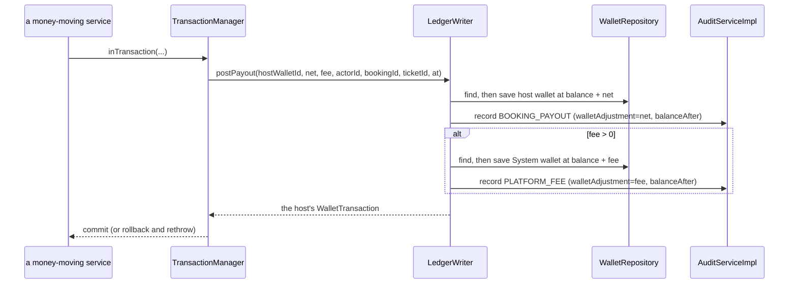

# Developer Guide — SnoozeShare

Handover brief for developers taking over this project. It describes **confirmed** work only and
is updated at checkpoints, so it can lag behind the code. For current status, work in flight, and
what to build next, read [`PROJECT_STATE.md`](https://github.com/CS3227-2610-MP2-SnoozeShare/CS3227-2610-MP2/blob/main/PROJECT_STATE.md) — that is the source of truth.

**Last updated:** 2026-09-29 — covers W1 (Shared Foundation), W6–W9 (Host Listings, Calendar,
Booking Requests, and Host Wallet), W10 (Agent Dispute Resolution), W12 (Platform Audit Trail), and
W14 (Unified Ledger), plus the scope, setup, requirements and glossary they rely on

## Contents

1. [Overview & Scope](#1-overview--scope)
2. [Setting Up](#2-setting-up)
3. [Architecture](#3-architecture)
4. [Components](#4-components)
5. [Requirements](#5-requirements)
6. [Glossary](#6-glossary)
7. [Testing](#7-testing)

---

## 1. Overview & Scope

SnoozeShare is a Java 25 / JavaFX desktop application for short-term property rentals. Guests book
stays, hosts list properties, and support agents settle disputes between them. All money moves
through one wallet and transaction ledger, and the booking price is held in escrow until the stay
and its dispute window are over. It runs as a single process against an embedded SQLite database;
there is no server.

**Target user:** the three roles the app serves — Guest (renter), Host (homeowner) and Support
Agent (platform admin). This guide documents the Support Agent's dispute-resolution tooling and the
platform audit trail that records every change to bookings, tickets, listings and wallets.

**Delivered features**

| Feature | What it is | Section |
|---|---|---|
| F0 (W1) | Shared foundation: mocked auth/registration, role shells, SQLite persistence, wallet ledger, events, audit and session boundaries | [3.1](#31-shared-foundation) |
| F5 (W6) | Host listing management: create/edit, publish, status controls, listing details and metrics | [4.9](#49-host-listing-management-uihostlistings) |
| F6 (W7) | Host calendar: monthly availability, inclusive manual date blocks and removal | [4.10](#410-host-calendar-and-date-overrides-uihostcalendar) |
| F7 (W8) | Host booking requests, approval/rejection messages, earnings previews and guarded completion | [4.11](#411-host-booking-requests-uihostbookings) |
| F8 (W9) | Host wallet management: shared wallet page, transaction statement, escrow summary, top-up and withdrawal modals | [4.12](#412-host-wallet-management-uihostwallet) |
| F9 (W10) | Agent dispute resolution: ticket queue, assign / unassign / notes, settlement of held escrow, ticket categories | [4.1](#41-settlement-domain)–[4.8](#48-agent-ui-uiadmin) |
| F11 (W12) | **Platform Audit Trail:** every change is logged as one typed row, and agents search the log on the Audit Log screen | [4.13](#413-audit-trail) |
| — (W14) | **Unified Ledger:** every wallet movement is a single `audit_log` money row (with the wallet's running balance); the System user gets a real role and wallet and receives the platform's 3% fee | [4.15](#415-unified-ledger-ledgerwriter) |

**Value proposition:** a support agent can take a dispute ticket, read both parties' evidence and
chat, and settle the booking's held escrow between guest and host in one atomic, audited action.
Every payout follows one uniform fee rule, so the ledger always adds up.

**Goals**

- Every dispute ticket ends in a fully settled booking: the whole held escrow reaches the guest, the
  host, or both, and nothing is paid twice.
- The platform fee is taken only from host earnings, never from guest money.
- Any failure during settlement leaves wallets, ledger, ticket and booking exactly as they were.
- Every agent mutation leaves an audit record.
- Every change to a booking, ticket, listing, ticket category or wallet balance leaves audit rows
  that commit or roll back with the change itself, and an agent can search them by user, id, action
  type and date (F11).
- The ticket categories guests choose from are maintained by agents, not by code changes.

**Out of scope**

- **Force Cancel / Force Complete (backlog F9.2.1)** — redundant: accepting a ticket with a full
  refund already cancels in effect, and rejecting it already completes, and both close the ticket (C22).
- **Persistent chat threads** — chat is a general messaging feature owned by a separate Messaging
  workstream (W13). Dispute chat runs on a session-only stand-in until then (C21).
- **The design canvas palette outside the agent screens** — the canvas "Fall Light" tab layout and
  palette apply to the agent shell only; guest and host shells keep `theme.css` (C24).
- **Guest ticket filing and host response screens** — these belong to the guest and host dispute
  features, not to agent dispute resolution.
- **Suspending Agent accounts, and undoing a suspension's side effects** — agents are listed but cannot be
  suspended (including by themselves), and reactivating an account changes only its status and reason:
  cancelled bookings are not reinstated and deactivated listings stay inactive (C34, C36).
- **The auto-complete scheduler** — a booking with an open ticket must be skipped by whatever
  completes bookings after the dispute window (C17), but that scheduler is a separate feature.
- **Clawing money back from a host wallet** — agents only ever settle *held* escrow (C17).
- **Microservices, message brokers, horizontal scaling, JPMS modules, JPA/Hibernate, a separate DTO
  layer** — ruled out for a course-scoped single-process app (`PROJECT_STATE.md` § Known Gaps).

---

## 2. Setting Up

**Prerequisites**

| Tool | Version | Notes |
|---|---|---|
| JDK | 25 | `build.gradle` sets a Java 25 toolchain |
| Gradle | 9.7.1 | Provided by the wrapper (`gradlew`, `gradlew.bat`); nothing to install |
| JavaFX | 25.0.4 | Fetched by the `org.openjfx.javafxplugin` Gradle plugin; no separate SDK |
| SQLite | embedded | `org.xerial:sqlite-jdbc` is a Gradle dependency; the `sqlite3` CLI is only needed to rebuild `db/snoozeshare-mock.db` |

**Build, test, run** (Windows PowerShell; on macOS/Linux use `./gradlew`)

```powershell
.\gradlew build   # compile, checkstyle, tests
.\gradlew test    # tests only
.\gradlew run     # start the app (main class com.snoozeshare.app.Launcher)
```

**Environment variable**

| Name | Purpose | Where to obtain the value |
|---|---|---|
| `SNOOZESHARE_DB_URL` | Optional JDBC URL that points the app at a SQLite file, for example `jdbc:sqlite:build/acceptance.db`. When unset or blank the app uses an empty in-memory database, so nothing survives a restart. | Build it from a copy of the mock DB (below). No secret is involved. |

`Main` reads the variable and passes it to `AppContext.create(String)`.

**Run against a copy of the mock database**

`db/snoozeshare-mock.db` is a committed, pre-populated reference database. Never point the app at
it directly, because the app writes to whatever it opens. Copy it first:

```powershell
Copy-Item db\snoozeshare-mock.db build\acceptance.db -Force
$env:SNOOZESHARE_DB_URL = "jdbc:sqlite:build/acceptance.db"
.\gradlew run
Remove-Item Env:SNOOZESHARE_DB_URL   # when finished
```

The first start records the schema baseline in `schema_history` (D10); the copy needs no other
preparation.

**Mock logins.** Authentication is mocked (`UserService.authenticate(email)`): the login screen takes
an email and checks no credential. The mock agents seeded in [`db/seed-mock-data.sql`](https://github.com/CS3227-2610-MP2-SnoozeShare/CS3227-2610-MP2/blob/main/db/seed-mock-data.sql) are
`amy.tanaka@snoozeshare.test`, `ben.alvarez@snoozeshare.test` and `chen.wu@snoozeshare.test`. Registering
a Host or Agent through the app needs a registration code; those are mock constants in
[`RegistrationCodes`](https://github.com/CS3227-2610-MP2-SnoozeShare/CS3227-2610-MP2/blob/main/src/main/java/com/snoozeshare/config/RegistrationCodes.java).

**Rebuilding the mock database** (only after editing the seed):
`sqlite3 x.db < db/schema.sql` then `sqlite3 x.db < db/seed-mock-data.sql`, and replace
`db/snoozeshare-mock.db`. See the conventions in [Testing](#7-testing) before editing the seed.

---

## 3. Architecture

SnoozeShare is a layered modular monolith in one Gradle module. Dependencies run strictly downward:
`ui` → `service` → `domain` and `repository` → `infra.db`. The diagram shows the dispute-resolution
slice only; `AppContext` wires every box and hands the services to the UI.

### 3.1 Shared foundation

W1 establishes the application boundaries used by every later workstream:

- `Main`/`Launcher` start the native JavaFX application; `SceneRouter` selects the Guest, Host or
  Support Agent shell after authentication.
- `AuthController` provides the combined Login/Register screen. Authentication is intentionally
  mocked by email; registration codes gate Host and Agent registration, while role checks remain in
  the service layer.
- `AppContext` owns the SQLite connection and wires repositories, services, the in-process event bus,
  `SessionContext`, and the role-aware scene router. Controllers receive services through this context
  and do not access JDBC directly.
- `ConnectionFactory`, `MigrationRunner` and `TransactionManager` define the embedded SQLite
  persistence boundary. Repository interfaces isolate domain/service code from `repository.jdbc`.
- `WalletService` provides atomic top-up, withdrawal, balance and statement operations.
  Every wallet-moving service writes through `LedgerWriter` ([4.15](#415-unified-ledger-ledgerwriter)),
  which updates a wallet's `balance` and writes its `audit_log` money row (with the new
  `balanceAfter`) in the same transaction; there is a single ledger, not a separate one.
- `EventBus`/`InProcessEventBus` publish committed domain events after successful transactions, and
  the shared audit contracts provide typed audit records for mutating services.

The foundation is a single-process desktop boundary: there is no server, external authentication,
message broker or distributed transaction coordinator. Package dependency tests protect the key
domain/UI and repository/JDBC boundaries.


```mermaid
flowchart TB
  subgraph UI["ui.admin (JavaFX)"]
    Shell["AdminShellController"]
    Detail["DisputeDetailController"]
    Dialog["ResolutionDialogController"]
  end
  subgraph Service["service"]
    Tickets["TicketServiceImpl"]
    Settle["DisputeSettlementServiceImpl"]
    Query["DisputeQueryServiceImpl"]
    Chat["InMemoryMessageService"]
    Audit["AuditServiceImpl"]
  end
  subgraph Domain["domain"]
    Calc["SettlementCalculator + EscrowPolicy"]
    SM["TicketStateMachine + BookingStateMachine"]
  end
  Repos["repository.jdbc.Jdbc*Repository"]
  Tx["TransactionManager"]
  Bus["InProcessEventBus"]
  DB[("SQLite")]
  Shell --> Detail
  Detail --> Dialog
  Detail --> Tickets
  Detail --> Query
  Detail --> Chat
  Tickets --> Settle
  Settle --> Calc
  Settle --> SM
  Settle --> Tx
  Settle --> Audit
  Settle --> Bus
  Tickets --> Repos
  Query --> Repos
  Settle --> Repos
  Repos --> DB
```

Left out for clarity: `AppContext` wiring, `SessionContext`, the other repositories (booking,
property, user, wallet, wallet transaction), and the queue and category screens, which call the
same services. Every service that changes data (booking, ticket, listing, wallet ledger and category
services as well as settlement) also calls `AuditService`; the Audit Log screen calls its `search`.

**Audit rows are written inside the change's own transaction.** A service calls
`AuditService.record(...)` while its `TransactionManager.inTransaction` block is open. The audit
repository shares the transaction's connection, so the audit rows commit with the change they describe
and roll back with it: a failed change leaves no audit row, and an audit write that fails rolls the
change back. See [4.13](#413-audit-trail).

**One request: an agent resolves a ticket**

1. In `DisputeDetailController` the agent presses Accept, Reject dispute or Manual adjustment.
   `ResolutionDialogController` collects the reason and, where needed, a guest refund amount (with a live
   `ResolutionPreview`), and returns a `ResolutionRequest(mode, guestRefund, reason)`.
2. The controller calls `TicketService.resolve(ticketId, request, agentId)`.
3. `TicketServiceImpl.resolve` checks the caller is an agent, loads the ticket and booking, and
   turns the request into a single guest refund figure: Reject is 0, Manual uses the entered amount,
   and Accept uses the ticket's requested remedy (the whole escrow for `FULL_REFUND`, 0 for
   `HOST_PAYOUT`, the entered amount otherwise). It then calls `DisputeSettlementService.settle`.
4. `DisputeSettlementServiceImpl.settle` requires a non-blank reason and the `AGENT` role, then runs
   the rest inside one `TransactionManager.inTransaction` call.
5. Inside the transaction it checks the preconditions (ticket `IN_REVIEW` and assigned to the caller;
   booking `CONFIRMED`; escrow still held per `EscrowPolicy.isHeld`), splits the escrow with
   `SettlementCalculator.split`, and confirms both state machines allow the transitions.
6. Still inside the transaction it updates the guest wallet and writes a ledger row (if the refund is
   above zero), does the same for the host (if the host share is above zero), saves the ticket as
   resolved, saves the booking as `COMPLETED`, and records one audit row.
7. The transaction commits; any exception rolls everything back and nothing is published.
8. After commit, `TicketResolvedEvent` and one `WalletTransactionRecordedEvent` per ledger row are
   published on the `InProcessEventBus`. `DisputeQueueController` subscribes to the ticket event and
   refreshes its rows.

**Main parts**

- **`ui.admin`** owns the agent screens. It may call `service` interfaces, the domain enums and
  records, and `AppContext` (to reach services). It must not import `repository` or `java.sql`.
- **`service`** owns business rules. `TicketServiceImpl` owns the ticket lifecycle and categories,
  `DisputeSettlementServiceImpl` is the only class that moves money for a dispute, and
  `DisputeQueryServiceImpl` builds read models for the screens.
- **`domain`** is pure Java (no JavaFX, no JDBC): the settlement maths, the escrow-held test and the
  state machines.
- **`AccountGovernanceService`** (`AccountGovernanceServiceImpl`) owns account suspension and reactivation.
  A suspension and its cascade (force-cancelled bookings with refunds, deactivated listings, audit rows) run
  in one transaction, and its events publish after commit ([4.14](#414-account-governance)).
- **`AuditService`** (with `AuditServiceImpl` and `JdbcAuditLogRepository`) owns the audit log: services
  write rows through it, and only the Audit Log screen reads them ([4.13](#413-audit-trail)).
- **`repository.jdbc`** is the only place that touches `java.sql`. **`infra.db`** owns the connection,
  the transaction boundary and migrations.

**Key Decisions**

| Decision | Why | Rejected | Ref |
|---|---|---|---|
| Escrow is held through the 7-day dispute window; a ticket opened in it leaves escrow held and the agent controls settlement. Agent money actions therefore always act on held escrow, with no clawback. | Consistent with the backlog's auto-complete and guest dispute rules; removes the "already paid out" case. | | C17 |
| Every resolution settles the **full** held escrow: guest refund `R` with no fee, host receives `(escrow − R) × 0.97`. Accept is the requested remedy, Reject is `R = 0`, Manual is an agent-set `R`. | The platform cut is only ever taken from host earnings, never from guest money. | The mockup's single-wallet "Adjust wallet" dropdown | C20 |
| A separate `DisputeSettlementService` moves the money, instead of `TransactionService.applyTicketRemedy` / `manualOverride`. | Those single-sided methods cannot express a two-sided full-escrow settlement. Also keeps W10 from editing shared W3 code. | | C16, D5 |
| Ticket chat runs through a general `MessageService` interface; W10 ships a temporary in-memory implementation. | Agent chat is one more participant in a general messaging feature, so it is not owned by dispute resolution. | W10 owning a `ticket_messages` table | C21 |
| No Force Cancel / Force Complete. The agent only settles by resolving a ticket. | Accepting or rejecting already closes the ticket and settles the booking. | Force actions on the detail screen | C22 |
| Resolving a ticket moves the booking `CONFIRMED → COMPLETED`, so `BookingStateMachine` allows `Role.AGENT` on that transition. "Stay ended — escrow held" is a derived display label, not a status. | Bookings in the dispute window are `CONFIRMED`; the label avoids a new status. | | C23 |
| The agent shell uses the design canvas layout (top bar plus tab strip Disputes / Accounts / Audit Log / Categories) and "Fall Light" palette, applied through `agent-theme.css` on the agent scene only. | Operator ruled canvas differences to be defects after a visual check. | Keeping the sidebar and navy theme as a documented deviation (D11) | C24 |
| Internal notes are one persisted free-text field per ticket (`Ticket.agentNotes`), replaced on Save. An assigned agent can Unassign (`IN_REVIEW → OPEN`), which is audited. | Operator preference after a visual check. | A note history list; disabling Assign after assigning | C25 |
| Agents can delete a category, but not while any ticket uses its label; deactivate it instead. Modals get a 50% light-grey scrim, and chat and notes boxes are user-resizable. | Delete is a new capability beyond backlog F9.3.1; protecting used labels keeps ticket history intelligible. | | C26 |
| `UNDER_REVIEW` was renamed `IN_REVIEW` in code, schema, seed data and UI text. | One term across code and UI. | A UI-only rename | C27 |
| The audit log is one row per change: status text in `beforeState` / `afterState`, money in a typed `walletAdjustment` column, plus typed reason and id columns. | The old single `afterState` blob was unreadable and unsearchable. | Two per-side booking rows; keeping JSON in `afterState`; `entityId`-only lookups | C28 |
| **W14 (executed 2026-09-27, confirmed 2026-09-29):** every wallet movement is one `audit_log` money row carrying its wallet's `balanceAfter`, written through `LedgerWriter`. Until then, a movement wrote both a `wallet_transactions` row and an `audit_log` money row in one transaction (historical: D13). | The dual ledger could not be removed without touching W1/W3/W5/W6/W10 money paths, so it was scheduled as its own workstream instead of folded into W12. | Doing the unification inside W12 | C31, C39–C42, D13 |
| **Reversed by W14:** the System user is role `SYSTEM`, status `ACTIVE`, and owns a real wallet that receives a `PLATFORM_FEE` row (via `LedgerWriter.postPayout`) whenever a payout's fee is positive. Until W14, the fee was recorded only as text in the host payout row's reason, with no platform wallet. | Keeps W12 small first; the operator wanted the fee as a real System-account entry, delivered by W14. | A platform wallet in W12 | C30, C39–C42 |
| Reactivate is built although backlog F10.1.1 says only suspend. Agent accounts are listed with no action and cannot be suspended. | The operator wanted suspension to be reversible; agents governing agents was out of scope. | Suspend-only | C34 |
| The suspension reason lives in a nullable `users.suspensionReason` column (migration V003) and is also written to the audit row. | Looking a reason up should not mean reading the audit log, which is not a data store. | A `suspensions` table; deriving the reason from `audit_log` | C34 (reverses the no-column part of C32) |
| Suspending a Guest or Host force-cancels their PENDING and not-yet-started CONFIRMED bookings (check-in after today) with a 100% refund; a Host's ACTIVE listings become INACTIVE. Started and ended stays are untouched, and reactivation restores nothing. | Upcoming stays cannot be honoured by a suspended party; a stay in progress settles through the normal path (W8 auto-completion, or W10 dispute resolution). | Cancelling PENDING only; reinstating on reactivation | C36 |

---

## 4. Components

Dependencies come first. Money is `BigDecimal` at scale 2 with `HALF_UP` throughout.

### 4.1 Settlement domain

**Purpose:** pure rules for dividing a booking's held escrow and deciding whether it is still held.

**API**

- [`SettlementCalculator.split(escrow, guestRefund)`](https://github.com/CS3227-2610-MP2-SnoozeShare/CS3227-2610-MP2/blob/main/src/main/java/com/snoozeshare/domain/settlement/SettlementCalculator.java) returns a `SettlementBreakdown`.
- [`SettlementBreakdown`](https://github.com/CS3227-2610-MP2-SnoozeShare/CS3227-2610-MP2/blob/main/src/main/java/com/snoozeshare/domain/settlement/SettlementBreakdown.java) is a record of `escrow`, `guestRefund`, `hostGross`, `fee`, `hostNet`.
- [`EscrowPolicy.isHeld(bookingTransactions)`](https://github.com/CS3227-2610-MP2-SnoozeShare/CS3227-2610-MP2/blob/main/src/main/java/com/snoozeshare/domain/settlement/EscrowPolicy.java) is true when the list has an `ESCROW_HOLD` row and no `ESCROW_REFUND`, `BOOKING_PAYOUT`, `TICKET_REMEDY` or `AGENT_OVERRIDE` row.

**Depends on:** `domain.enums`, `domain.model.WalletTransaction`, `DomainValidation`. No JavaFX or JDBC.

**Invariants**

- The full escrow is settled: `guestRefund + hostGross = escrow`.
- The 3% fee is `round(hostGross × 0.03, 2, HALF_UP)` and applies to the host share only; the guest refund is fee-free.
- `0 ≤ guestRefund ≤ escrow`, with at most two decimal places; otherwise `IllegalArgumentException`.
- A zero amount produces no ledger row (the caller omits it).

**Deviations:** none.

### 4.2 State machines

**Purpose:** the single legality check for booking and ticket transitions.

**API:** [`BookingStateMachine.canTransition(from, to, role)`](https://github.com/CS3227-2610-MP2-SnoozeShare/CS3227-2610-MP2/blob/main/src/main/java/com/snoozeshare/domain/statemachine/BookingStateMachine.java) and [`TicketStateMachine.canTransition(from, to, role)`](https://github.com/CS3227-2610-MP2-SnoozeShare/CS3227-2610-MP2/blob/main/src/main/java/com/snoozeshare/domain/statemachine/TicketStateMachine.java).

**Depends on:** `domain.enums` only.

**Invariants**

| Machine | Transition | Allowed for |
|---|---|---|
| Booking | `CONFIRMED → COMPLETED` | `HOST` and, for dispute resolution, `AGENT` (C23) |
| Ticket | `OPEN → IN_REVIEW` | `AGENT` |
| Ticket | `IN_REVIEW → OPEN` (Unassign, C25) | `AGENT` |
| Ticket | `IN_REVIEW → RESOLVED_APPROVED` or `RESOLVED_REJECTED` | `AGENT` |
| Ticket | any other, including out of a resolved status | nobody |

Terminal booking statuses never transition. The `FORCE_*` booking statuses remain in the enum and the
booking machine but nothing in the agent UI uses them (C22).

**Deviations:** D9 (the `AGENT` permission on `CONFIRMED → COMPLETED` is an additive change to a shared file).

### 4.3 Persistence: tickets and ticket categories

**Purpose:** store dispute tickets and the category lookup that guests choose from.

**API**

- [`TicketRepository`](https://github.com/CS3227-2610-MP2-SnoozeShare/CS3227-2610-MP2/blob/main/src/main/java/com/snoozeshare/repository/TicketRepository.java) and its adapter [`JdbcTicketRepository`](https://github.com/CS3227-2610-MP2-SnoozeShare/CS3227-2610-MP2/blob/main/src/main/java/com/snoozeshare/repository/jdbc/JdbcTicketRepository.java): `findById`, `findByStatus`, `findQueue(status, assignee, agentId)`, `existsByCategory(label)`, `save` (upsert).
- [`TicketCategoryRepository`](https://github.com/CS3227-2610-MP2-SnoozeShare/CS3227-2610-MP2/blob/main/src/main/java/com/snoozeshare/repository/TicketCategoryRepository.java) and [`JdbcTicketCategoryRepository`](https://github.com/CS3227-2610-MP2-SnoozeShare/CS3227-2610-MP2/blob/main/src/main/java/com/snoozeshare/repository/jdbc/JdbcTicketCategoryRepository.java): `findActive`, `findAll`, `findById`, `labelInUse(label, excludeCategoryId)`, `save`, `deleteById`.
- [`MigrationRunner.migrate`](https://github.com/CS3227-2610-MP2-SnoozeShare/CS3227-2610-MP2/blob/main/src/main/java/com/snoozeshare/infra/db/migration/MigrationRunner.java) applies `V001__foundation.sql`, or adopts a database that already has a `users` table (such as the mock DB) by recording the baseline.


```mermaid
erDiagram
  tickets {
    TEXT ticketId PK
    TEXT bookingId FK
    TEXT raisedByUserId FK
    TEXT raisedByRole
    TEXT category
    TEXT title
    TEXT description
    TEXT requestedRemedy
    TEXT supportingText
    TEXT status
    TEXT assignedAgentId FK
    TEXT agentNotes
    TEXT resolutionReason
    TEXT createdAt
    TEXT resolvedAt
  }
  ticket_categories {
    TEXT categoryId PK
    TEXT label
    INTEGER active
  }
  bookings {
    TEXT bookingId PK
  }
  users {
    TEXT userId PK
  }
  bookings ||--o{ tickets : "bookingId"
  users ||--o{ tickets : "raisedByUserId, assignedAgentId"
  ticket_categories ||..o{ tickets : "label text, no FK"
```

1. `tickets` references the booking it disputes and the users involved (the raiser, and the assigned agent when there is one).
2. `tickets.category` holds the category **label text**, not a foreign key to `ticket_categories`.
3. `ticket_categories.active` is `1` or `0`; deactivating hides a category from new filings only.
4. `bookings` and `users` show only their keys; their other columns are not part of this component.

`raisedByRole` is limited to `GUEST` or `HOST`; `requestedRemedy` to `FULL_REFUND`, `PARTIAL_REFUND`,
`HOST_PAYOUT`, `OTHER`; `status` to `OPEN`, `IN_REVIEW`, `RESOLVED_APPROVED`, `RESOLVED_REJECTED`
(all `CHECK` constraints in [`db/schema.sql`](https://github.com/CS3227-2610-MP2-SnoozeShare/CS3227-2610-MP2/blob/main/db/schema.sql)).

**Depends on:** `infra.db.ConnectionFactory`, `JdbcCodecs` and `RowMappers` (`repository.jdbc.support`), `java.sql` (only here).

**Invariants**

- Only `repository.jdbc.*` imports `java.sql`.
- `findQueue` orders by `createdAt, ticketId`; a null status means every status; `MINE` requires an agent id.
- The ticket upsert only updates `status`, `assignedAgentId`, `agentNotes`, `resolutionReason`, `resolvedAt`; the filing fields are immutable after insert.
- `labelInUse` and `existsByCategory` compare case-insensitively.
- Timestamps are read with `JdbcCodecs.instant`, which needs UTC ISO-8601 text ending in `Z`.

**Deviations:** D8 (label text, so a rename does not rewrite existing tickets); D10 (`MigrationRunner` adoption); D12 (a) (ordering by `createdAt` text means sub-second ties can mis-order) and (b) (adoption only checks for a `users` table). The repository method names above are what the code has; the design spec used slightly different names, and the code wins.

### 4.4 Messaging seam

**Purpose:** let the dispute screens show and post ticket chat before a persistent messaging feature exists.

**API**

- [`MessageService`](https://github.com/CS3227-2610-MP2-SnoozeShare/CS3227-2610-MP2/blob/main/src/main/java/com/snoozeshare/service/MessageService.java): `thread(ticketId, ThreadChannel)` and `post(ticketId, channel, authorId, authorRole, body)`. The contract belongs to the Messaging workstream (W13).
- [`InMemoryMessageService`](https://github.com/CS3227-2610-MP2-SnoozeShare/CS3227-2610-MP2/blob/main/src/main/java/com/snoozeshare/service/impl/InMemoryMessageService.java): a temporary, session-only implementation wired in `AppContext`.
- [`Message`](https://github.com/CS3227-2610-MP2-SnoozeShare/CS3227-2610-MP2/blob/main/src/main/java/com/snoozeshare/domain/model/Message.java) and [`ThreadChannel`](https://github.com/CS3227-2610-MP2-SnoozeShare/CS3227-2610-MP2/blob/main/src/main/java/com/snoozeshare/domain/enums/ThreadChannel.java) (`GUEST`, `HOST`).

**Depends on:** a `Clock`, `DomainValidation`.

**Invariants**

- A non-blank body is required; it is trimmed.
- A guest can post only in the `GUEST` thread and a host only in the `HOST` thread; the agent can post in both.
- Messages live in memory and are lost when the app closes. The interface is the only thing the UI depends on, so a persistent replacement needs no UI change.

**Deviations:** C21 (chat ownership). `TicketService.addHostResponse` is deprecated and throws `UnsupportedOperationException`.

### 4.5 `DisputeSettlementService`

**Purpose:** the only class that moves money when an agent resolves a dispute.

**API:** [`DisputeSettlementService.settle(ticketId, mode, guestRefund, agentId, reason)`](https://github.com/CS3227-2610-MP2-SnoozeShare/CS3227-2610-MP2/blob/main/src/main/java/com/snoozeshare/service/DisputeSettlementService.java), implemented by [`DisputeSettlementServiceImpl`](https://github.com/CS3227-2610-MP2-SnoozeShare/CS3227-2610-MP2/blob/main/src/main/java/com/snoozeshare/service/impl/DisputeSettlementServiceImpl.java). It returns a [`Settlement`](https://github.com/CS3227-2610-MP2-SnoozeShare/CS3227-2610-MP2/blob/main/src/main/java/com/snoozeshare/service/Settlement.java) (ticket, booking, `SettlementBreakdown`, and the guest and host `WalletTransaction`, either of which is `null` when its amount was zero). [`ResolutionMode`](https://github.com/CS3227-2610-MP2-SnoozeShare/CS3227-2610-MP2/blob/main/src/main/java/com/snoozeshare/domain/enums/ResolutionMode.java) is `ACCEPT`, `REJECT` or `MANUAL`.

**Outcome by mode**

| Mode | Guest row | Host row | Ticket ends as |
|---|---|---|---|
| `ACCEPT` | `TICKET_REMEDY` when the refund is above zero | `BOOKING_PAYOUT` when the host share is above zero | `RESOLVED_APPROVED` |
| `REJECT` (refund must be 0) | none | `BOOKING_PAYOUT` for the whole escrow, net of fee | `RESOLVED_REJECTED` |
| `MANUAL` | `AGENT_OVERRIDE` when the refund is above zero | `BOOKING_PAYOUT` when the host share is above zero | `RESOLVED_APPROVED` if the refund is above zero, else `RESOLVED_REJECTED` |

The host row's `amount` is already `hostGross − fee`; when `fee` is positive, `LedgerWriter.postPayout`
also writes a second `PLATFORM_FEE` row crediting the System wallet, in the same transaction
([4.15](#415-unified-ledger-ledgerwriter)). Every row carries `bookingId`, `ticketId` and
`actorUserId = agentId`. `ACCEPT` with a zero refund is allowed only when the ticket's requested
remedy is `HOST_PAYOUT`.


```mermaid
sequenceDiagram
  participant TS as TicketServiceImpl
  participant DS as DisputeSettlementServiceImpl
  participant TM as TransactionManager
  participant R as Jdbc repositories
  participant AU as AuditServiceImpl
  participant EB as InProcessEventBus
  TS->>DS: settle(ticketId, mode, refund, agentId, reason)
  DS->>TM: inTransaction(apply)
  TM->>R: load ticket, booking, wallets, ledger rows
  R-->>TM: current state
  Note over DS: EscrowPolicy.isHeld, SettlementCalculator.split, state machine checks
  TM->>R: save wallets, ledger rows, ticket, booking
  TM->>AU: record audit rows (4.13)
  TM-->>DS: commit (or rollback and rethrow)
  DS->>EB: TicketResolvedEvent, WalletTransactionRecordedEvent
  DS-->>TS: Settlement
```

1. `TicketServiceImpl.resolve` derives the refund and calls `settle`.
2. `settle` validates the reason and the `AGENT` role, then hands the work to `TransactionManager`.
3. Inside the transaction the service loads the current ticket, booking, both wallets and the booking's ledger rows.
4. It applies the preconditions and the split (shown as a note; the domain classes are pure).
5. It writes wallets, ledger rows, ticket and booking, then the audit rows (ticket, booking and the wallet sides; see [4.13](#413-audit-trail)), all on the same connection.
6. Commit makes everything visible at once; any exception rolls back all of it.
7. Only after commit are events published, then the `Settlement` is returned.

**Depends on:** `TicketRepository`, `BookingRepository`, `PropertyRepository`, `UserRepository`, `WalletRepository`, `LedgerWriter`, `LedgerRepository`, `AuditService`, `EventBus`, `TransactionManager`, the settlement domain (4.1) and state machines (4.2).

**Invariants**

- Preconditions are checked inside the transaction: caller is an agent; ticket is `IN_REVIEW` and assigned to the caller; booking is `CONFIRMED`; escrow is held (`LedgerRepository.entriesForBooking` plus `EscrowPolicy`); `0 ≤ refund ≤ escrow`; reason non-blank. Any failure writes nothing.
- One transaction covers both wallet balances, their money (and platform-fee) rows, the ticket, the booking (`COMPLETED`, `completedAt`) and its status audit rows. Events are published only after commit.
- Every wallet write goes through `LedgerWriter.post` / `postPayout` ([4.15](#415-unified-ledger-ledgerwriter)); the service never touches `WalletRepository.save` itself.
- A wallet's `balance` changes only in the same transaction as the money row that explains it, and that row carries the wallet's new `balanceAfter`.

**Deviations:** D5 (a dedicated service instead of `TransactionService.applyTicketRemedy` / `manualOverride`); D12 (c) (guest and host wallets are read once, so a self-booking where guest and host are the same user would lose an update), (d) (resolved by W12: `AuditServiceImpl` now stamps the record's own time, or the injected clock), (e) (the escrow amount comes from `booking.totalAmount()`, not the `ESCROW_HOLD` row).

### 4.6 `TicketService`

**Purpose:** the ticket lifecycle for agents (queue, assign, unassign, notes, resolve) and category administration.

**API:** [`TicketService`](https://github.com/CS3227-2610-MP2-SnoozeShare/CS3227-2610-MP2/blob/main/src/main/java/com/snoozeshare/service/TicketService.java), implemented by [`TicketServiceImpl`](https://github.com/CS3227-2610-MP2-SnoozeShare/CS3227-2610-MP2/blob/main/src/main/java/com/snoozeshare/service/impl/TicketServiceImpl.java).

| Method | Behaviour |
|---|---|
| `queueForAgent(status, AssigneeFilter, agentId)` | Tickets oldest first; `AssigneeFilter` is `ALL`, `UNASSIGNED` or `MINE`; a null status means all. |
| `assignToMe(ticketId, agentId)` | `OPEN → IN_REVIEW`, sets the assignee. Fails if not `OPEN` or already assigned to another agent. |
| `unassign(ticketId, agentId)` | `IN_REVIEW → OPEN`, clears the assignee; only the assigned agent. |
| `saveNotes(ticketId, notes, agentId)` | Replaces the single internal-notes text; only while `IN_REVIEW` and assigned to the caller. |
| `resolve(ticketId, ResolutionRequest, agentId)` | Derives the refund and delegates to `DisputeSettlementService.settle`. |
| `listCategories()` / `listAllCategories()` | Active categories only (what guests see) / all categories. |
| `createCategory`, `renameCategory`, `setCategoryActive` | Label must be non-blank and unique, case-insensitively. |
| `deleteCategory(categoryId, agentId)` | Permanent delete; refused while any ticket uses the label (deactivate instead). |

`ResolutionRequest` is a record of `mode`, `guestRefund` and `reason`; the refund is required for
`MANUAL` and for `ACCEPT` of a `PARTIAL_REFUND` or `OTHER` request, and is ignored or derived otherwise.
`fileTicket` validates the guest, booking eligibility and active category before creating a ticket;
`addHostResponse` is deprecated (see 4.4).

**Depends on:** `TicketRepository`, `TicketCategoryRepository`, `BookingRepository`, `UserRepository`, `DisputeSettlementService`, `AuditService`, `AuthorizationService`, `TicketStateMachine`.

**Invariants**

- Every method requires the `AGENT` role; role is enforced here, not only in the UI.
- Every mutation makes exactly one `AuditService.record` call: `TICKET_ASSIGNED`, `TICKET_UNASSIGNED`, `TICKET_NOTE_SAVED`, `TICKET_CATEGORY_CREATED`, `TICKET_CATEGORY_RENAMED`, `TICKET_CATEGORY_TOGGLED`, `TICKET_CATEGORY_DELETED` (renamed from `CATEGORY_DELETED`, D17); resolution is audited by the settlement service as `TICKET_RESOLVED`.
- Ticket status changes go through `TicketStateMachine`.

**Deviations:** the design spec described notes as an appended, attributed list (`addAgentNote`); the built behaviour is one replaceable text (`saveNotes`, C25). `unassign` (C25) and `deleteCategory` (C26) were added after the spec. `tickets.category` is label text (D8).

### 4.7 `DisputeQueryService`

**Purpose:** read models for the agent screens, so controllers never touch repositories.

**API:** [`DisputeQueryService`](https://github.com/CS3227-2610-MP2-SnoozeShare/CS3227-2610-MP2/blob/main/src/main/java/com/snoozeshare/service/DisputeQueryService.java) with `queue(status, assignee, agentId)` returning [`DisputeSummary`](https://github.com/CS3227-2610-MP2-SnoozeShare/CS3227-2610-MP2/blob/main/src/main/java/com/snoozeshare/service/DisputeSummary.java) rows and `detail(ticketId)` returning a [`DisputeDetail`](https://github.com/CS3227-2610-MP2-SnoozeShare/CS3227-2610-MP2/blob/main/src/main/java/com/snoozeshare/service/DisputeDetail.java), implemented by [`DisputeQueryServiceImpl`](https://github.com/CS3227-2610-MP2-SnoozeShare/CS3227-2610-MP2/blob/main/src/main/java/com/snoozeshare/service/impl/DisputeQueryServiceImpl.java).

- `DisputeSummary`: ticket id and label, title, category, listing title, guest, host and assignee names, status, `createdAt`.
- `DisputeDetail`: the ticket, listing and dates, party names, booking status, `escrowAmount`, `escrowHeld` and `phaseLabel`.

**Depends on:** `TicketRepository`, `BookingRepository`, `PropertyRepository`, `UserRepository`, `LedgerRepository`, `EscrowPolicy`, a `Clock`.

**Invariants**

- The ticket label is `#` plus the last four characters of the ticket id (for example `#0002`).
- `phaseLabel` is derived, never stored: "Stay ended — escrow held" (booking `CONFIRMED`, end date before today, escrow held), "Upcoming", "Active", or the prettified booking status otherwise (C23).
- Read-only: it never writes.

**Deviations:** none.

### 4.8 Agent UI (`ui.admin`)

**Purpose:** the Support Agent's shell with the Disputes, Accounts, Audit Log and Categories screens.

**API**

| File | Role |
|---|---|
| [`AdminShellController`](https://github.com/CS3227-2610-MP2-SnoozeShare/CS3227-2610-MP2/blob/main/src/main/java/com/snoozeshare/ui/admin/AdminShellController.java) + [`admin-shell.fxml`](https://github.com/CS3227-2610-MP2-SnoozeShare/CS3227-2610-MP2/blob/main/src/main/resources/com/snoozeshare/ui/admin/admin-shell.fxml) | Top bar and tab strip (Disputes, Accounts, Audit Log, Categories); swaps the centre view and disposes the live views (queue, accounts) when it does. |
| [`DisputeQueueController`](https://github.com/CS3227-2610-MP2-SnoozeShare/CS3227-2610-MP2/blob/main/src/main/java/com/snoozeshare/ui/admin/tickets/DisputeQueueController.java) + `dispute-queue.fxml` | Oldest-first table, All / Unassigned / Mine chips, status filter (All statuses, Open, In review, Approved, Rejected), "N unassigned" badge; refreshes on `TicketResolvedEvent`. |
| [`DisputeDetailController`](https://github.com/CS3227-2610-MP2-SnoozeShare/CS3227-2610-MP2/blob/main/src/main/java/com/snoozeshare/ui/admin/tickets/DisputeDetailController.java) + `dispute-detail.fxml` | Booking summary, guest and host chat panes, one notes field, Assign to me / Unassign, Accept, Reject dispute, Manual adjustment. The Accept label follows the ticket raiser ("remedy guest" or "remedy host"). |
| [`ResolutionDialogController`](https://github.com/CS3227-2610-MP2-SnoozeShare/CS3227-2610-MP2/blob/main/src/main/java/com/snoozeshare/ui/admin/tickets/ResolutionDialogController.java) + `resolution-dialog.fxml` | One dialog for the three modes; reason required; live preview. |
| [`ResolutionPreview`](https://github.com/CS3227-2610-MP2-SnoozeShare/CS3227-2610-MP2/blob/main/src/main/java/com/snoozeshare/ui/admin/tickets/ResolutionPreview.java) | Pure logic that turns a refund text into a preview or an error message, using `SettlementCalculator`. |
| [`CategoryAdminController`](https://github.com/CS3227-2610-MP2-SnoozeShare/CS3227-2610-MP2/blob/main/src/main/java/com/snoozeshare/ui/admin/categories/CategoryAdminController.java), [`CategoryDialogController`](https://github.com/CS3227-2610-MP2-SnoozeShare/CS3227-2610-MP2/blob/main/src/main/java/com/snoozeshare/ui/admin/categories/CategoryDialogController.java) | Category table with active toggle, Add and Edit modals; Edit has Delete. |
| [`AuditLogController`](https://github.com/CS3227-2610-MP2-SnoozeShare/CS3227-2610-MP2/blob/main/src/main/java/com/snoozeshare/ui/admin/audit/AuditLogController.java) + [`audit-log.fxml`](https://github.com/CS3227-2610-MP2-SnoozeShare/CS3227-2610-MP2/blob/main/src/main/resources/com/snoozeshare/ui/admin/audit/audit-log.fxml) | The read-only Audit Log screen (below). |
| [`AccountGovernanceController`](https://github.com/CS3227-2610-MP2-SnoozeShare/CS3227-2610-MP2/blob/main/src/main/java/com/snoozeshare/ui/admin/accounts/AccountGovernanceController.java) + [`account-governance.fxml`](https://github.com/CS3227-2610-MP2-SnoozeShare/CS3227-2610-MP2/blob/main/src/main/resources/com/snoozeshare/ui/admin/accounts/account-governance.fxml) | The Accounts screen (below). Refreshes on `AccountStatusChangedEvent`. |
| [`SuspensionDialogController`](https://github.com/CS3227-2610-MP2-SnoozeShare/CS3227-2610-MP2/blob/main/src/main/java/com/snoozeshare/ui/admin/accounts/SuspensionDialogController.java) + `suspension-dialog.fxml` | The Suspend and Reactivate modal (one card, two modes). |
| [`AccountText`](https://github.com/CS3227-2610-MP2-SnoozeShare/CS3227-2610-MP2/blob/main/src/main/java/com/snoozeshare/ui/admin/accounts/AccountText.java), [`AccountSearch`](https://github.com/CS3227-2610-MP2-SnoozeShare/CS3227-2610-MP2/blob/main/src/main/java/com/snoozeshare/ui/admin/accounts/AccountSearch.java) | Pure helpers: role and status labels, `DD MMM YYYY` dates, and the live-search match. |
| [`MultiSelectMenu`](https://github.com/CS3227-2610-MP2-SnoozeShare/CS3227-2610-MP2/blob/main/src/main/java/com/snoozeshare/ui/admin/audit/MultiSelectMenu.java) | The action-type dropdown with a check per option; an empty selection means every action. |
| [`AgentModal`](https://github.com/CS3227-2610-MP2-SnoozeShare/CS3227-2610-MP2/blob/main/src/main/java/com/snoozeshare/ui/admin/AgentModal.java) | Shared modal shell: transparent undecorated stage plus a light-grey scrim over the owner window. |
| [`HeightGrip`](https://github.com/CS3227-2610-MP2-SnoozeShare/CS3227-2610-MP2/blob/main/src/main/java/com/snoozeshare/ui/admin/HeightGrip.java) | Drag handle that resizes chat panes together and the notes box, within min and max heights. |
| [`agent-theme.css`](https://github.com/CS3227-2610-MP2-SnoozeShare/CS3227-2610-MP2/blob/main/src/main/resources/com/snoozeshare/ui/admin/agent-theme.css) | The "Fall Light" palette, loaded on the agent scene root only. |

**Audit Log screen (W12).** A read-only table over `AuditService.search` ([4.13](#413-audit-trail)).

- **Filters:** one **Search** box (user name, or booking / ticket / user id; Enter applies it), an **Action type** multi-select (empty means all actions), separate **From** and **To** date pickers, an **Apply filters** button and a red-outline **Clear** button. Filters take effect only on Apply (selecting does not auto-apply); Apply refuses a From date after the To date. The date pickers and the multi-select popup are styled after the design board's Date picker component in `agent-theme.css` (C33).
- **Table:** TIMESTAMP (`dd/MM/yyyy HH:mm`), ACTOR (a user, can be the System user), ACTION TYPE (a coloured pill), TARGET (the row's one direct entity — a user's name, or `Property/Booking/Ticket/Category #last4`; a wallet movement targets the wallet owner, so a `PLATFORM_FEE` row shows `SnoozeShare System`; a ticket resolution names only the ticket, not its booking — replaced the last-four-character `REF` column, W14 follow-up), STATUS (`Before → After`, or one status, or a dash), REASON and AMOUNT (signed, for example `+SGD 175.00`), 200 rows at a time with a Load more button. Rows are not clickable: they get the queue's grey hover but keep the default cursor.

**Accounts screen (W11).** Every Guest, Host and Agent account except the System user, in a fixed-header table. The System user is hidden here (it cannot be governed) but does appear as an actor or target on the Audit Log screen above.

- **Columns:** DISPLAY NAME, EMAIL, ROLE, JOINED (`DD MMM YYYY`), STATUS (an ACTIVE or SUSPENDED pill, with `Reason: …` under a suspended one) and ACTION. Guests and Hosts get a red-outline **Suspend** or a **Reactivate** button of the same size; Agent rows show a dash and no action.
- **Search:** one live box (no Apply button) that matches the displayed display name, email, role, joined text and status. It does not search the reason.
- **Modals:** both use `AgentModal` with the 50% scrim. The banner shows the display name large, the email below it and `Role · joined DD MMM YYYY`; Suspend is red and Reactivate is green (#40680C). A reason is required, and Confirm stays disabled until one is typed.
- **Sizing:** the scroll area takes its height from the laid-out rows, so a filtered list that fits shows without a scroll bar instead of being squeezed.

- **Fixed headers on every agent table:** in the dispute queue, the audit log, the accounts list and the categories list only the rows scroll; the header stays put and the slim scroll bar starts below it. The queue and audit tables size to their rows but shrink to the window and scroll internally; the categories list scrolls inside a `ScrollPane` under its fixed header.

**Depends on:** `AppContext` (to reach `TicketService`, `DisputeQueryService`, `MessageService`, `AuditService`, `AccountGovernanceService`, `SessionContext`, `EventBus`), the domain enums and records, and `NavShellController` from the shared shell.

**Invariants**

- `ui.*` must not import `com.snoozeshare.repository` or `java.sql`; `LayerDependencyTest` and `UiDependencyTest` check this. Controllers reach data only through service interfaces. (The rule against importing `infra.db` is a convention; the tests do not check it.)
- The dialog requires a reason and a refund within the escrow, and the services enforce the same rules again.
- There is no Force Cancel / Force Complete control anywhere (C22).
- Subscriptions are released in `DisputeQueueController.dispose()` and `AccountGovernanceController.dispose()` when the shell navigates away.

**Deviations:** D18 (the JavaFX date-picker popup cannot be restyled to match the board exactly: it keeps two month/year spinners and mixed-case weekday names, has no unavailable-day state, and the categories header columns sit about 5px left of the rows while the scroll bar shows); the design board's Audit Log artboard is older than the built screen (it has User ID / Booking ID inputs and no REF/TARGET column) and C29 supersedes it. D7 (the design canvas shows Force actions, a newest-first queue, an "Adjust wallet" dropdown and no Accept amount field; the built screens follow C22, oldest-first per F9.1.1, and the refund-amount field of C20); D11 (a sidebar shell) was superseded by C24, so the built shell is the tab strip; D12 (f) (`DisputeDetailController.load()` still calls `render()` outside the error handler). The dispute screens use the `SGD` currency label (C10).

### 4.9 Host listing management (`ui.host.listings`)

**Purpose:** hosts create, edit, publish, deactivate and inspect their own properties.

| File | Role |
|---|---|
| [`HostListingsController`](https://github.com/CS3227-2610-MP2-SnoozeShare/CS3227-2610-MP2/blob/main/src/main/java/com/snoozeshare/ui/host/listings/HostListingsController.java) + `host-listings.fxml` | Host-scoped listing dashboard with listing cards, booking/rating metrics, Active/Inactive control, Edit and calendar entry. |
| [`HostListingFormController`](https://github.com/CS3227-2610-MP2-SnoozeShare/CS3227-2610-MP2/blob/main/src/main/java/com/snoozeshare/ui/host/listings/HostListingFormController.java) + `host-listing-form.fxml` | Shared create/edit form for details, location, capacity, pricing and amenities; validates checkout after check-in. |
| [`HostListingDetailController`](https://github.com/CS3227-2610-MP2-SnoozeShare/CS3227-2610-MP2/blob/main/src/main/java/com/snoozeshare/ui/host/listings/HostListingDetailController.java) + `host-listing-detail.fxml` | Host-facing detail page with Back, Edit and booking-calendar actions. |
| [`ListingServiceImpl`](https://github.com/CS3227-2610-MP2-SnoozeShare/CS3227-2610-MP2/blob/main/src/main/java/com/snoozeshare/service/impl/ListingServiceImpl.java) | Enforces host ownership, validates listing data, persists changes and emits audit records. |
| [`ListingMetricsService`](https://github.com/CS3227-2610-MP2-SnoozeShare/CS3227-2610-MP2/blob/main/src/main/java/com/snoozeshare/service/ListingMetricsService.java) | Supplies booking, occupancy and earnings metrics with zero-value fallbacks. |

Listings are host-owned and mutations are enforced in the service layer. New listings are active by
default; status and property values remain enum/database values even when the UI renders readable labels.

### 4.10 Host calendar and date overrides (`ui.host.calendar`)

**Purpose:** hosts inspect one listing's monthly availability and create or remove manual blocks.

[`HostCalendarController`](https://github.com/CS3227-2610-MP2-SnoozeShare/CS3227-2610-MP2/blob/main/src/main/java/com/snoozeshare/ui/host/calendar/HostCalendarController.java)
uses `AvailabilityService` to load the selected month, navigate months, add inclusive single-date or
range blocks, and remove existing manual blocks. Booking blocks and manual blocks are shown with separate
visual treatments. Validation rejects an end date before the start date and overlapping unavailable dates.
The calendar is listing-scoped and does not bypass booking availability checks.

### 4.11 Host booking requests (`ui.host.bookings`)

**Purpose:** hosts review pending requests, decide them, inspect earnings and see request history.

[`HostBookingsController`](https://github.com/CS3227-2610-MP2-SnoozeShare/CS3227-2610-MP2/blob/main/src/main/java/com/snoozeshare/ui/host/bookings/HostBookingsController.java)
uses `BookingService.pendingRequestRowsFor` and `historyRowsFor` for host-scoped projections. The request
table includes guest, dates, nights, amount, estimated net earnings and guest rating. Approve and reject
decisions use the shared host modal style; rejection may include the persisted `hostDecisionMessage`.
Rejected requests refund held escrow and approved requests retain it until completion or dispute settlement.
`BookingService.completeEligibleBookings()` guards automatic completion so bookings with open or in-review
tickets remain held.

The host-facing slices share the same service and repository boundaries as the agent slice: controllers
receive capabilities through `AppContext` and do not access repositories directly. `TransactionService`
settles eligible completion payouts, while `DisputeSettlementService` owns agent-directed two-sided
settlement of held escrow.

### 4.12 Host wallet management (`ui.host.wallet`)

**Purpose:** provide hosts with the same native wallet capability and visual language as the guest wallet,
while keeping the presentation owned by the common wallet module.

The shared [`WalletDashboardController`](https://github.com/CS3227-2610-MP2-SnoozeShare/CS3227-2610-MP2/blob/main/src/main/java/com/snoozeshare/ui/common/wallet/WalletDashboardController.java)
and `wallet-dashboard.fxml` are loaded by both Guest and Host shells. The page includes the available
balance, the amount currently held in escrow for pending bookings, top-up and withdrawal actions, and a
five-column transaction statement. The statement uses compact type badges, aligned date/related/amount/
balance columns, dollar-formatted values, and green/red directional styling for credits and deductions.

`WalletActionDialogController` and `WalletModal` provide native application modals for top-up and
withdrawal. Preset top-up amounts fill the input, the withdrawal link fills the full available balance,
and both dialogs use full-window scrims with content-sized modal cards, outlined Cancel actions, and
contained confirmation actions. Wallet-specific presentation lives in `wallet.css`; it does not depend on
agent styling.

**Escrow display.** The balance hint is computed from wallet transactions: escrow holds are grouped by
booking and reduced by releasing transactions, so the displayed amount reflects currently held escrow
rather than a fixed placeholder. The `audit_log` money rows are the source of balance truth (the unified
ledger, [4.15](#415-unified-ledger-ledgerwriter)); `wallets.balance` is a cache of the owner's newest
`balanceAfter`.

**Tests:** `WalletDashboardControllerTest`, `WalletUiStructureTest`, `WalletLedgerTest` and the wallet
modal tests cover the statement layout, dynamic escrow copy, all wallet transaction types, preset/full-
balance actions, and FXML/CSS wiring.

### 4.13 Audit trail

**Purpose:** record every change to bookings, tickets, listings, ticket categories and wallet balances as typed, searchable rows, and let a support agent search them.

**API**

- [`AuditService`](https://github.com/CS3227-2610-MP2-SnoozeShare/CS3227-2610-MP2/blob/main/src/main/java/com/snoozeshare/service/AuditService.java), implemented by [`AuditServiceImpl`](https://github.com/CS3227-2610-MP2-SnoozeShare/CS3227-2610-MP2/blob/main/src/main/java/com/snoozeshare/service/impl/AuditServiceImpl.java): `record(AuditRecord)` and `search(AuditFilter, limit, offset)`. `AuditService.SYSTEM_ACTOR_ID` is the seeded System user. (W14 removed the `recordWalletTransaction` helper: every money row now goes through `LedgerWriter`, [4.15](#415-unified-ledger-ledgerwriter).)
- [`AuditRecord`](https://github.com/CS3227-2610-MP2-SnoozeShare/CS3227-2610-MP2/blob/main/src/main/java/com/snoozeshare/service/AuditRecord.java) is what a service asks to write; [`AuditLogEntry`](https://github.com/CS3227-2610-MP2-SnoozeShare/CS3227-2610-MP2/blob/main/src/main/java/com/snoozeshare/domain/model/AuditLogEntry.java) is what a search returns; [`AuditAction`](https://github.com/CS3227-2610-MP2-SnoozeShare/CS3227-2610-MP2/blob/main/src/main/java/com/snoozeshare/domain/enums/AuditAction.java) is the enum of action types (the column stores the constant's name).
- [`AuditFilter`](https://github.com/CS3227-2610-MP2-SnoozeShare/CS3227-2610-MP2/blob/main/src/main/java/com/snoozeshare/service/AuditFilter.java) (`text`, a set of `actions`, inclusive `from` / `to` dates) is the screen's filter; [`AuditCriteria`](https://github.com/CS3227-2610-MP2-SnoozeShare/CS3227-2610-MP2/blob/main/src/main/java/com/snoozeshare/repository/AuditCriteria.java) is its repository form. [`AuditLogRepository`](https://github.com/CS3227-2610-MP2-SnoozeShare/CS3227-2610-MP2/blob/main/src/main/java/com/snoozeshare/repository/AuditLogRepository.java) and [`JdbcAuditLogRepository`](https://github.com/CS3227-2610-MP2-SnoozeShare/CS3227-2610-MP2/blob/main/src/main/java/com/snoozeshare/repository/jdbc/JdbcAuditLogRepository.java) store and query rows.
- The schema change is [`V002__audit_trail.sql`](https://github.com/CS3227-2610-MP2-SnoozeShare/CS3227-2610-MP2/blob/main/src/main/resources/db/migration/V002__audit_trail.sql), which is also reflected in [`db/schema.sql`](https://github.com/CS3227-2610-MP2-SnoozeShare/CS3227-2610-MP2/blob/main/db/schema.sql).

**Column layout.** One row is one change. Migration V002 added seven columns to the V001 `audit_log` table:

| Column | Holds |
|---|---|
| `logId`, `actorUserId`, `actionType`, `entityType`, `entityId`, `timestamp` | From V001: the row id, who acted, the `AuditAction` name, what kind of entity changed and its id, and the time (`Instant.toString()` text). |
| `beforeState`, `afterState` | **Status text only** (for example `IN_REVIEW`, `RESOLVED_APPROVED`); null means none. Never money and never JSON. |
| `walletAdjustment` | The **signed** amount that actually moved in one wallet (a payout net of fee, a negative escrow hold). Set on wallet rows only. |
| `reason` | Free text: the agent's resolution reason, or a note such as "Payout net of 3% platform fee (...)". |
| `ticketId`, `bookingId` | The ticket and booking the row concerns, so a search by either id finds every related row. |
| `subjectUserId` | The user the change happened to (the guest whose wallet moved, the ticket raiser), as opposed to the actor. |
| `actorName`, `subjectName` | Snapshots of the display names taken when the row was written. They are null on rows written before V002. |
| `balanceAfter` | The wallet's balance immediately after this row's `walletAdjustment`. Set on money rows only; added by V007 (W14). |

**`AuditRecord` and its builder.** `AuditRecord`'s constructor rejects a record that carries both a wallet adjustment and a status, so a
row is never both, and a `balanceAfter` is rejected unless `walletAdjustment` is also set. Services build
records with `AuditRecord.builder(actorId, action, entityType, entityId)` and chain
`.status(before, after)` (enums are stored by name), `.wallet(amount, balanceAfter)`, `.reason(text)`
(blank becomes null), `.subject(userId)`, `.booking(id)`, `.ticket(id)` and `.at(instant)`; `build()`
returns the record. Money rows reuse the wallet transaction type's name (`AuditAction.forWallet`), so
`TOP_UP`, `ESCROW_HOLD`, `BOOKING_PAYOUT`, `PLATFORM_FEE` and the like name the row's `actionType`. Since
W14 the `audit_log` row **is** the ledger row — there is no separate ledger table to also appear in
([4.15](#415-unified-ledger-ledgerwriter)).

**Writing rows.** `AuditServiceImpl.record` fills `actorName` and `subjectName` from the user table
("Unknown user" if the id has no user) and stamps the row with the record's `at`, or the injected `Clock` when none is set. The
audit repository is built on the same connection as the caller's transaction (`AppContext`), so the row commits or
rolls back with the change.

| Source | Rows written |
|---|---|
| `BookingServiceImpl` | `BOOKING_REQUESTED` plus an `ESCROW_HOLD` money row; `BOOKING_CONFIRMED` or `BOOKING_REJECTED` (a rejection adds an `ESCROW_REFUND` row); `BOOKING_CANCELLED_BY_GUEST` plus its refund row |
| `DisputeSettlementServiceImpl` | `TICKET_RESOLVED`, `BOOKING_COMPLETED`, and the guest and host money rows (see the sequence diagram below) |
| `TicketServiceImpl` | `TICKET_ASSIGNED`, `TICKET_UNASSIGNED`, `TICKET_NOTE_SAVED`, `TICKET_CATEGORY_CREATED`, `TICKET_CATEGORY_RENAMED`, `TICKET_CATEGORY_TOGGLED`, `TICKET_CATEGORY_DELETED` |
| `ListingServiceImpl` | `LISTING_CREATED`, `LISTING_UPDATED`, `LISTING_STATUS_CHANGED` |
| `AccountGovernanceServiceImpl` | `ACCOUNT_SUSPENDED` or `ACCOUNT_REACTIVATED`; on a suspension also `LISTING_STATUS_CASCADE`, `BOOKING_FORCE_CANCELLED` and an `ESCROW_REFUND` money row per affected booking, all through `LedgerWriter` ([4.14](#414-account-governance)) |
| `LedgerWriter` (used by `WalletServiceImpl`, `TransactionServiceImpl`, `BookingServiceImpl`, `DisputeSettlementServiceImpl` and `AccountGovernanceServiceImpl`) | Every money row: `TOP_UP`, `WITHDRAWAL`, `ESCROW_HOLD`, `ESCROW_REFUND`, `BOOKING_PAYOUT`, `TICKET_REMEDY`, `AGENT_OVERRIDE`, and `PLATFORM_FEE` (the System wallet's cut of a payout, written by `postPayout` only when the fee is positive) — see [4.15](#415-unified-ledger-ledgerwriter) |

The `AuditAction` values `BOOKING_CANCELLED_BY_HOST` and `TICKET_OPENED` exist, but no service writes them yet (see
[Known Limitations](#known-limitations)).

The System user (`SnoozeShare System`, role `SYSTEM`, status `ACTIVE` since W14) is seeded so
system-initiated rows can keep `actorUserId` non-null, and since W14 also owns a real wallet that
receives a `PLATFORM_FEE` row on every payout whose fee is positive. It is hidden from the Accounts
screen, and cannot sign in, be suspended, or be governed ([4.15](#415-unified-ledger-ledgerwriter)).

**Single ledger (W14).** A wallet movement writes exactly one `audit_log` money row — the row itself
carries the wallet's new `balanceAfter` — through `LedgerWriter`. Before W14, a movement wrote both a
`wallet_transactions` row and this `audit_log` row in one transaction (D13); `wallet_transactions` was
dropped once the fold shipped ([4.15](#415-unified-ledger-ledgerwriter)).

**Searching.** `AuditServiceImpl.search(filter, limit, offset)` returns rows newest first. Filters combine with AND.

- **Text** (one search box) matches in two ways, OR-ed. First, the text is resolved to user ids by a case-insensitive contains-match on `users.displayName` and `users.email` and on the `actorName` / `subjectName` snapshots, and the log is queried by those ids as actor or subject; because it goes by id, a user's rows are still found after a rename. Second, if the text is an **id fragment** (4 to 36 hex characters and dashes) it is also matched as a substring against `entityId`, `bookingId`, `ticketId`, `actorUserId` and `subjectUserId`. Text that resolves to nothing returns nothing.
- **Action types** are a set: rows must have one of the chosen actions (an `IN` clause with bound parameters); an empty set means every action.
- **Dates** are inclusive. `From` is the start of that day and `To` runs to the end of that day, both in the clock's zone, compared to the whole second.
- **Ordering** is `timestamp DESC`, then `rowid DESC` within an identical timestamp, so the last row written by an action is on top, like the rest of the list (operator change 2026-09-27).
- **Paging** is `limit` and `offset`. The screen asks for 200 rows at a time and shows a Load more button while a full page came back.

**Sequence diagram: a dispute resolution writes its audit rows.** All are written inside the
settlement transaction. A zero-amount side writes no wallet row, so a resolution writes three or four rows.


```mermaid
sequenceDiagram
  participant DS as DisputeSettlementServiceImpl
  participant TM as TransactionManager
  participant R as Jdbc repositories
  participant AU as AuditServiceImpl
  participant LW as LedgerWriter
  participant AL as JdbcAuditLogRepository
  DS->>TM: inTransaction(apply)
  TM->>R: save ticket (resolved), save booking (COMPLETED)
  TM->>AU: record TICKET_RESOLVED (status IN_REVIEW to resolved, reason)
  AU->>AL: save row 1
  TM->>AU: record BOOKING_COMPLETED (status CONFIRMED to COMPLETED)
  AU->>AL: save row 2
  TM->>LW: post(guest wallet, TICKET_REMEDY/AGENT_OVERRIDE, refund) [if above zero]
  LW->>AL: save row 3 (walletAdjustment = refund, balanceAfter)
  TM->>LW: postPayout(host wallet, net, fee) [if host share above zero]
  LW->>AL: save row 4 (walletAdjustment = net, balanceAfter, reason names the fee)
  LW->>AL: save row 5 (PLATFORM_FEE to the System wallet) [if fee above zero]
  TM-->>DS: commit (any failure rolls back all rows)
```

1. `settle` opens one transaction and saves the resolved ticket and the `COMPLETED` booking.
2. Row 1 is the ticket status change (`beforeState` is `IN_REVIEW`, `afterState` the resolved status) with the agent's reason.
3. Row 2 is the booking status change to `COMPLETED`, with the reason "Escrow settled by ticket resolution".
4. Row 3 is the guest wallet: `LedgerWriter.post` writes `walletAdjustment` as the refund (with the wallet's new `balanceAfter`); skipped when the refund is zero.
5. Row 4 is the host wallet: `LedgerWriter.postPayout` writes `walletAdjustment` as the payout **net** of the 3% fee, `reason` reads "Payout net of 3% platform fee (...)"; skipped when the host share is zero.
6. Row 5 is the System wallet's `PLATFORM_FEE` row, written by the same `postPayout` call, only when the fee is positive ([4.15](#415-unified-ledger-ledgerwriter)).
7. Rows 1 and 2 record status only; rows 3–5 record money only, each with its own `balanceAfter`. All carry the ticket and booking ids.
8. If anything throws, the transaction rolls back and no audit row survives.

**Data model: the whole schema.** Every table in [`db/schema.sql`](https://github.com/CS3227-2610-MP2-SnoozeShare/CS3227-2610-MP2/blob/main/db/schema.sql). To stay readable, each table other than `audit_log` lists only its keys and the columns that matter here; the full column lists are in the schema file, and [4.3](#43-persistence-tickets-and-ticket-categories) has the full `tickets` and `ticket_categories`. `audit_log` shows all its columns, with the V002 and V007 additions marked. `wallet_transactions` no longer exists — W14's V008 dropped it ([4.15](#415-unified-ledger-ledgerwriter)).


```mermaid
erDiagram
  users {
    TEXT userId PK
    TEXT role "GUEST/HOST/AGENT/SYSTEM, V006"
    TEXT displayName
    TEXT email
    TEXT accountStatus
    TEXT suspensionReason "V003"
  }
  properties {
    TEXT propertyId PK
    TEXT hostId FK
    TEXT status
    TEXT title
    REAL baseNightlyRate
  }
  availability_blocks {
    TEXT blockId PK
    TEXT propertyId FK
    TEXT bookingId FK
    TEXT source
    TEXT startDate
    TEXT endDate
  }
  bookings {
    TEXT bookingId PK
    TEXT listingId FK
    TEXT guestId FK
    TEXT status
    REAL totalAmount
  }
  wallets {
    TEXT walletId PK
    TEXT userId FK
    REAL balance "cache of newest audit_log.balanceAfter"
    TEXT currency
  }
  ticket_categories {
    TEXT categoryId PK
    TEXT label
    INTEGER active
  }
  tickets {
    TEXT ticketId PK
    TEXT bookingId FK
    TEXT raisedByUserId FK
    TEXT assignedAgentId FK
    TEXT category
    TEXT status
  }
  reviews {
    TEXT reviewId PK
    TEXT bookingId FK
    TEXT guestId FK
    INTEGER rating
  }
  audit_log {
    TEXT logId PK
    TEXT actorUserId FK
    TEXT actionType
    TEXT entityType
    TEXT entityId
    TEXT beforeState
    TEXT afterState
    TEXT timestamp
    TEXT actorName "V002"
    REAL walletAdjustment "V002"
    TEXT reason "V002"
    TEXT subjectUserId FK "V002"
    TEXT subjectName "V002"
    TEXT bookingId FK "V002"
    TEXT ticketId FK "V002"
    REAL balanceAfter "V007, W14"
  }
  schema_history {
    INTEGER version PK
    TEXT appliedAt
  }
  users ||--o{ properties : "hostId"
  users ||--o{ bookings : "guestId"
  properties ||--o{ bookings : "listingId"
  properties ||--o{ availability_blocks : "propertyId"
  bookings |o--o{ availability_blocks : "bookingId"
  users ||--o| wallets : "userId"
  bookings ||--o{ tickets : "bookingId"
  users ||--o{ tickets : "raisedByUserId"
  users |o--o{ tickets : "assignedAgentId"
  ticket_categories ||..o{ tickets : "label text, no FK"
  bookings ||--o{ reviews : "bookingId"
  users ||--o{ reviews : "guestId"
  users ||--o{ audit_log : "actorUserId"
  users |o--o{ audit_log : "subjectUserId"
  bookings |o--o{ audit_log : "bookingId"
  tickets |o--o{ audit_log : "ticketId"
```

1. `users` is the hub: it owns properties (as host), bookings (as guest), one wallet, tickets (as raiser and as assigned agent), reviews and audit rows. Since W14 one seeded row (the System user) has role `SYSTEM` and its own wallet.
2. `wallets` holds one cached `balance` per user; `audit_log` is the single money ledger (a row with a `walletAdjustment` and a `balanceAfter`), through which every top-up, withdrawal, escrow hold/refund, payout, ticket remedy, override and platform fee is written (W14, [4.15](#415-unified-ledger-ledgerwriter)). Only `actorUserId` is required among `audit_log`'s foreign keys; `entityId` is not a foreign key because it can name a money row, property, category, booking or ticket.
3. `ticket_categories` has no foreign key: a ticket stores the category's label text (D8).
4. `schema_history` is migration bookkeeping and has no relationships. Left out for size: each table's remaining columns, the `CHECK` constraints and the indexes.

**Depends on:** `UserRepository` (names), `AuditLogRepository`, a `Clock`, and the caller's `TransactionManager` transaction.

**Invariants**

- Audit rows are written only by services, on the caller's connection, inside the change's own transaction. A rolled-back change leaves no row; tests cover the rollback (`WalletLedgerAuditTest`, `DisputeSettlementAtomicityTest`, using `FailingAuditService`).
- One row is one change: a row has a status change or a wallet adjustment, never both (`AuditRecord`).
- A ticket resolution writes the rows in the sequence diagram above; the guest and host wallet rows are skipped when their amount is zero.
- Names are snapshotted onto each row when written, and text searches go by user id, so renames do not hide history.
- A money row's `balanceAfter` is written in the same `LedgerWriter` call as its `walletAdjustment`; `wallets.balance` is a cache of the owner's newest `balanceAfter`, checked by `LedgerConservationTest` ([4.15](#415-unified-ledger-ledgerwriter)).

**Deviations:** D13 (dual-write until W14 — historical, see [4.15](#415-unified-ledger-ledgerwriter)); D15 (the committed mock DB ships already migrated — now at `schema_history` v8 after W14, see 4.15; the System user has existed since V002, and `db/schema.sql` creates `schema_history`); D16 (seed `availability_blocks` ids were remapped to valid hex); D17 (the spec's `AuditService.query` became `search`, `CATEGORY_DELETED` became `TICKET_CATEGORY_DELETED`, and the search was corrected to a contains-match with a 4-character minimum for id fragments; the Audit Log's `REF` column was later replaced by `TARGET`, W14 follow-up).

### 4.14 Account governance

**Purpose:** let a support agent suspend and reactivate Guest and Host accounts, cascading a suspension to the account's upcoming bookings and listings atomically.

**API**

- [`AccountGovernanceService`](https://github.com/CS3227-2610-MP2-SnoozeShare/CS3227-2610-MP2/blob/main/src/main/java/com/snoozeshare/service/AccountGovernanceService.java), implemented by [`AccountGovernanceServiceImpl`](https://github.com/CS3227-2610-MP2-SnoozeShare/CS3227-2610-MP2/blob/main/src/main/java/com/snoozeshare/service/impl/AccountGovernanceServiceImpl.java): `listAccounts()` (every account except the System user, as [`AccountSummary`](https://github.com/CS3227-2610-MP2-SnoozeShare/CS3227-2610-MP2/blob/main/src/main/java/com/snoozeshare/service/AccountSummary.java) read models), `suspend(userId, agentId, reason)` and `reactivate(userId, agentId, reason)`.
- `AccountStatusChangedEvent` ([`infra/events/events`](https://github.com/CS3227-2610-MP2-SnoozeShare/CS3227-2610-MP2/blob/main/src/main/java/com/snoozeshare/infra/events/events/AccountStatusChangedEvent.java)) is published after commit; the Accounts screen refreshes on it.
- Supporting changes: `User.suspensionReason`, `UserRepository.findAll`, `BookingRepository.findByListing`, migration [`V003__suspension_reason.sql`](https://github.com/CS3227-2610-MP2-SnoozeShare/CS3227-2610-MP2/blob/main/src/main/resources/db/migration/V003__suspension_reason.sql), and a guard in `BookingServiceImpl.submitRequest` that refuses a guest whose account is not ACTIVE. The old `UserService.suspend` stub was removed (D19).

**Depends on:** the user, booking, property, wallet, transaction and availability repositories, `TransactionManager`, `AuditService`, the event bus and `BookingStateMachine`.

**Suspension flow** (a Host; a Guest skips the listing step and uses `findByGuest`):


```mermaid
sequenceDiagram
  actor Agent
  participant UI as AccountGovernanceController
  participant Svc as AccountGovernanceServiceImpl
  participant Repos as repositories
  participant Audit as AuditService
  participant Bus as EventBus
  Agent->>UI: Suspend, enter reason
  UI->>Svc: suspend(userId, agentId, reason)
  Svc->>Svc: validate actor, target, reason
  Svc->>Repos: save user SUSPENDED with reason
  Svc->>Audit: ACCOUNT_SUSPENDED
  loop each ACTIVE listing
    Svc->>Repos: save property INACTIVE
    Svc->>Audit: LISTING_STATUS_CASCADE
  end
  loop each PENDING or not-yet-started CONFIRMED booking
    Svc->>Repos: save FORCE_CANCELLED, release blocks
    Svc->>Repos: credit guest wallet, save refund transaction
    Svc->>Audit: BOOKING_FORCE_CANCELLED, ESCROW_REFUND
  end
  Svc-->>UI: commit, return user
  Svc->>Bus: AccountStatusChangedEvent and booking and wallet events
  Bus-->>UI: refresh the list
```

1. The service checks that the actor is an active Agent, the target is a Guest or Host, the reason is not blank, and the target is ACTIVE (SUSPENDED for reactivation).
2. Inside one `TransactionManager.inTransaction` call it saves the user with the new status and reason and writes `ACCOUNT_SUSPENDED`.
3. For a Host it sets each ACTIVE listing INACTIVE and writes `LISTING_STATUS_CASCADE` rows.
4. For each affected booking it moves the booking to `FORCE_CANCELLED` through `BookingStateMachine` (the agent role), releases the availability blocks and refunds the full booking amount to the guest's wallet with a ledger row, writing `BOOKING_FORCE_CANCELLED` and `ESCROW_REFUND` rows.
5. Any failure rolls back everything and publishes nothing; after commit the events are published.

**Invariants**

- Affected bookings are PENDING, or CONFIRMED with a check-in date after today (the injected clock's zone). A stay that has started, including one checking in today, or ended is untouched (C36).
- Reactivation only sets the status to ACTIVE, clears the reason and writes `ACCOUNT_REACTIVATED`. Nothing is restored (C34).
- Wallet writes go through `LedgerWriter.post`, on the same transaction as the suspension (W14); `LedgerWriter` never opens its own transaction, so this and every other caller wrap it in theirs ([4.15](#415-unified-ledger-ledgerwriter)).
- Money is `BigDecimal`; tests compare it with `compareTo` because SQLite returns `REAL`.

**Deviations:** D19 (`UserService.suspend` removed); D20 (the System user is hidden from the list; `BookingServiceImpl` gained a `UserRepository` parameter; the cascade refunds `totalAmount` without checking for an `ESCROW_HOLD` row).

### 4.15 Unified ledger (`LedgerWriter`)

**Purpose:** one place that changes a wallet balance, so every money-moving service writes the same
shape of row and a balance can never drift from the rows that explain it.

**API**

- [`LedgerWriter`](https://github.com/CS3227-2610-MP2-SnoozeShare/CS3227-2610-MP2/blob/main/src/main/java/com/snoozeshare/service/impl/LedgerWriter.java): `post(walletId, type, amount, actorId, bookingId, ticketId, reason, at)` moves a signed `amount` in one wallet and writes its `audit_log` money row; `postPayout(hostWalletId, net, fee, actorId, bookingId, ticketId, at)` writes the host's `BOOKING_PAYOUT` row (`net`) and, only when `fee` is positive, a second `PLATFORM_FEE` row crediting the System wallet. Neither method opens a transaction — the caller wraps the call (and the state change it belongs with) in its own `TransactionManager.inTransaction` block.
- [`LedgerRepository`](https://github.com/CS3227-2610-MP2-SnoozeShare/CS3227-2610-MP2/blob/main/src/main/java/com/snoozeshare/repository/LedgerRepository.java), implemented by [`JdbcLedgerRepository`](https://github.com/CS3227-2610-MP2-SnoozeShare/CS3227-2610-MP2/blob/main/src/main/java/com/snoozeshare/repository/jdbc/JdbcLedgerRepository.java): `entriesForWallet(walletId)` and `entriesForBooking(bookingId)`, both newest-row-order reads of the money rows in `audit_log` (joined to `wallets` on `subjectUserId`). `EscrowPolicy` and the wallet statement/escrow-hint screens read through this instead of a dedicated ledger table.
- [`WalletTransactionType`](https://github.com/CS3227-2610-MP2-SnoozeShare/CS3227-2610-MP2/blob/main/src/main/java/com/snoozeshare/domain/enums/WalletTransactionType.java) gained `PLATFORM_FEE` alongside `TOP_UP`, `WITHDRAWAL`, `ESCROW_HOLD`, `ESCROW_REFUND`, `BOOKING_PAYOUT`, `TICKET_REMEDY` and `AGENT_OVERRIDE`.
- Callers: `WalletServiceImpl`, `TransactionServiceImpl`, `BookingServiceImpl`, `DisputeSettlementServiceImpl` ([4.5](#45-disputesettlementservice)) and `AccountGovernanceServiceImpl` ([4.14](#414-account-governance)). `WalletService` and `TransactionService` stay separate interfaces (C3, narrowed rather than removed by C39) — both now write through `LedgerWriter` instead of each hand-rolling "read wallet, add, save, insert ledger row".

**Migrations:** three, run in order by `MigrationRunner`.

| Migration | Does |
|---|---|
| `V006__system_role.sql` | Rebuilds `users` (SQLite cannot `ALTER` a `CHECK` constraint) so `role` allows `SYSTEM`; sets the seeded System user's row to `role = 'SYSTEM'`, `accountStatus = 'ACTIVE'`. Run with foreign keys off, restored after (a SQLite requirement for rebuilding a referenced table). |
| `V007__unified_ledger.sql` | Adds `audit_log.balanceAfter`; backfills it on existing money rows from `wallet_transactions`; inserts any legacy `wallet_transactions` row that was never audited; creates the System wallet; backfills one legacy `PLATFORM_FEE` row per historical payout that had a fee, with a running System balance; adds `idx_audit_money` on `(subjectUserId, walletAdjustment)`. |
| `V008__drop_wallet_transactions.sql` | Drops `wallet_transactions` now that V007 copied everything into `audit_log`. |

**Sequence diagram: a host payout with a fee.**


```mermaid
sequenceDiagram
  participant Svc as a money-moving service
  participant TM as TransactionManager
  participant LW as LedgerWriter
  participant WR as WalletRepository
  participant AU as AuditServiceImpl
  Svc->>TM: inTransaction(...)
  TM->>LW: postPayout(hostWalletId, net, fee, actorId, bookingId, ticketId, at)
  LW->>WR: find, then save host wallet at balance + net
  LW->>AU: record BOOKING_PAYOUT (walletAdjustment=net, balanceAfter)
  alt fee > 0
    LW->>WR: find, then save System wallet at balance + fee
    LW->>AU: record PLATFORM_FEE (walletAdjustment=fee, balanceAfter)
  end
  LW-->>TM: the host's WalletTransaction
  TM-->>Svc: commit (or rollback and rethrow)
```

**Invariants**

- `LedgerWriter` never opens a transaction; every caller wraps it in the `TransactionManager` transaction that also carries the booking/ticket/account state change, so a balance change, its money row and the triggering state change commit or roll back together.
- A wallet's `balance` always equals its newest `audit_log` row's `balanceAfter` for that wallet, and each row's `balanceAfter` equals the previous balance plus that row's `walletAdjustment` — the conservation invariant `LedgerConservationTest` checks against the mock DB and against a real settlement.
- `postPayout` writes the `PLATFORM_FEE` row only when `fee` is positive, so a zero-fee payout (for example a $0.01 listing) never posts a zero-amount row — `LedgerWriter.post` rejects a zero amount outright.
- Listing rates must be positive with at most 2 decimal places (`ListingServiceImpl`, `HostListingFormController`), so a booking's settlement always nets to a positive host payout or an explicit zero handled by the caller (C42; a $0 listing is forbidden, not supported end to end).

**Deviations:** the spec's single ledger-fold migration was split into V006/V007/V008 so code could stop writing `wallet_transactions` (V006, V007) before it was dropped (V008), which the plan anticipated. C42: Task 8's review found a $0 or sub-cent listing rate crashed settlement once `LedgerWriter` rejected its zero-amount payout; the operator chose to forbid degenerate rates rather than build free-stay support end to end.

---

## 5. Requirements

### Functional Requirements

Numbering follows [`ProductBacklog.md`](/product-backlog/).

- **F9.1.1** The system shows an active dispute ticket queue sorted oldest first, with guest and host evidence and their chat threads. Filters: All / Unassigned / Mine, and by status. Chat threads are session-only for now (see Known Limitations).
- **F9.1.2** Agents can accept (assign to themselves) ticket requests, unassign, and record internal notes on a ticket.
- **F9.2.1** *Dropped.* Force Cancel / Force Complete was removed as redundant with ticket accept and reject (C22).
- **F9.2.2** Agents resolve a dispute by settling the booking's full held escrow: accept the requested remedy, reject the ticket (host paid in full net of the 3% fee), or apply a manual adjustment (Full refund, Full payout, or a custom split). Guest refunds carry no fee. Resolution completes the booking (`CONFIRMED → COMPLETED`).
- **F9.3.1** Agents can create, rename, activate/deactivate and delete the ticket categories guests choose from. Delete is beyond the backlog wording (C26): it is refused when any ticket was filed under the label, in which case the category must be deactivated instead.
- **F10.1.1** Agents suspend a Guest or Host account with a required reason; the reason is stored on the user and in the audit log. **Reactivate** is built beyond the backlog wording (C34). Agent accounts are listed but cannot be suspended.
- **F10.1.2** Suspending an account force-cancels its PENDING and not-yet-started CONFIRMED bookings with a 100% refund and deactivates a Host's ACTIVE listings, atomically (C36). A suspended guest cannot submit a booking request.
- **F11.1.1** The system provides an audit logging service and table and logs every booking state transition. Built as one typed row per change (4.13). Booking cancellation by a host is not written yet (see Known Limitations).
- **F11.1.2** Audit logging covers wallet transactions (hold, refund, payout, remedy, override, top-up, withdrawal, and the platform fee) and ticket resolutions.
- **F11.1.3** Agents filter the audit log with one search (user name, or user / booking / ticket id), a set of action types, and a From and To date (4.8, 4.13).
- **F12.1.1** A `MessageService` gives each dispute ticket a guest-to-agent and a host-to-agent thread. *(planned)*
- **F12.1.2** Messages persist, each party reads only its own thread, and the agent reads both. *(planned)*

### Non-Functional Requirements

- **NFR1** Settlement is atomic: wallet balances, ledger rows, ticket, booking and audit rows commit together or not at all, and no event is published on failure.
- **NFR2** Money is `BigDecimal` at scale 2 with `HALF_UP` rounding. The platform fee is 3% of the host share, rounded once, and no fee is taken from guest money.
- **NFR3** Every mutating agent action makes an audit record; each change is one row, so a ticket resolution writes several (4.13).
- **NFR4** Layering: `ui.*` imports no `repository.*` and no `java.sql`; only `repository.jdbc.*` imports `java.sql`; `domain` imports no JavaFX or `java.sql`.
- **NFR5** Ticket and booking status changes go through `TicketStateMachine` and `BookingStateMachine`; a resolved ticket cannot be settled again.
- **NFR6** Ledger integrity: for each wallet, `balance` equals its newest `audit_log` money row's `balanceAfter`, and each row's `balanceAfter` equals the previous balance plus that row's `walletAdjustment` ([4.15](#415-unified-ledger-ledgerwriter)).
- **NFR7** Role checks run in the service layer, not only in the UI.
- **NFR8** Domain events are published only after the database transaction commits.

### Known Limitations

- **Chat is not persisted** — dispute chat uses `InMemoryMessageService` until the Messaging workstream supplies a persistent `MessageService` (C21).
- **Host ticket-filing screens** — guests can file tickets through the delivered guest flow; a dedicated host response screen remains outside the current scope.
- **Category renames do not update existing tickets** — `tickets.category` stores label text (D8).
- **Suspension refund is not checked against an escrow hold** — the cascade credits the booking's `totalAmount` without reading an `ESCROW_HOLD` row, as `BookingServiceImpl` does (D20).
- **A stay checking in today counts as started** — a CONFIRMED booking with today's check-in is not cancelled by a suspension (C36). A suspended guest's in-progress stay is paid out by the normal settlement (`BookingService.completeEligibleBookings()`, run at startup, skipping bookings with an open ticket) or by an agent through a dispute ticket.
- **Ticket categories are a lookup table, not a rules engine** — revisit only if workflow branching is needed (`PROJECT_STATE.md` § Known Gaps).
- **Authentication is mocked** — login takes an email and checks no credential; role separation is enforced in service code (`PROJECT_STATE.md` § Known Gaps).
- **Single-process only** — no multi-instance or distributed deployment support (`PROJECT_STATE.md` § Known Gaps).
- **Sub-second ticket ordering** — the queue orders by `createdAt` text, so tickets created in the same second can mis-order (D12 (a)).
- **Migration adoption is shallow** — `MigrationRunner` adopts any database that has a `users` table (D12 (b)).
- **Self-booking loses an update** — if guest and host are the same user, settlement reads that wallet once (D12 (c)).
- **Escrow amount is `booking.totalAmount()`** — settlement does not read it from the `ESCROW_HOLD` row (D12 (e)).
- **A load error can escape the detail screen's handler** — `DisputeDetailController.load()` calls `render()` outside the error handler (D12 (f)).
- **Audit rows within one second can misorder** — timestamps are `Instant.toString()` text with a variable fractional part, so rows in the same second can sort out of order under `ORDER BY timestamp DESC, rowid DESC` (`PROJECT_STATE.md` § Known Gaps).
- **Some audit rows are not emitted yet** — no service writes `BOOKING_CANCELLED_BY_HOST` or `TICKET_OPENED`, and W7 host calendar blocks are not audited.
- **Audit Log calendar differs from the board** — the date-picker popup keeps two month/year spinners and mixed-case weekday names, and the categories header sits about 5px left of its rows while the scroll bar shows (D18).
- **The Audit Log screen has not been run in the real app** — plan Task 10 Step 3 was not performed; FX smoke and snapshot tests cover the flows, and the manual check below remains (D14).
- **Auto-complete must skip open tickets** — W10 does not implement the scheduler; whatever completes bookings after the dispute window must leave a booking alone while its ticket is `OPEN` or `IN_REVIEW` (C17).

---

## 6. Glossary

- **Agent (Support Agent):** the platform-admin role. Agents triage tickets, settle disputes and maintain ticket categories.
- **AGENT_OVERRIDE:** wallet transaction type written on the guest's wallet for a manual adjustment that refunds the guest.
- **Action type:** the kind of change an audit row records, one `AuditAction` constant (for example `TICKET_RESOLVED`, `ESCROW_HOLD`). The Audit Log filters by a set of them.
- **Audit row / audit log:** the `audit_log` table. One row is one change, either a status change (`beforeState` / `afterState`) or a wallet adjustment, never both.
- **BOOKING_PAYOUT:** wallet transaction type for money released to the host. Its `amount` is already net of the 3% fee; when the fee is positive, `LedgerWriter.postPayout` also writes a `PLATFORM_FEE` row crediting the System wallet (W14).
- **Cascade (suspension):** the bookings and listings changed in the same transaction as a suspension: force-cancelled bookings with refunds and a Host's deactivated listings.
- **Dispute window:** the 7 days after checkout during which escrow stays held and a ticket can be opened (C17).
- **Dual-write (historical):** until W14, a wallet movement wrote both a `wallet_transactions` row and an `audit_log` money row in one transaction (D13). W14 folded them into the one `audit_log` row and dropped `wallet_transactions` ([4.15](#415-unified-ledger-ledgerwriter)).
- **Escrow:** the booking's `totalAmount`, held out of the guest's wallet from booking until it is refunded or paid out. It is "held" while a booking has an `ESCROW_HOLD` row and no releasing row.
- **ESCROW_HOLD:** wallet transaction type that records the escrow being taken from the guest.
- **FORCE_CANCELLED:** booking status set by an agent-role transition; today only the suspension cascade produces it.
- **Guest refund (`R`):** the part of the escrow returned to the guest; never charged a fee.
- **Host share:** `escrow − R`, the gross amount owed to the host before the 3% fee.
- **Id fragment:** four or more hex characters (and dashes) typed in the audit search, matched anywhere in an entity, booking, ticket, actor or subject id.
- **IN_REVIEW:** ticket status after an agent has taken it (renamed from `UNDER_REVIEW`, C27). An agent can return it to `OPEN` by unassigning.
- **Ledger:** the money rows of `audit_log` — a row with a `walletAdjustment` and a `balanceAfter` — written through `LedgerWriter` (W14, [4.15](#415-unified-ledger-ledgerwriter)). Each wallet's `balance` is a cache of its owner's newest `balanceAfter`; before W14 the ledger was a separate `wallet_transactions` table (see Dual-write).
- **LedgerWriter:** the single class that changes a wallet balance; every money-moving service calls `post` or `postPayout` on it, inside its own transaction ([4.15](#415-unified-ledger-ledgerwriter)).
- **Manual adjustment:** an agent-chosen split of the held escrow (Full refund, Full payout or Custom), independent of the remedy the ticket asked for.
- **Mock DB:** the committed reference database `db/snoozeshare-mock.db`, built from `db/schema.sql` and `db/seed-mock-data.sql`.
- **PLATFORM_FEE:** wallet transaction type crediting the System wallet with the platform's 3% cut of a host payout; written by `LedgerWriter.postPayout` only when the fee is positive (W14).
- **Reactivation:** returning a SUSPENDED Guest or Host to ACTIVE and clearing the reason. It restores no bookings or listings.
- **Remedy:** what the ticket raiser asks for: `FULL_REFUND`, `PARTIAL_REFUND`, `HOST_PAYOUT` or `OTHER`.
- **Scrim:** the light-grey 50% overlay laid over the agent window while a modal dialog is open (C26).
- **Settlement:** dividing a booking's whole held escrow between guest and host in one atomic transaction when an agent resolves a ticket.
- **Subject user:** the user an audited change happened to (for example the guest whose wallet moved), as opposed to the actor who caused it.
- **Suspension reason:** the required text an agent enters when suspending or reactivating; stored in `users.suspensionReason` while suspended and in the audit row.
- **System user:** the seeded, non-loginable account (`AuditService.SYSTEM_ACTOR_ID`), role `SYSTEM` and status `ACTIVE` since W14, that owns system-initiated audit rows and a real wallet receiving the platform's `PLATFORM_FEE` cut. Hidden from the Accounts screen; cannot sign in, be suspended, or be governed.
- **TARGET:** the Audit Log column naming the row's one direct entity — a user's name, or `Property/Booking/Ticket/Category #last4` — dropping any related record (a ticket resolution names only the ticket, not its booking). Replaced the last-four-character `REF` column (W14 follow-up).
- **Ticket:** a dispute filed against a booking by its guest or host. It moves `OPEN → IN_REVIEW → RESOLVED_APPROVED` or `RESOLVED_REJECTED`.
- **Ticket category:** an admin-managed label (`ticket_categories`) offered to guests when they file a ticket. A ticket stores the label text.
- **TICKET_REMEDY:** wallet transaction type written on the guest's wallet when an agent accepts a ticket and refunds the guest.
- **W14 (unified ledger):** folded `wallet_transactions` into `audit_log` (a money row now carries `balanceAfter`) and gave the System user a real role and wallet that receives a `PLATFORM_FEE` row per payout. Built and operator-confirmed 2026-09-29 (C31, C39–C45; [4.15](#415-unified-ledger-ledgerwriter)).
- **Wallet:** a user's balance holder (`wallets`, one per user, `balance` a cache); each change is one `audit_log` money row, written by `LedgerWriter` (W14).

---

## 7. Testing

### Automated

| Command | What it does |
|---|---|
| `.\gradlew test` | Runs every suite below (JUnit 5, TestFX on the classpath). |
| `.\gradlew build` | Compiles, runs checkstyle (`config/checkstyle/checkstyle.xml`), then all tests. |
| `.\gradlew test --tests "com.snoozeshare.service.DisputeFlowEndToEndTest"` | Runs one class. A pattern such as `--tests "*DisputeSettlement*"` also works. |

No credentials or external services are needed. Database-backed suites copy `db/snoozeshare-mock.db`
to a temporary directory, so the committed file is never modified. Test run times were not
measured for this guide.

| Suite | Covers |
|---|---|
| Foundation and architecture: `W1FoundationIntegrationTest`, `DatabaseBootstrapTest`, `LayerDependencyTest`, `UiDependencyTest` | SQLite bootstrap/migrations, repository and service wiring, wallet provisioning, role routing and the enforced package boundaries. |
| Unit: `SettlementCalculatorTest`, `EscrowPolicyTest`, `StateMachineTest`, `AgentCompletionTest`, `ResolutionPreviewTest`, `HeightGripTest` | Split maths and fee rounding, the escrow-held rule, every legal and illegal transition per role, live preview text, drag-height bounds. |
| Service, fakes: `TicketServiceTest`, `TicketServiceCategoryTest`, `InMemoryMessageServiceTest` | Queue order and filters, assign / unassign / notes rules, category rules including delete-when-used, chat posting rules. |
| Mock-DB integration: `DisputeSettlementServiceTest`, `TicketServiceIntegrationTest`, `DisputeQueryServiceTest`, `JdbcTicketRepositoryTest`, `JdbcTicketCategoryRepositoryTest` | Exact ledger rows, wallet balances, ticket and booking end states, audit content, precondition rejections that leave the database unchanged, repository round trips, read models. Built on [`MockDbFixture`](https://github.com/CS3227-2610-MP2-SnoozeShare/CS3227-2610-MP2/blob/main/src/test/java/com/snoozeshare/testsupport/MockDbFixture.java) with `MockIds` and `SettlementFixtures`. |
| Audit trail, unit and service: `AuditActionTest`, `AuditRecordTest`, `AuditServiceTest`, `WalletLedgerAuditTest`, `AuditLogFormattingTest` | The enum and wallet-type mapping, the one-row-one-change rule and builder, status-only rows with name snapshots, search by name (surviving a rename), id fragment, action set, inclusive dates and ordering, top-up and withdrawal money rows and rollback when the audit write fails, and the screen's status, amount and TARGET text. |
| Audit trail, database: `JdbcAuditLogRepositoryTest`, `AuditTrailMigrationTest`, `MockAuditSeedTest`, `CommittedMockDbTest` | Repository round trips and search clauses; V002 adds the columns and the System user and is idempotent; the seeded audit rows (one money row per ledger row, the four rows of ticket `#0004`, governance rows in the shape W11 will write). `CommittedMockDbTest` opens the committed `db/snoozeshare-mock.db` **directly and read-only** (not a copy, and without `MigrationRunner`) and checks it already has the audit columns, the System user and a migration version of at least 2 (now v8 after W14 — see the next row), so a stale committed file cannot hide behind a migrated copy (D15). |
| Unified ledger (W14): `LedgerWriterTest`, `JdbcLedgerRepositoryTest`, `LedgerConservationTest`, `MigrationForeignKeyTest`, `SystemRoleMigrationTest`, `SystemUserGuardTest`, `UnifiedLedgerMigrationTest`, `DropWalletTransactionsMigrationTest` | `LedgerWriter.post`/`postPayout` money rows, balances and the System `PLATFORM_FEE` credit; `LedgerRepository` queries; the conservation invariant (a wallet's `balance` equals its newest row, and a refund + host net + fee nets to the original escrow) against the mock DB and a real settlement; V006 rebuilding `users` with foreign keys off and restoring them; the System role and wallet; the System user guard (cannot authenticate, be suspended, or appear governable); V007's `balanceAfter` backfill and legacy `PLATFORM_FEE` rows; V008 dropping `wallet_transactions` ([4.15](#415-unified-ledger-ledgerwriter)). |
| Audit screen layout (FX toolkit): `MultiSelectMenuTest`, `AdminTableLayoutTest` | The multi-select control's behaviour; fixed table headers, shared control heights, hover without a hand cursor and the date-picker styling on the agent tables. They skip when the toolkit cannot start. |
| Account governance: `AccountGovernanceServiceTest`, `AccountGovernanceCascadeTest`, `AccountGovernanceAtomicityTest`, `SuspensionReasonMigrationTest`, `BookingServiceTest` | Validation, audit rows and events; the cascade scope (PENDING and not-yet-started CONFIRMED), refunds and listing deactivation; rollback on failure; V003; the suspended-guest booking guard |
| Accounts UI: `AccountTextTest`, `AccountSearchTest`, `SuspensionDialogFlowTest`, `AccountGovernanceUiTest` | Labels and dates, live-search matching, the modal's required reason, the screen's rows, actions and refresh |
| Atomicity: `DisputeSettlementAtomicityTest` | A forced failure after the guest row rolls back everything and publishes nothing; the connection stays usable. |
| Schema and migration: `SchemaParityTest`, `MockDbFixtureTest`, `MigrationRunnerReferenceDbTest` | `V001__foundation.sql` matches `db/schema.sql`; the mock DB opens and passes the ledger invariant; baseline adoption. |
| End to end: `DisputeFlowEndToEndTest` | `AppContext` on a mock DB copy: agent works an open ticket from queue to resolution through the real services. |
| Architecture: `LayerDependencyTest`, `UiDependencyTest` | `domain` has no JavaFX or `java.sql` imports; `ui` has no `com.snoozeshare.repository` or `java.sql` imports. |
| Layout: `AdminFxmlLayoutTest`, `AdminShellInitialsTest`, `ShellLayoutTest`, `AuthLayoutTest` | FXML and CSS content checks; these need no display. |
| FX smoke and flow: `AdminUiSmokeTest`, `AgentModalTest`, `ResolutionDialogFlowTest`, `CategoryDialogFlowTest` | Real JavaFX toolkit: screens render, dialogs validate and return results, the scrim is added and removed. They skip (`assumeTrue`) when the toolkit cannot start, for example on a headless machine. |
| Snapshots: `AdminUiSnapshotTest`, `AdminDetailSnapshotTest`, `AdminModalSnapshotTest` | Render the agent screens at 1280x800 and write PNGs to `build/ui-snapshots/`. They never assert on pixels and skip when the toolkit cannot start. Open the images to review layout by eye. |

**Mock DB conventions to follow when writing tests or editing the seed**

- Ids are hex UUIDs (prefixes: users `a`/`b`/`c`, tickets `d`, listings `1`, bookings `2`, wallets `3`, transactions `4`, availability `5`, audit `6`, categories `7`, reviews `8`). A non-hex prefix makes `UUID.fromString` throw.
- Timestamps are UTC ISO-8601 ending in `Z`. `JdbcCodecs.instant` rejects zone-less values.
- SQLite returns money columns as `REAL`, so a `BigDecimal` can come back at scale 1 (`150.0`). Assert money with `compareTo`, never `equals`.
- Rebuild `db/snoozeshare-mock.db` from `db/schema.sql` and `db/seed-mock-data.sql` after any seed edit, and keep the ledger invariant (NFR6) true.

### Manual

**Agent screens visual check.** Layout and palette are cheaper to judge by eye than to assert.

- **Prerequisites:** a copy of the mock DB and `SNOOZESHARE_DB_URL` set as in [Setting Up](#2-setting-up); a display.
- **Steps:**
  1. Run `.\gradlew run` and log in as `amy.tanaka@snoozeshare.test`.
  2. On Disputes, check the queue is oldest first with an "N unassigned" badge, and that the All / Unassigned / Mine chips and status dropdown change the rows.
  3. Open ticket `#0002`. Check the booking summary shows the held escrow and "Stay ended — escrow held", that Accept, Reject dispute and Manual adjustment are disabled, and that no Force control exists.
  4. Press Assign to me (the button becomes Unassign and the actions enable). Type in the notes box, press Save, and drag the grips to resize the chat panes and notes box.
  5. Press Accept and enter a refund of `175`: the preview should read `Guest refund SGD 175.00 | Host payout SGD 679.00 (fee SGD 21.00)`. Leave the reason empty and confirm the dialog will not submit, then enter a reason and confirm.
  6. Open the Accounts tab and type part of a name, email, role or status: the list filters live, and a short result list shows in full with no scroll bar. Suspend a Guest with upcoming bookings (a reason is required): the banner shows the display name, email and role, the row turns SUSPENDED with its reason, and Audit Log shows `ACCOUNT_SUSPENDED` with the cancellation and refund rows. Reactivate the account: the status returns to ACTIVE and no booking or listing is restored. Agent rows show a dash.
  7. Open the Categories tab: add, rename and deactivate a category, try a duplicate label, and delete one that no ticket uses.
- **Expected:** the agent screens use the canvas tab strip and "Fall Light" palette; every modal dims the window behind it with a light-grey scrim; the resolved ticket shows escrow as "Settled" and its actions are disabled; a duplicate category label shows an error; a category used by a ticket cannot be deleted; the Accounts modals show a red (Suspend) or green (Reactivate) banner and refuse an empty reason.

**Audit Log real-app check (D14).** Not yet performed; the FX smoke and snapshot tests cover the flows but nobody has driven the real app.

- **Prerequisites:** as above (a copy of the mock DB, `SNOOZESHARE_DB_URL` set, a display).
- **Steps:**
  1. Run `.\gradlew run` and log in as `amy.tanaka@snoozeshare.test`; open the Audit Log tab.
  2. Type a user's name, then a booking or ticket id fragment of four or more characters, and press Apply filters: only matching rows remain.
  3. Choose two or more action types in the multi-select, and set From and To dates (the same day is allowed); Apply.
  4. Press Clear: every filter resets and all rows return.
  5. Resolve a ticket on the Disputes tab, return to Audit Log and Apply: the resolution's rows appear together, in order.
  6. Scroll the table: the header stays fixed; check the same on the Disputes and Categories tabs, and that hovering a row shows a grey background without a hand cursor.
- **Expected:** filters combine as described in [4.13](#413-audit-trail); the red Clear button resets them; the ticket resolution appears as its ticket, booking and wallet rows; table headers stay put while rows scroll.
