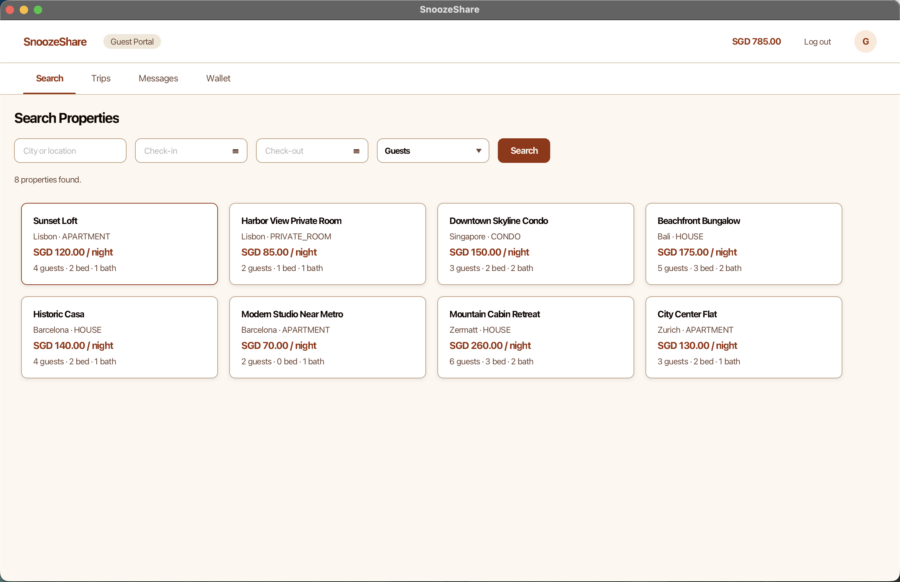
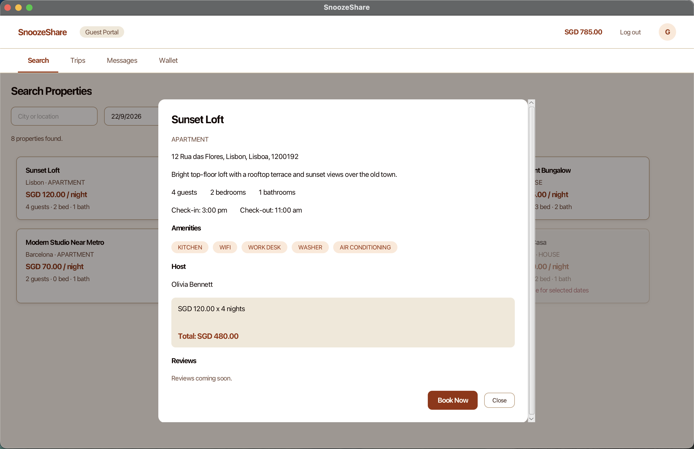
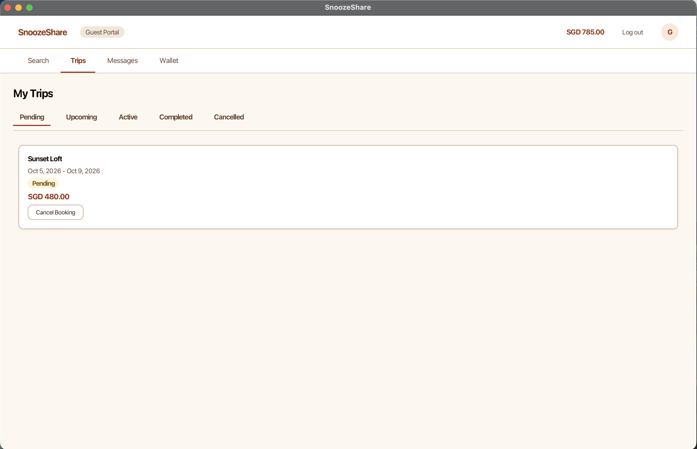
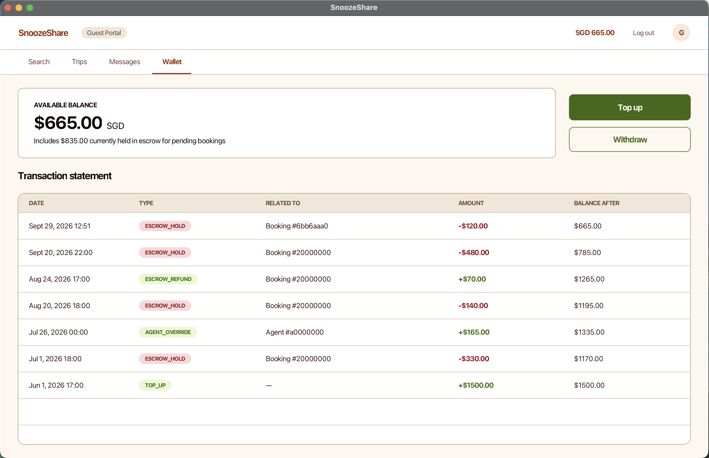
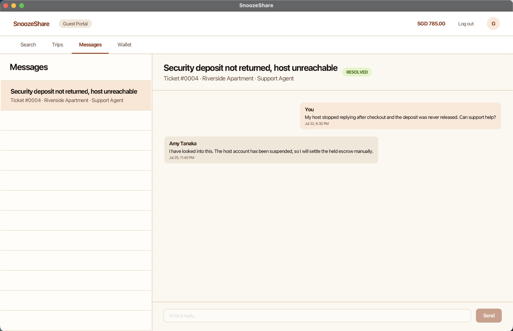
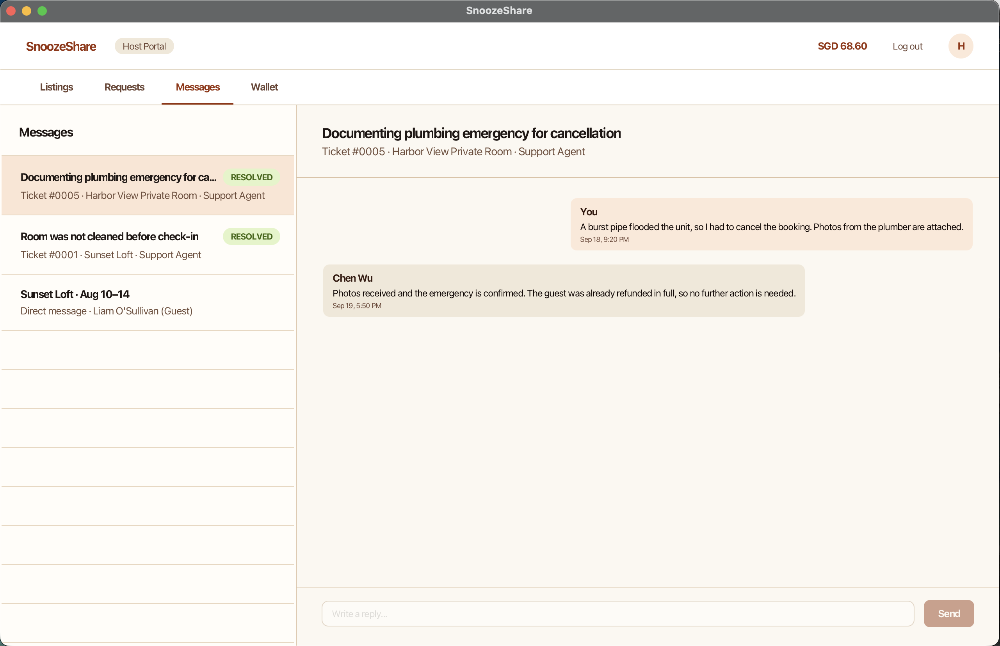
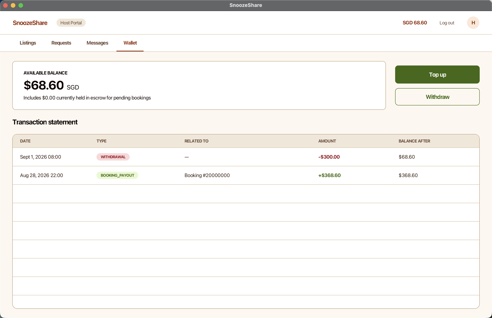
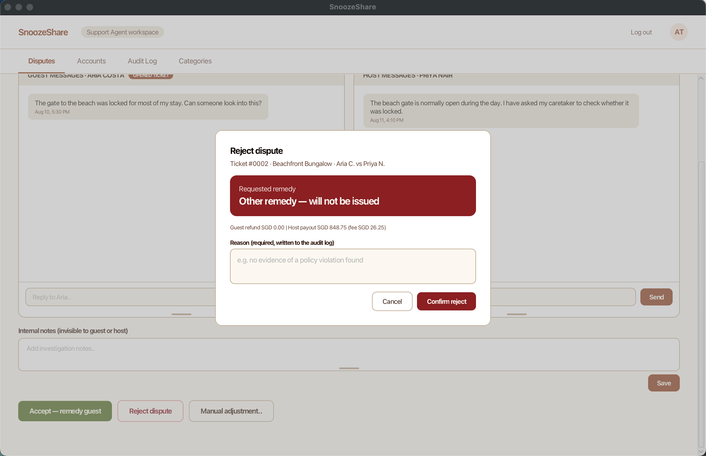
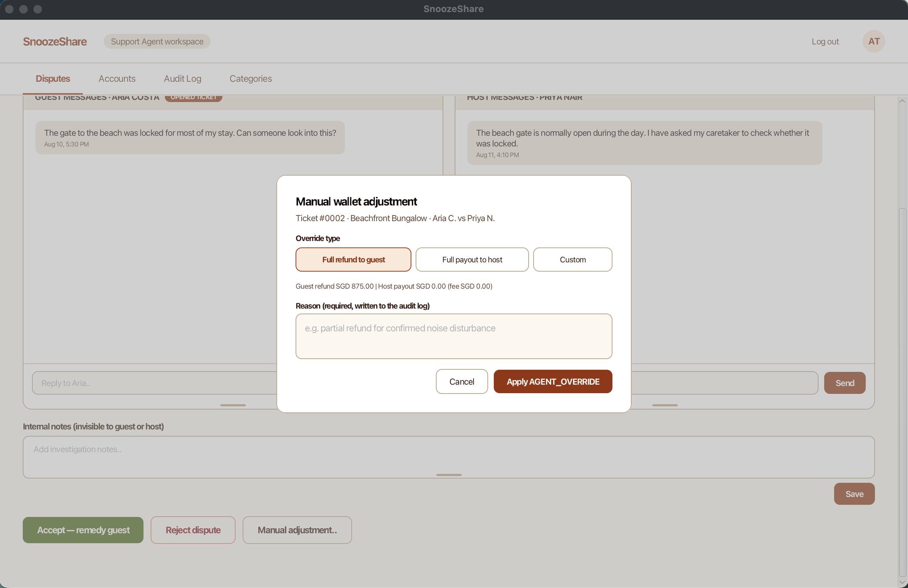

# SnoozeShare User Guide

## Introduction

SnoozeShare is a desktop application for short-term property rentals. It has
three role-specific experiences:

- **Guest** — discover properties, book stays, manage trips, wallets and disputes.
- **Host** — publish properties, manage availability, decide booking requests,
  respond to tickets and track earnings.
- **Support Agent** — triage disputes, settle escrow, manage ticket categories,
  govern accounts and inspect the audit trail.

## Starting the App

SnoozeShare requires Java 25. Check the installed version with `java -version`.

### From Source

Run the app from the project root:

```shell
./gradlew run
```

On Windows, use `gradlew.bat run` if the Unix wrapper is unavailable.

### From a Packaged Jar

```shell
./gradlew shadowJar
java -jar build/libs/SnoozeShare.jar
```

The application uses mocked authentication and a local SQLite database. No real
email, payment gateway or payout rail is contacted.

## Registering and Logging In

1. Open the application and choose **Register**.
2. Enter a display name and email address.
3. Choose a role:
   - **Guest** registration needs no registration code.
   - **Host** registration needs the Host registration code.
   - **Support Agent** registration needs the Agent registration code.
4. Submit the form. A successful Guest or Host registration provisions a wallet
   with a zero balance.
5. Log in with the mocked email login. The application routes you to the shell
   for the selected role; no real credential verification is performed.


*Figure: SnoozeShare login screen.*


*Figure: SnoozeShare registration screen.*

## Guest Walkthrough

### 1. Find a property

1. Start on the **Search** tab after Guest login.
2. Enter a city or location substring, minimum guest capacity, and check-in and
   check-out dates.
3. Review the available listing cards. Availability excludes host blocks and
   confirmed bookings.
4. Open a listing to inspect its address, property type, amenities, house rules,
   host summary, check-in/out times and nightly price.
5. Use the listing detail view's cost estimate to check the nightly-rate ×
   number-of-nights total.

The current UI provides city, capacity and date filtering. A maximum nightly
budget filter is not exposed in the current UI.


*Figure: Guest Search page with filters and listing cards.*


*Figure: Guest listing detail view with pricing and Book Now.*

### 2. Request a stay and manage trips

1. Select dates on a listing and choose **Book Now**.
2. Confirm the date range and submit the request.
3. The booking appears as **Pending**. The requested dates are protected from
   overlapping reservations and the total is held in the Guest wallet as escrow.
4. Open **Trips** to view bookings in the Pending, Upcoming, Active, Completed
   and Cancelled tabs.
5. When a Host approves or rejects a request, the Trip Hub refreshes from the
   booking event and reflects the new state.


*Figure: Guest Trips page with status tabs and booking card.*

### 3. Cancel a booking and understand refunds

Guests can cancel pending or confirmed bookings before check-in. Pending
bookings receive a full refund. For confirmed bookings, the current policy gives
100% back when more than 48 hours remain and 50% inside the 48-hour window. The
escrow release and refund are recorded with the cancellation.

### 4. File a dispute and review a stay

1. From an eligible booking, open the dispute/ticket action during the stay's
   dispute window.
2. Choose an active ticket category and provide a title and description.
3. Select a requested remedy — Full Refund, Partial Refund or Other — and add
   optional supporting text.
4. Use **Messages** to read and post in the Guest-side ticket thread with the
   assigned Support Agent.
5. After a completed stay, submit one 1–5 star rating and an optional review.


*Figure: Guest Messages dispute filing form.*

### 5. Use the Guest wallet

1. Open **Wallet** from the Guest navigation.
2. Review the available balance, held escrow and chronological statement.
3. Choose **Top up**, enter an amount, and confirm the mocked wallet action.
4. Choose **Withdraw** to withdraw up to the non-escrowed available balance.
5. Use the statement to distinguish top-ups, escrow holds, refunds, payouts,
   remedies and withdrawals.


*Figure: Guest Wallet page with balance, escrow, statement and wallet actions.*

### 6. Read Guest Messages — F12

Guest Messages contains the Guest's own ticket conversations and private booking
conversation. Guests cannot read the Host's ticket thread or Support Agent-only
notes. Booking chat is writable during the allowed booking window and becomes
read-only afterwards.


*Figure: Guest Messages page.*

## Host Walkthrough

### 1. Create and publish a listing

1. Open **Listings** after Host login and choose **Create listing**.
2. Enter the title, description, address, property type, guest capacity, beds,
   baths, nightly rate, check-in/out times and amenities.
3. Submit the form. Required fields, positive capacity and valid pricing are
   checked before storage.
4. Open a listing card to view its details and performance metrics.
5. Use the listing controls to edit the listing or toggle it between **Active**
   and **Inactive**.


*Figure: Host Listings page with metrics, listing cards and status controls.*


*Figure: Host listing creation form.*

### 2. Block dates on the booking calendar

1. Open a listing and choose **Booking Calendar**.
2. Select a single date or inclusive date range.
3. Enter a non-blank reason for private use or maintenance.
4. Submit the block. The application rejects overlaps with existing unavailable
   blocks or confirmed bookings.
5. Review the blocked-date history and remove manual blocks when needed.

Booking-derived blocks remain visible and cannot be removed from the calendar.


*Figure: Host Booking Calendar with date blocking controls and history.*

### 3. Decide booking requests and track completion

1. Open **Requests** to see pending requests with guest identity, dates, nights,
   gross amount, projected net earnings and the guest rating.
2. Choose **Approve** to confirm a request or **Reject** to decline it. A Host
   rejection may include a persisted decision message.
3. Approved requests keep the Guest escrow hold until completion or dispute
   settlement. Rejected requests refund the Guest.
4. Review past requests and the completion state from the same page.
5. Completion sweeps run at startup and from the Host Requests flow. A booking
   with an open or in-review ticket remains held until an Agent resolves it.


*Figure: Host Requests queue with earnings, ratings and decision actions.*

### 4. Respond to messages

The Host **Messages** tab combines private booking conversations with Host-side
ticket threads. Hosts can respond to existing Agent-managed ticket threads but
cannot create new tickets. Booking conversations become read-only after their
allowed window.


*Figure: Host Messages page.*

### 5. Use the Host wallet

1. Open **Wallet** from the Host navigation.
2. Review balance, held escrow, payouts, fees, refunds, remedies and the full
   chronological statement.
3. Use **Top up** for the mocked wallet top-up flow.
4. Use **Withdraw** to cash out up to the available balance.
5. After a completed booking, verify the host payout and platform-fee rows in the
   statement. Host net earnings are gross booking value less the 3% fee.


*Figure: Host Wallet page with balance, escrow, statement and wallet actions.*

## Support Agent Walkthrough

### 1. Triage the dispute queue

1. Log in with a Support Agent account and open **Disputes**.
2. Use the queue's **All**, **Unassigned** and **Mine** filters.
3. Open the oldest ticket first; the queue is ordered chronologically.
4. Assign the ticket to yourself, inspect the Guest and Host evidence/chat, and
   save internal administrative notes.
5. Use the ticket status controls to accept the request, reject it, or open a
   resolution action.


*Figure: Support Agent dispute queue with filters and ticket rows.*


*Figure: Support Agent dispute detail with party messages, notes and assignment controls.*

### 2. Resolve a dispute and settle escrow

From the resolution dialog, choose one of the supported outcomes:

- **Accept** the requested remedy.
- **Reject** the ticket and pay the Host the held amount net of the 3% fee.
- **Manual** adjustment: Full Refund, Full Payout or a customised partial split.

Enter the required reason and refund amount where applicable. Resolution moves
the booking to Completed and writes the corresponding audit and ledger rows.
There is no separate Force Cancel or Force Complete control; the resolution flow
is the supported way to settle a dispute.


*Figure: Support Agent accept remedy dialog.*


*Figure: Support Agent reject dispute dialog.*


*Figure: Support Agent manual wallet adjustment dialog.*

### 3. Manage ticket categories

1. Open **Categories** from the Support Agent navigation.
2. Review the **Ticket categories** table. It shows each label, whether it is
   active, and the available action.
3. Choose **+ Add category**, enter a label, and select **Add category**. The new
   category becomes available when Guests file disputes.
4. Choose **Edit** to rename a category or delete it when it is no longer needed.
5. Use the **Active** toggle to deactivate a category without removing it from
   the administration history. Inactive categories are not offered to Guests.


*Figure: Support Agent Categories page with ticket categories and actions.*

### 4. Govern accounts

1. Open **Accounts** and search by display name, email, role, joined date or
   status.
2. Select a Guest or Host and choose **Suspend**.
3. Enter the required reason and confirm. Suspension force-cancels pending and
   not-yet-started confirmed bookings, refunds held escrow, releases booking
   blocks and deactivates the Host's active listings.
4. Use **Reactivate** to restore a suspended Guest or Host account.
5. Agent accounts are listed but cannot be suspended; the System user is hidden
   from governance.


*Figure: Support Agent Accounts page with governance actions.*

### 5. Inspect the audit trail

1. Open **Audit Log**.
2. Search by user name or a User, Booking or Ticket ID fragment.
3. Select an Action Type and optional From/To date range.
4. Choose **Apply filters**. Use **Clear** to reset the filters.
5. Read each row's timestamp, actor, action type, direct target, before/after
   status, reason and signed amount. Use **Load more** for additional rows.

The System user may appear as the actor or target of platform-fee and other
system-generated ledger activity.


*Figure: Support Agent Audit Log with filters and ledger activity.*

## Role and Feature Quick Reference

| Role | Main screen | User outcome |
|---|---|---|
| All | Login/Register | Mocked role routing and Guest/Host wallet provisioning |
| Guest | Search, Trips, Messages, Wallet | Discover, book, manage, review and dispute stays |
| Host | Listings, Requests, Messages, Wallet | Publish, block dates, decide requests and manage earnings |
| Support Agent | Disputes, Accounts, Audit Log, Categories | Resolve tickets, govern accounts and inspect activity |
| Guest, Host, Support Agent | Messages | Party-scoped ticket and booking conversations |

## Current Limitations

- Authentication, payments and withdrawals are mocked; no external service is
  contacted.
- A maximum nightly budget filter is not exposed in the current Guest Search UI.
- Hosts can respond to existing tickets but cannot file new tickets.
- Agents cannot read private booking conversations; they can read the Guest and
  Host ticket threads.
- Some booking and availability mutations do not yet produce dedicated audit
  rows; the supported audit and ledger rows are still available in Audit Log.
- Automatic completion is a startup/Host Requests sweep, not a background
  scheduler.
