# SnoozeShare User Guide

SnoozeShare is a desktop app for **short-term property rentals**. Guests search for and book
stays, Hosts list properties and approve requests, and Support Agents resolve disputes and govern
accounts. All three roles work in one app, and each has its own portal.

Everything in SnoozeShare is a **demo**: sign-in needs only an email address, and wallet top-ups
and withdrawals are mocked. No real money moves and no real payment service is connected.

**How to read this guide**

- New here? Start with [Quick start](#quick-start), then [Signing in](#signing-in-and-creating-accounts).
- Want to try the app straight away? Use the [sample accounts](#sample-accounts).
- Looking for something specific? Use the [feature summary](#feature-summary) or the contents below.

Text in the guide uses these markers:

> :bulb: **Tip:** a shortcut or helpful hint.

> :exclamation: **Caution:** something that can surprise you or cannot be undone.

> :camera: **Screenshot placeholder:** a screenshot will be added here. The file name shown is
> where the image will be saved (`docs/images/`).

---

## Table of contents

1. [Quick start](#quick-start)
2. [Signing in and creating accounts](#signing-in-and-creating-accounts)
3. [Sample accounts](#sample-accounts)
4. [Rules that apply across the app](#rules-that-apply-across-the-app)
5. [Guest portal](#guest-portal)
6. [Host portal](#host-portal)
7. [Support Agent portal](#support-agent-portal)
8. [Feature summary](#feature-summary)
9. [FAQ](#faq)
10. [Known limitations](#known-limitations)
11. [Troubleshooting](#troubleshooting)
12. [Glossary](#glossary)

---

## Quick start

### 1. Prerequisites

| You need | Notes |
|---|---|
| **Java 25 (JDK)** | Check with `java -version`. The first line should report version 25. |
| **Windows, macOS or Linux** | The commands below use Windows PowerShell. On macOS/Linux use `./gradlew` instead of `.\gradlew`. |
| **The project files** | Clone the repository or unzip the release. JavaFX and every other library are downloaded automatically by Gradle on the first run, so no separate JavaFX install is needed. |

> :exclamation: **Caution:** the first run downloads dependencies and can take a few minutes. An
> internet connection is needed for that first run only.

### 2. Choose your data: sample data or a blank start

SnoozeShare decides which data to open when it starts, **by looking for a file named
`snoozeshare-mock.db` inside a folder called `db`** in the folder you launch it from.

| Situation | What you get |
|---|---|
| `db/snoozeshare-mock.db` **exists** | The app opens it. You start with sample guests, hosts, agents, listings, bookings, tickets and wallet balances. See [Sample accounts](#sample-accounts). |
| The file **does not exist** | The app starts with a **blank, temporary database**. There are no users yet, so you [create accounts](#creating-an-account) first. Everything is discarded when you close the app. |

#### To start with sample data

1. Download `snoozeshare-mock.db` from the release page. If you cloned the repository, the file
   is already at `db/snoozeshare-mock.db`.
2. Put it in a folder named **`db`** in the folder you will launch the app from (the project
   folder, or the folder that holds `SnoozeShare.jar`):

   ```text
   SnoozeShare/
   ├── db/
   │   └── snoozeshare-mock.db     <-- place the file here
   └── SnoozeShare.jar             (or the project files, if running from source)
   ```

3. Start the app as described in step 3 below.

> :camera: **Screenshot placeholder:** `docs/images/quickstart-db-folder.png` — file explorer
> showing the `db` folder containing `snoozeshare-mock.db`.

#### To start blank

Make sure there is no `db/snoozeshare-mock.db` (delete it or rename it), then start the app.

> :bulb: **Tip:** with the sample database the app **saves your changes into that file**, so
> bookings, messages and wallet movements are still there next time. To go back to a fresh copy of
> the sample data, close the app and replace the file with a new download of `snoozeshare-mock.db`.

> :exclamation: **Caution:** if you use a different database file, set the environment variable
> `SNOOZESHARE_DB_URL` (for example `jdbc:sqlite:build/my-test.db`). When it is set it takes
> priority over the `db` folder. In PowerShell: `$env:SNOOZESHARE_DB_URL = "jdbc:sqlite:build/my-test.db"`.

### 3. Start the app

**From the source code** (from the project folder):

```shell
.\gradlew run
```

**From a packaged jar:**

```shell
.\gradlew shadowJar
java -jar build/libs/SnoozeShare.jar
```

> :exclamation: **Caution:** run the jar **from the folder that contains `db/`**. The app looks
> for `db/snoozeshare-mock.db` relative to where you start it, not relative to the jar file.

The **Welcome back** login screen appears. The window is at least 1280 × 800.

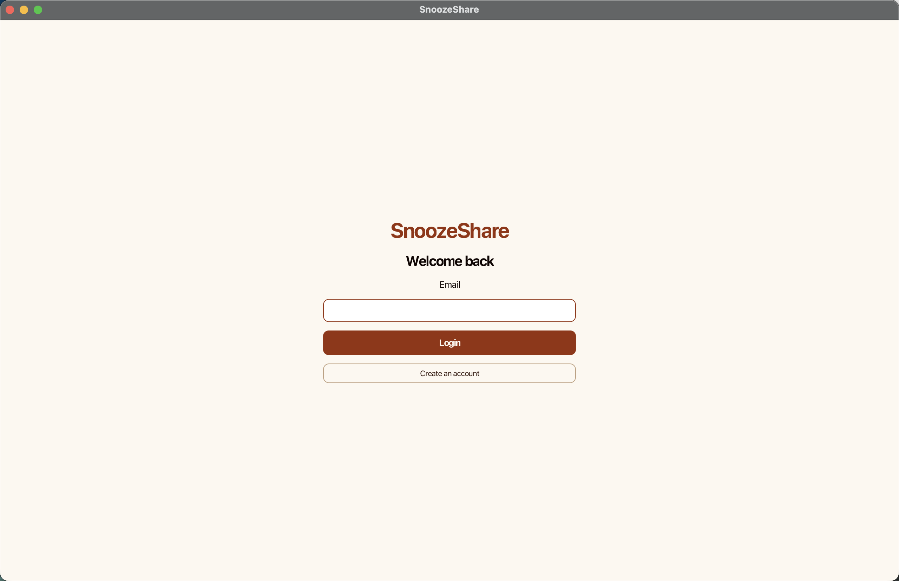
*Figure: The "Welcome back" login screen.*

### 4. Other useful commands

| Command | What it does |
|---|---|
| `.\gradlew test` | Runs the automated tests. |
| `.\gradlew build` | Compiles, runs the style checks and the tests. |
| `.\gradlew shadowJar` | Builds the single runnable `build/libs/SnoozeShare.jar`. |

---

## Signing in and creating accounts

SnoozeShare uses **mocked authentication**. There are no passwords. The sign-in email decides who
you are.

### Logging in

1. On **Welcome back**, type the account's **email**.
2. Click **Login**.
3. You land in the portal for that account's role: Guest, Host or Support Agent.

Click **Log out** at the top right of any portal to return to the login screen.

| Message | Meaning |
|---|---|
| `Invalid email` | No account uses that email. Check the spelling or create the account. |
| `Account is not active` | The account has been **suspended** by a Support Agent. See [Account governance](#account-governance). |

### Creating an account

1. On the login screen click **Create an account**.
2. Fill in **Display name** and **Email**.
3. Choose a **Role**: Guest, Host or Agent.
4. If you chose Host or Agent, a **Registration code** field appears. Enter the sign-up key from
   the table below. Guests need no key.
5. Click **Register**. You are returned to the login screen with *Registration successful.
   Please log in.*
6. Log in with the email you just registered.

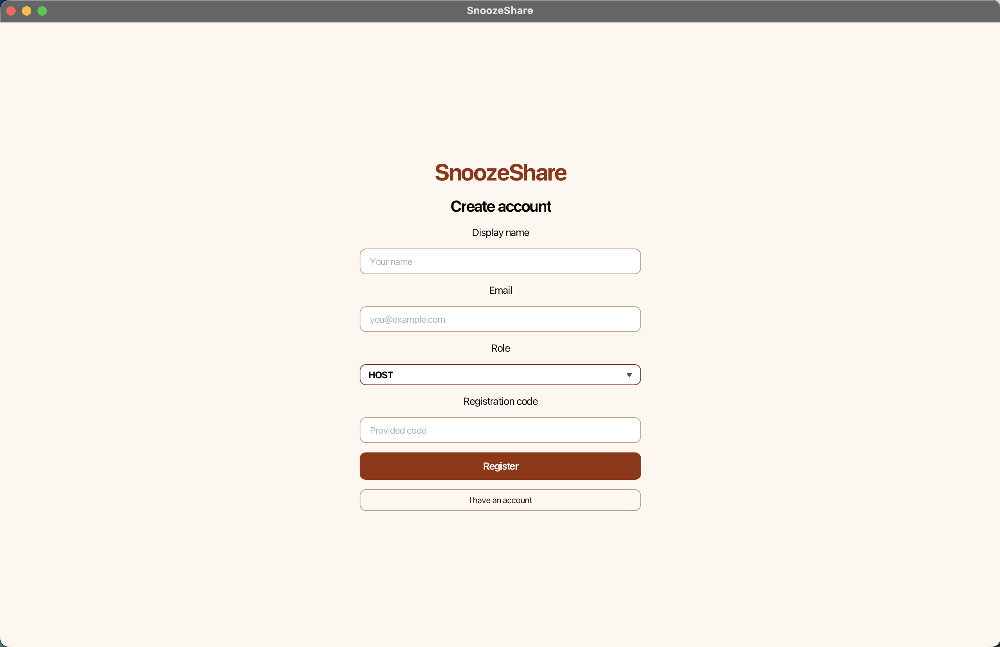
*Figure: The "Create account" form with Role set to Host and the Registration code field showing.*

#### Sign-up keys

| Role | Sign-up key (registration code) | Notes |
|---|---|---|
| **Guest** | *none* | Leave the code field out; it is hidden for Guests. |
| **Host** | `HOST-DEMO` | Case-sensitive. |
| **Support Agent** | `AGENT-DEMO` | Case-sensitive. |

| Message | Meaning |
|---|---|
| `Invalid registration code` | The key is wrong for the chosen role. Re-check the table above. |
| `Email is already registered` | The email is taken. Use another or log in with it. |
| `... must not be blank` | A required field is empty. |

New **Guest** and **Host** accounts automatically get a wallet with a **SGD 0.00** balance. Guests
need to [top up](#wallet) before they can book.

> :bulb: **Tip:** the sample accounts were created with other codes (such as `HOST-2026-01`), but
> those codes are **not** needed to log in. Logging in only needs the email. Use `HOST-DEMO` and
> `AGENT-DEMO` when creating new accounts.

---

## Sample accounts

These accounts exist only when the app opens `db/snoozeshare-mock.db` (see
[Quick start](#2-choose-your-data-sample-data-or-a-blank-start)). Log in with the email alone;
there is no password.

### Guests

| Name | Email | Wallet (SGD) | Good for trying |
|---|---|---|---|
| Wei Zhang | `wei.zhang@snoozeshare.test` | 785.00 | A pending request, a completed stay (leave a review), a cancelled trip |
| Noah Kim | `noah.kim@snoozeshare.test` | 480.00 | Two pending requests, a trip the host cancelled |
| Aria Costa | `aria.costa@snoozeshare.test` | 525.00 | Confirmed trips, an **open dispute ticket** |
| Liam O'Sullivan | `liam.osullivan@snoozeshare.test` | 420.00 | Upcoming and completed stays, a resolved dispute |
| Sophia Rossi | `sophia.rossi@snoozeshare.test` | 790.00 | A dispute currently **in review** |
| Maya Singh | `maya.singh@snoozeshare.test` | 500.00 | A guest cancellation, a confirmed stay |
| Kai Nakamura | `kai.nakamura@snoozeshare.test` | 800.00 | **Suspended** — logging in is refused |

### Hosts

| Name | Email | Listings | Good for trying |
|---|---|---|---|
| Olivia Bennett | `olivia.bennett@snoozeshare.test` | Sunset Loft, Harbor View Private Room (Lisbon) | A **pending request** from Wei Zhang |
| Marcus Lee | `marcus.lee@snoozeshare.test` | Downtown Skyline Condo, Quiet Garden House (inactive) | An inactive listing |
| Priya Nair | `priya.nair@snoozeshare.test` | Beachfront Bungalow (Bali) | A pending request and an open dispute to respond to |
| Diego Fernandez | `diego.fernandez@snoozeshare.test` | Historic Casa, Modern Studio Near Metro (Barcelona) | Several confirmed bookings |
| Fatima Haidari | `fatima.haidari@snoozeshare.test` | Mountain Cabin Retreat, City Center Flat | A pending request from Noah Kim |
| Sam O'Connor | `sam.oconnor@snoozeshare.test` | Riverside Apartment (inactive) | **Suspended** — logging in is refused |

### Support Agents

| Name | Email |
|---|---|
| Amy Tanaka | `amy.tanaka@snoozeshare.test` |
| Ben Alvarez | `ben.alvarez@snoozeshare.test` |
| Chen Wu | `chen.wu@snoozeshare.test` |

> :bulb: **Tip:** a good first tour is to log in as **Wei Zhang** and search for a stay, then log
> out and log in as **Olivia Bennett** to approve the request, then log in as **Amy Tanaka** to
> look at the dispute queue and audit log.

> :bulb: **Tip:** the sample data also includes an internal *SnoozeShare System* account that
> collects the platform fee. You cannot log in to it or register it.

---

## Rules that apply across the app

| Topic | Rule |
|---|---|
| **Currency** | Everything is in **SGD**. |
| **Escrow** | When a Guest books, the full stay cost is **held in escrow** from their wallet straight away. It is released to the Host only after the stay is completed. |
| **Cancellation refund** | A Guest who cancels **more than 48 hours before check-in** gets a **100%** refund. Cancelling **less than 48 hours before** check-in refunds **50%**. |
| **Host rejection / cancellation** | A request that the Host rejects or cancels is refunded to the Guest in full. |
| **Platform fee** | The Guest pays no fee. The platform keeps **3%** of what is paid out to the Host. |
| **Completing a stay** | A confirmed booking completes automatically **7 days after check-out** (the dispute window) and the Host is paid. A booking with an **open dispute** is not completed until an agent resolves it. |
| **Disputes** | A Guest can file a dispute up to **7 days after the stay ends**. |
| **Listing rate** | A nightly rate must be greater than 0 with at most 2 decimal places. |
| **Suspension** | A suspended account cannot log in. See [Account governance](#account-governance). |

---

## Guest portal

Log in with a Guest account. The top bar shows the SnoozeShare name, a **Guest Portal** label, your
**wallet balance** (SGD) and **Log out**. Four tabs sit underneath: **Search**, **Trips**,
**Messages** and **Wallet**. The app opens on **Search**.

> :camera: **Screenshot placeholder:** `docs/images/guest-shell-overview.png` — Guest portal with
> top bar and the four tabs.

### Search for a stay

The **Search** tab lists available properties and lets you narrow them down.

| Filter | What to enter |
|---|---|
| **Location** | Part of a city name, e.g. `Lisbon`. |
| **Check-in** / **Check-out** | Pick both dates. Past dates are greyed out and cannot be chosen. Properties already booked or blocked for those dates are shown last and marked unavailable. |
| **Guests** | The number of guests. Only properties that fit them are shown. |
| **Max nightly budget** | The most you want to pay per night. |

Click **Search** to apply the filters. Leave a filter empty to ignore it. The list also loads by itself when you open the tab.

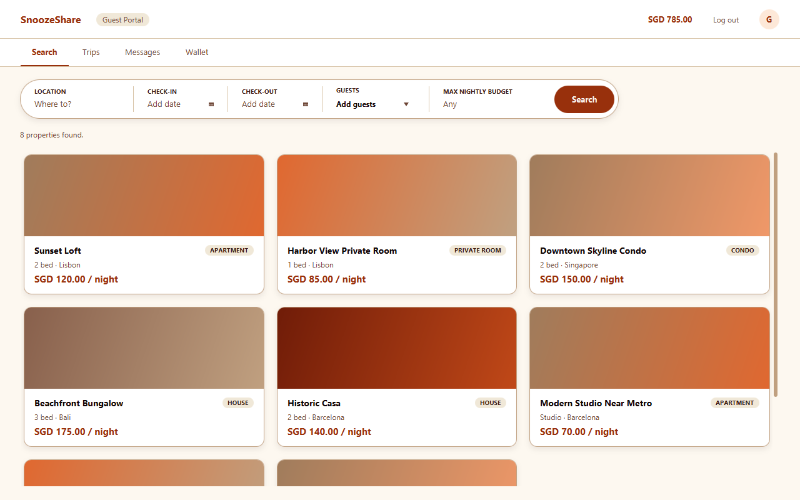
*Figure: Search tab with filters and property cards.*

### View a listing

Click a property card to open its details: price per night, **max guests**,
**bedrooms**, **bathrooms**, **check-in/check-out times**, **amenities** and **reviews** from
earlier guests. Enter your dates to see the **total price** (nightly rate × nights).

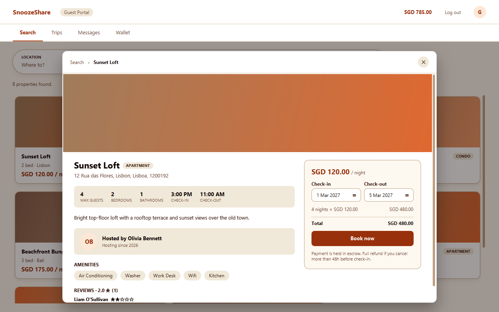
*Figure: Listing detail with price breakdown and **Book now** button.*

### Book a stay

1. Open a listing and pick **Check-in** and **Check-out**.
2. Check the **Total**.
3. Click **Book now**.

The total is **held in escrow** from your wallet and the booking becomes **Pending** until the Host
decides. The dates are blocked for other guests straight away.

> :exclamation: **Caution:** you need enough wallet balance to cover the whole stay. If the balance
> is too low, [top up](#wallet) first. A suspended guest cannot book.

### Trips

The **Trips** tab (**My trips**) groups your bookings into three sections: **Upcoming** (including
requests still waiting for the Host, marked **Pending**), **Active** (the stay is under way) and
**Past** (completed, cancelled or rejected stays). Click a section heading to collapse or expand it.
The page updates by itself when a Host approves or rejects a request, so you do not need to refresh.

| Action | Where | Result |
|---|---|---|
| **Cancel** a trip | Pending trip card, or a confirmed trip that has not started | Opens a confirmation showing the refund (see below). |
| **Leave a review** | Completed trip card | Give a rating from 1 to 5 stars and an optional comment. One review per stay. |
| **File dispute** | Confirmed or completed trip card, once the trip has started and up to 7 days after check-out; hidden once a ticket exists for that booking | Opens the dispute form (see below). |
| **Message host** | Confirmed trip card | Opens the Messages tab on your private chat with the Host about that booking. |

When you press **Cancel**, a **Cancel this booking?** window shows the refund you will get (100% more
than 48 hours before check-in, 50% within 48 hours) and the cancellation policy. Choose **Confirm
cancel** to cancel, or **Keep booking** to leave the booking as it is. The refund is credited to your
wallet straight away.

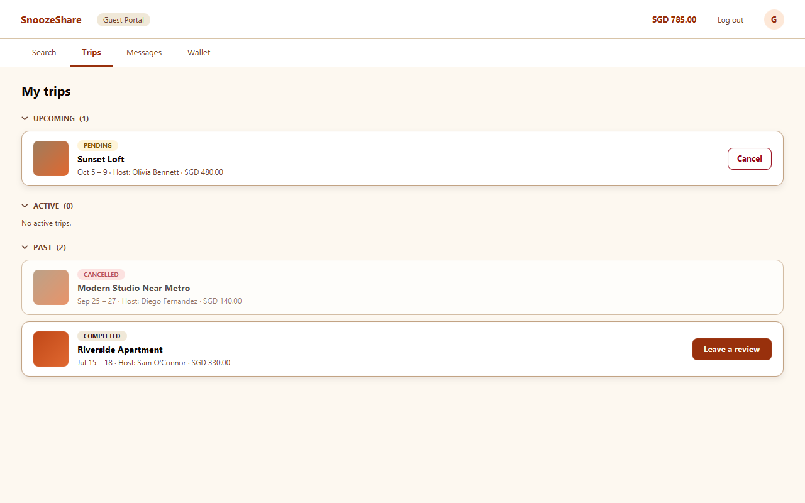
*Figure: Trips tab with a pending trip card and its Cancel button.*

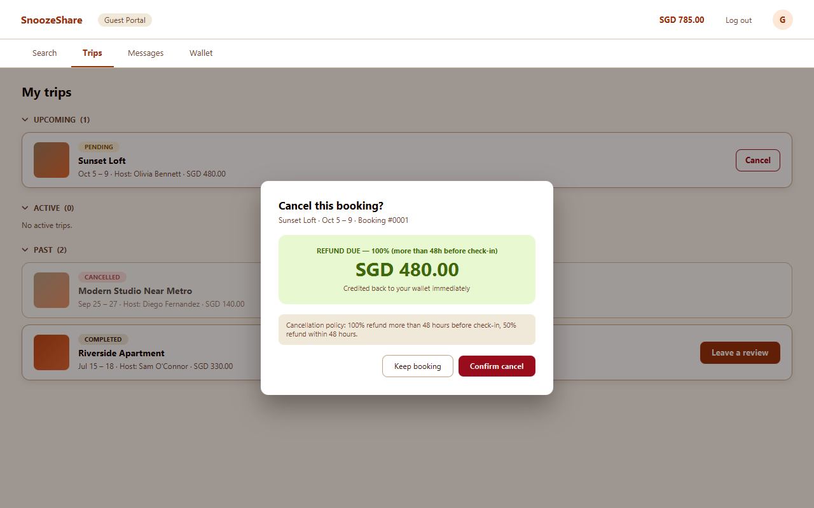
*Figure: Cancel this booking dialog with the refund amount and policy.*

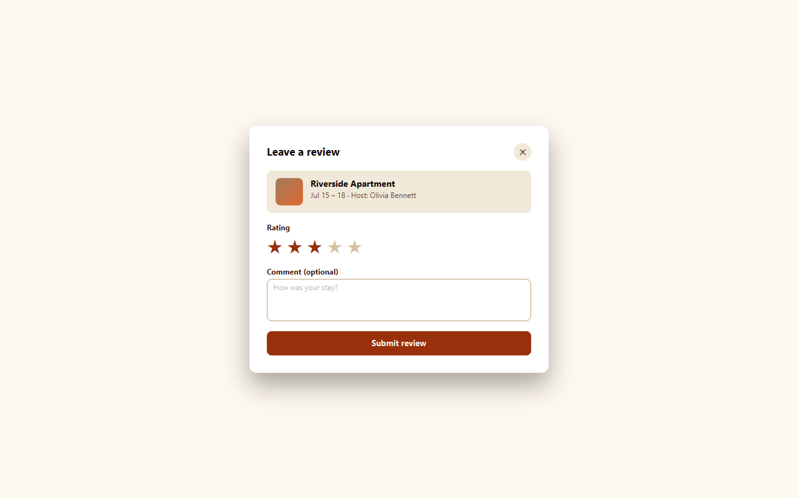
*Figure: "Leave a review" dialog with star rating.*

### File a dispute

If something went wrong with a stay, tell us what happened:

1. Choose a **Category** (for example *Cleanliness*, *Property Mismatch*, *Damage Dispute*).
2. Type a short **Title** and a **Description**.
3. Choose the **Requested Remedy**: **Full Refund**, **Partial Refund** or **Other**.
4. Optionally add **Supporting Information** such as evidence.
5. Click **Submit**.

The money for that booking stays in escrow until a Support Agent resolves the ticket.

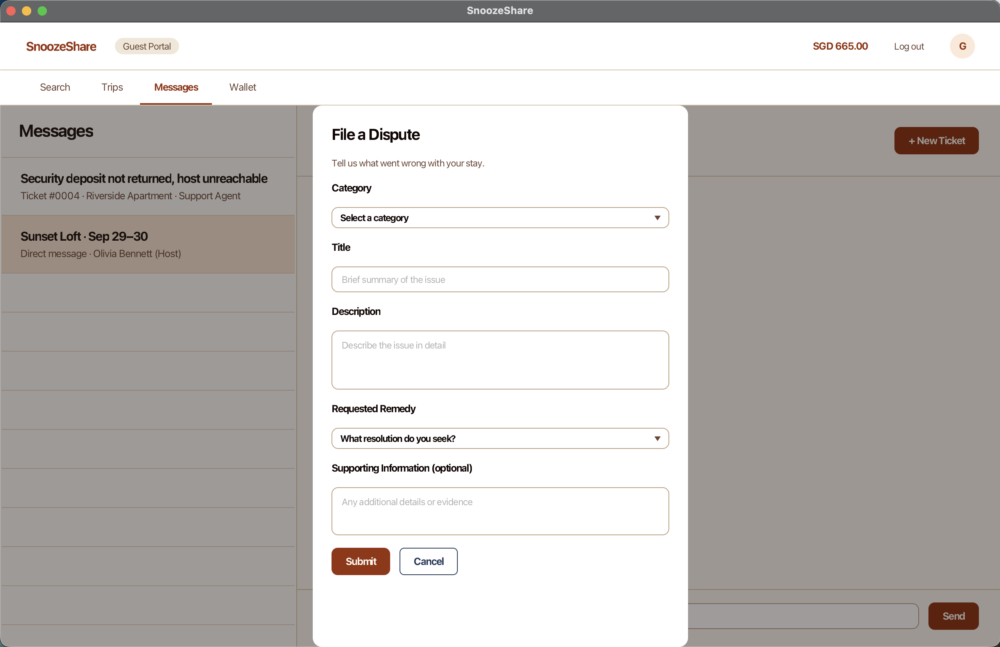
*Figure: "File a Dispute" form.*

### Messages

The **Messages** tab shows your conversations. Click one to read it and type in **Write a reply...**,
then **Send**. Use **+ New Ticket** to start a dispute from here.

- The list shows each conversation's **status** (for example open, in review, resolved).
- You can only see **your own** thread with the agent, not the Host's thread.
- A resolved ticket's chat is read-only.

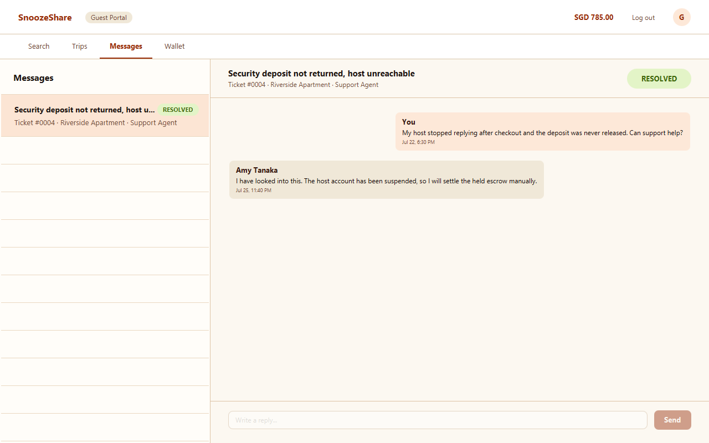
*Figure: Messages tab with a conversation open.*

### Wallet

The **Wallet** tab (shared with Hosts) shows your **available balance** in SGD, how much is
**currently held in escrow**, and the **Transaction statement**: date, type, amount, balance after
and the related booking or ticket.

| Action | Steps |
|---|---|
| **Top up** | Click **Top up**, type an amount or click a preset (**$50**, **$100**, **$500**, **$1000**), click **Confirm**. |
| **Withdraw** | Click **Withdraw**, type an amount or choose **Withdraw full available balance**, click **Confirm**. |

You can withdraw only what is **available**. Money held in escrow cannot be withdrawn. Top-ups and
withdrawals are mocked.

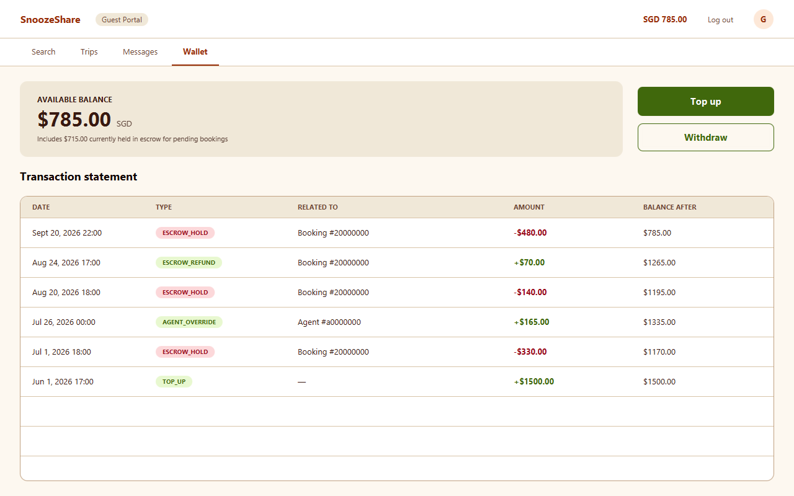
*Figure: Wallet with balance and transaction statement.*

> :camera: **Screenshot placeholder:** `docs/images/wallet-topup-dialog.png` — the top-up dialog
> with preset amounts.

---

## Host portal

Log in with a Host account. The tabs are **Listings**, **Requests**, **Messages** and **Wallet**.
The app opens on **Listings**. The top bar shows your wallet balance.

> :camera: **Screenshot placeholder:** `docs/images/host-shell-overview.png` — Host portal with the
> four tabs.

### Your listings

**My listings** shows a card for each of your properties, with its status, live booking counts and
average rating. Click a card to open its detail page.

The detail page shows the property specs, amenities, guest **reviews** and a **Performance** card:
**Total bookings**, **Occupancy (30d)** and **Earnings (30d)**. From here you can **Edit** the
listing or **Open Booking Calendar**.

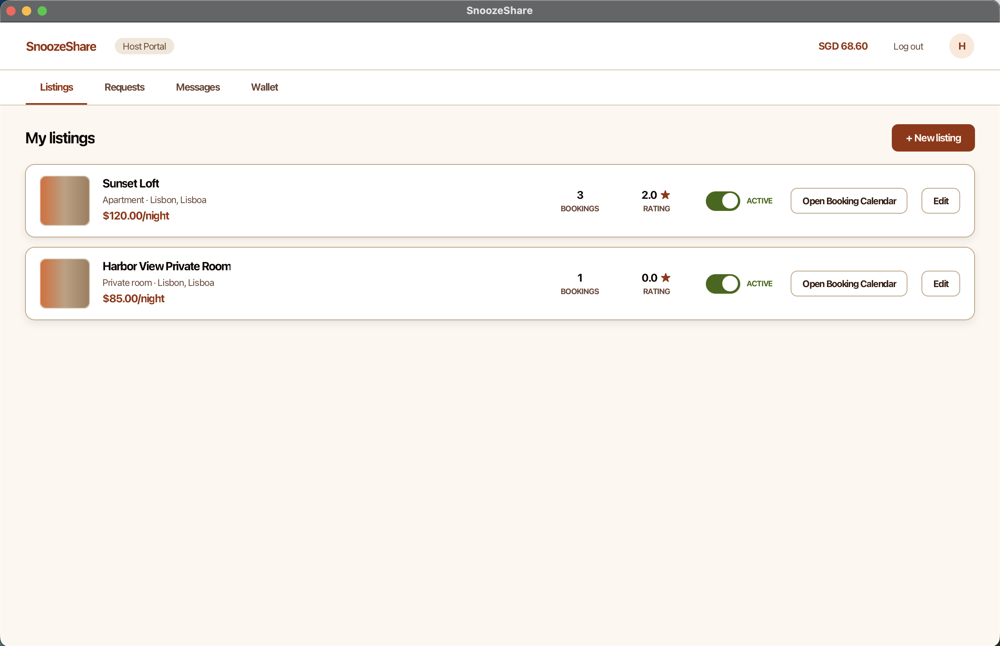
*Figure: My listings cards.*

> :camera: **Screenshot placeholder:** `docs/images/host-listing-detail.png` — listing detail with
> Performance card.

### Create or edit a listing

Click **+ New listing** (or **Edit** on a listing). The form has four cards:

| Card | Fields |
|---|---|
| **Basic details** | Title, description, property type (apartment, house, condo, private room), status. |
| **Location** | Street address, city, region, postal code. |
| **Capacity & pricing** | Max guests, bedrooms, bathrooms, **rate per night ($)**, check-in and check-out times. |
| **Amenities** (optional) | Wi-Fi, parking, air conditioning, kitchen, washer, work desk. |

Click **Create listing** (or **Save** when editing). Fix anything the form highlights in red.
Capacity must be above 0 and the rate must be above 0 with at most 2 decimals.

> :bulb: **Tip:** set a listing's status to **Inactive** to hide it from guest search without
> deleting it, and back to **Active** to reopen it.

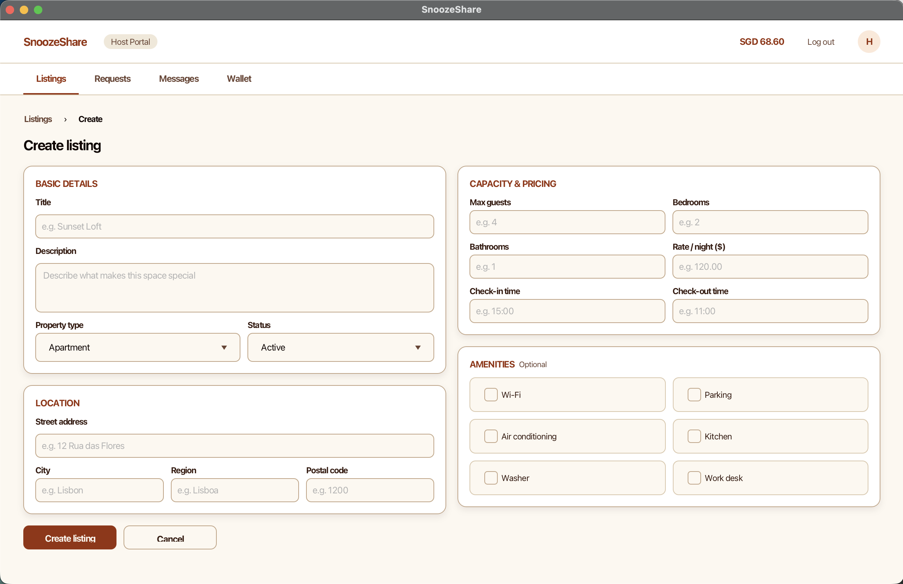
*Figure: Create listing form.*

### Booking calendar

Open a listing, then **Open Booking Calendar**. The calendar colours each day as **Available**,
**Booked** or **Blocked**.

To block dates (maintenance, personal use):

1. Pick **From** and **To** dates.
2. Type a **Reason**.
3. Click **Block these dates**.

Blocked ranges appear under **Current blocked dates**, where you can remove them.

> :exclamation: **Caution:** you cannot block dates that already have a **confirmed** guest booking.

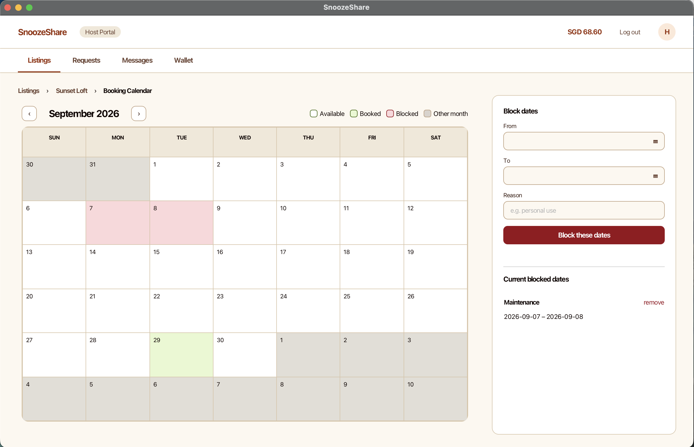
*Figure: Booking Calendar with the block-dates panel.*

### Requests

The **Requests** tab (**Booking requests**) lists guests' requests for your properties: **Listing**,
**Guest**, **Dates**, **Nights**, **Gross**, **Net earning** (gross minus 3%) and the **Guest
rating** (average of their reviews, or *No ratings yet*).

1. Click **Approve** or **Decline** on a pending request.
2. In the dialog, optionally add a **Message to guest**. Declining shows a notice that the guest
   will be refunded.
3. Click **Confirm**.

Approving confirms the booking. Declining refunds the guest in full and frees the dates. The
**Past requests** table keeps the history.

Once a confirmed stay has passed its 7-day dispute window without an open ticket, the booking
completes automatically and the **net earning** is paid into your wallet.

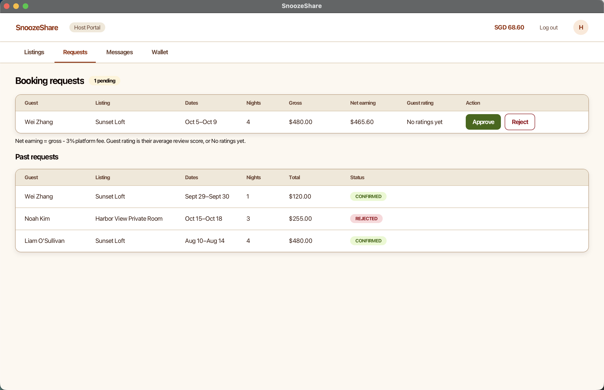
*Figure: Booking requests table.*

> :camera: **Screenshot placeholder:** `docs/images/host-approve-dialog.png` — "Approve booking
> request?" dialog.

### Messages

The **Messages** tab merges two kinds of conversation: private chat about a **booking** and the
**host-side thread of a dispute ticket**. Pick one, type under **Write a reply...** and click
**Send**. Unread conversations show a badge. Hosts respond to tickets a guest has filed; Hosts
cannot open tickets themselves. You only see your own thread, not the guest's thread with the
agent.

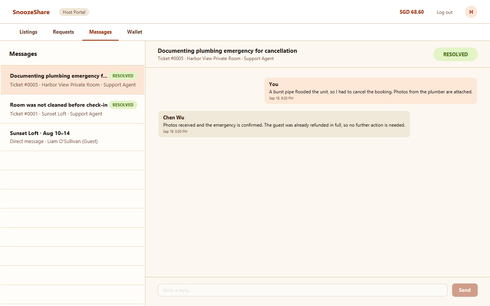
*Figure: Messages with a ticket conversation.*

### Wallet

Works exactly like the [Guest wallet](#wallet). Your statement shows **payouts** for completed
stays, the **platform fee** rows, ticket remedies, top-ups and withdrawals.

---

## Support Agent portal

Log in with an Agent account. The top bar reads **Support Agent workspace** and the tabs are
**Disputes**, **Accounts**, **Audit Log** and **Categories**.

> :camera: **Screenshot placeholder:** `docs/images/agent-shell-overview.png` — Agent workspace
> with the four tabs.

### Disputes

The **Dispute queue** lists open tickets, **oldest first**. Filter with the chips **All**,
**Unassigned** or **Mine**.

Click a ticket to open it. The detail page shows a summary (opened date, booking status, **amount
held in escrow**), the **guest** and **host** message boxes, and an **Internal notes** box that
neither party can see.

| Action | What it does |
|---|---|
| **Assign to me** | Takes the ticket. Use the same button to unassign. |
| **Guest / Host messages** | Reply to each party in their own thread. |
| **Internal notes** → **Save** | Store investigation notes. |
| **Accept — remedy guest** | Grants the remedy the guest asked for. |
| **Reject dispute** | Closes the ticket in the Host's favour; the Host is paid in full (less the 3% fee). |
| **Manual adjustment…** | Choose **Full refund to guest**, **Full payout to host**, or **Custom** (enter the guest refund; the rest goes to the Host). |

Every resolution needs a **reason**, which is written to the audit log, and settles the **entire
escrow**: the guest's refund carries no fee, and anything paid to the Host is net of 3%. Resolving
completes the booking.

> :exclamation: **Caution:** a resolution moves money and cannot be undone.

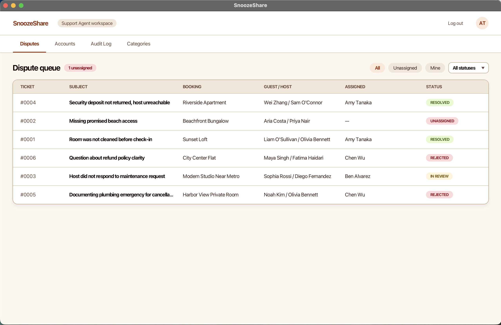
*Figure: Dispute queue.*

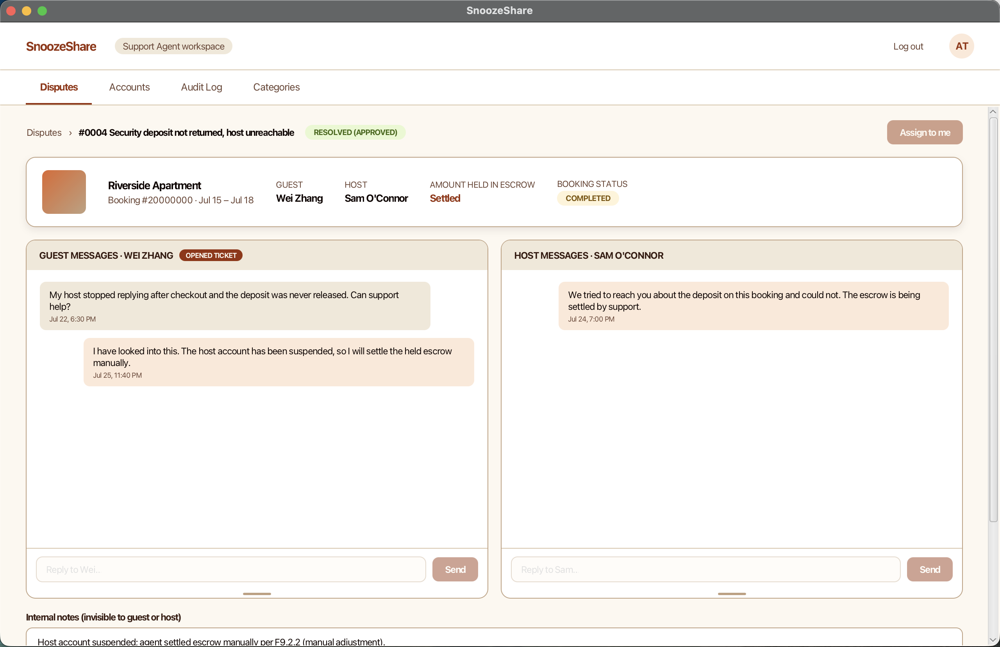
*Figure: Dispute detail.*

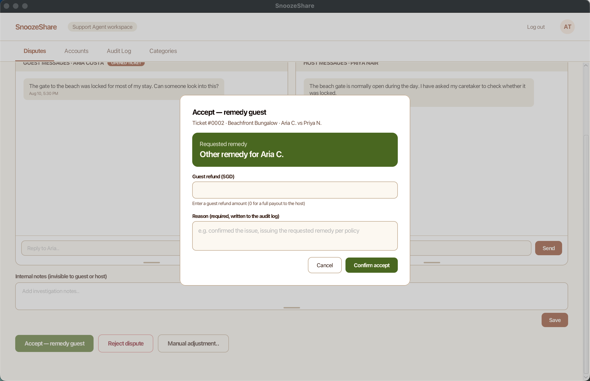
*Figure: Resolution dialog with refund/payout preview.*

### Account governance

The **Accounts** tab (**Account governance**) lists Guests and Hosts with **Display name**,
**Email**, **Role**, **Joined** and **Status**. Use the **Search...** box to filter by name, email,
role, date or status.

- **Suspend**: give a required reason. The account can no longer log in; its **pending** and
  **not-yet-started confirmed** bookings are **cancelled and fully refunded**, and a Host's
  **active listings are deactivated**.
- **Reactivate**: restores login.

Agent accounts cannot be suspended here.

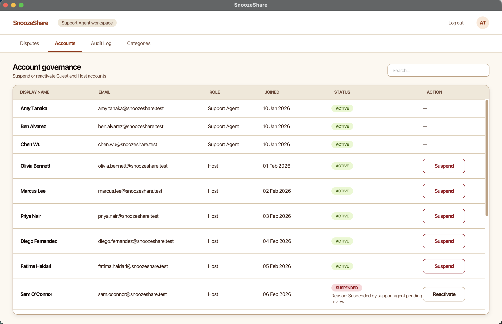
*Figure: Accounts table.*

> :camera: **Screenshot placeholder:** `docs/images/agent-suspend-dialog.png` — Suspend dialog.

### Audit Log

The **Audit Log** is a read-only history of booking changes, wallet movements, ticket resolutions
and account changes.

| Control | Use |
|---|---|
| **Search** | A user name, or a booking, ticket or user ID. |
| **Action type** | Pick one or more kinds of event. |
| **From / To** | Restrict to a date range. |
| **Apply filters** / **Clear** | Run or reset the filters. |
| **Load more** | Show the next page. |

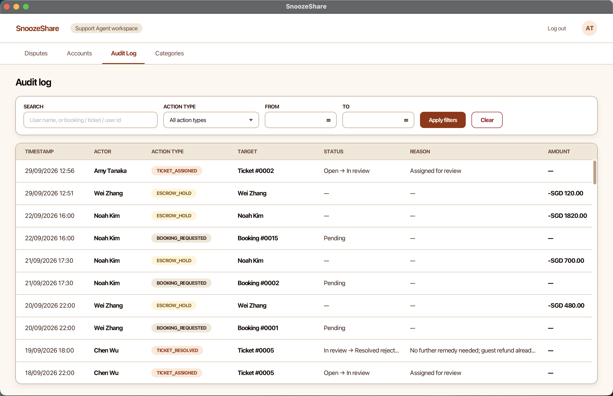
*Figure: Audit log with filters.*

### Categories

The **Categories** tab (**Ticket categories**) controls the list guests choose from when filing a
dispute. Click **+ Add category**, or edit or delete an existing one. Each has a **Label** and an
**Active** flag. Only active categories are offered to guests.

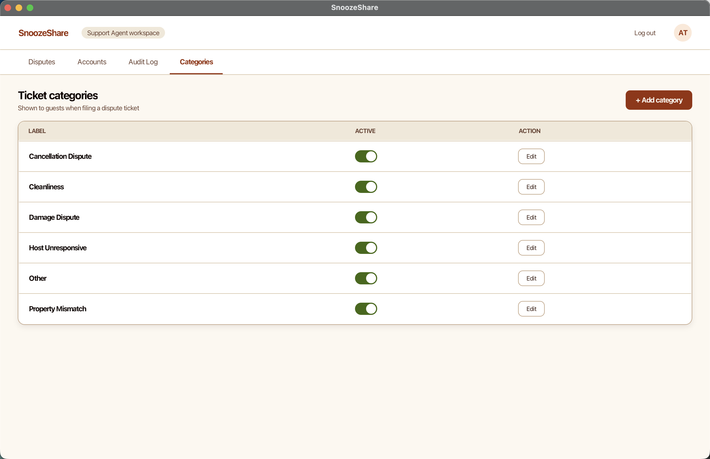
*Figure: Ticket categories.*

---

## Feature summary

| Portal | Feature | Where |
|---|---|---|
| All | Register, log in, log out | [Signing in](#signing-in-and-creating-accounts) |
| All | Wallet top-up, withdraw, statement | [Wallet](#wallet) |
| Guest | Search by location, dates, guests and budget | [Search](#search-for-a-stay) |
| Guest | Listing details and price breakdown | [View a listing](#view-a-listing) |
| Guest | Book with escrow hold | [Book a stay](#book-a-stay) |
| Guest | Trips, cancel with refund, leave a review | [Trips](#trips) |
| Guest | File a dispute, chat with an agent | [File a dispute](#file-a-dispute) |
| Host | Create, edit and activate/deactivate listings | [Your listings](#your-listings) |
| Host | Block dates on a calendar | [Booking calendar](#booking-calendar) |
| Host | Approve or decline requests, see net earnings | [Requests](#requests) |
| Host | Reply to booking and ticket chats | [Messages](#messages-1) |
| Agent | Dispute queue and resolution | [Disputes](#disputes) |
| Agent | Suspend and reactivate accounts | [Account governance](#account-governance) |
| Agent | Search the audit log | [Audit Log](#audit-log) |
| Agent | Manage dispute categories | [Categories](#categories) |

---

## FAQ

**Q: How do I log in? I have no password.**
There are no passwords. Enter only your account email. See [Logging in](#logging-in).

**Q: I registered as a Host but it says `Invalid registration code`.**
Use `HOST-DEMO` for Hosts and `AGENT-DEMO` for Agents. They are case-sensitive.

**Q: The app starts empty and my sample users are not found.**
The app did not find `db/snoozeshare-mock.db`. Put the file in a `db` folder in the folder you
launch from, then restart. See [Quick start](#2-choose-your-data-sample-data-or-a-blank-start).

**Q: I made changes and now they are gone.**
Without `db/snoozeshare-mock.db` the app uses a temporary database that is discarded when it closes.
With the file present, changes are saved into it.

**Q: How do I reset the sample data?**
Close the app, replace `db/snoozeshare-mock.db` with a fresh download and start again.

**Q: Why can't I book?**
Your wallet must cover the whole stay, and your account must not be suspended. Top up first.

**Q: Where did my money go after I booked?**
It is held in escrow until the stay is completed. Your Wallet tab shows how much is held.

**Q: Can I move data to another computer?**
Yes. Copy the `.db` file.

---

## Known limitations

- Authentication is a **demonstration only**: no passwords, and the sign-up keys are fixed values.
- Wallet top-ups and withdrawals are **mocked**; no payment provider is connected.
- All amounts are in **SGD**.
- Hosts cannot open tickets; only Guests can file disputes.
- The app is a single-user desktop program: everything runs on your machine against one local
  database file, so several people cannot use one database at the same time.
- Agents cannot read a Guest's or Host's private **booking** chat, only ticket threads.

---

## Troubleshooting

| Problem | Try this |
|---|---|
| `.\gradlew` is not recognised | Run from the project folder; on macOS/Linux use `./gradlew`. |
| Build complains about the Java version | Install JDK 25 and make sure `java -version` shows it. |
| Blank app, no sample users | Check the `db/snoozeshare-mock.db` path (see [Quick start](#2-choose-your-data-sample-data-or-a-blank-start)). |
| Window opens tiny or cut off | The minimum size is 1280 × 800; use a display at least that large. |
| `Account is not active` | The account is suspended. Ask an Agent to reactivate it, or use another account. |

---

## Glossary

| Term | Meaning |
|---|---|
| **Escrow** | Money reserved from the Guest's wallet at booking time and released only when the stay completes or a dispute is resolved. |
| **Dispute window** | The 7 days after check-out in which a Guest can file a dispute and the booking is not yet paid out. |
| **Ticket** | A dispute filed by a Guest. It has a guest thread and a host thread, both handled by an agent. |
| **Remedy** | What a Guest asks for in a ticket: full refund, partial refund or other. |
| **Platform fee** | The 3% the platform keeps from a Host payout. |
| **Registration code / sign-up key** | The code a Host or Agent enters to create an account. |
| **Suspension** | An agent action that blocks an account from logging in. |

*See also the [Product Backlog](/product-backlog/) for the full feature list and the
[Developer Guide](/developer-guide/) for how the app is built.*
